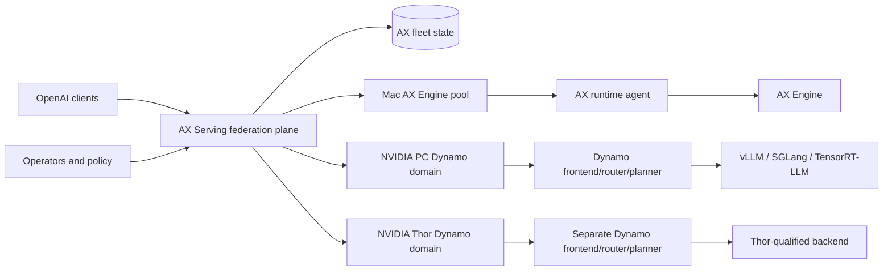

# Product Requirements: AX Serving Federated Inference Control Plane

| Field | Value |
| --- | --- |
| Status | Canonical target; core gateway implemented, Dynamo federation and live certification pending |
| Owner | AX Serving maintainers |
| Last updated | 2026-07-15 |
| Applies to | AX Serving 3.x final architecture |
| Architecture decision | [ADR-016](../adr/ADR-016-FEDERATED-DYNAMO-AND-AX-ENGINE-CONTROL-PLANE.md) |
| Technical specification | [Federated control-plane specification](../specs/TECH-SPEC-FEDERATED-INFERENCE-CONTROL-PLANE.md) |
| Evidence status | [Implementation and certification status](../IMPLEMENTATION-STATUS.md) |

## 1. Executive summary

AX Serving is a **federated heterogeneous inference control plane** for private AI fleets. It
provides one authenticated OpenAI-compatible endpoint and selects one execution domain for every
request:

- Apple Silicon Macs execute with AX Engine through the AX runtime agent;
- NVIDIA GPU PCs execute inside a pinned upstream NVIDIA Dynamo domain;
- NVIDIA Thor devices execute inside a separate, independently qualified Dynamo domain.

AX Serving does not compete with the inference systems inside those domains. Dynamo owns
NVIDIA-local routing, KV-aware placement, disaggregated serving, planning, scaling, and the vLLM,
SGLang, or TensorRT-LLM backend. AX Engine owns Apple Silicon tokenization, batching, caches,
speculation, and kernels. AX Serving owns the high-value decisions that neither execution system
can make alone: tenant and trust policy, logical models, semantic equivalence, privacy/locality,
domain admission, cost/SLO policy, cross-domain safety, audit, and one operator surface.

The product is valuable only for a genuinely heterogeneous or policy-segmented fleet. A user with
one model on one NVIDIA deployment should call Dynamo directly. AX Serving must earn its additional
hop and operational surface through measurable cross-domain utilization, policy enforcement,
availability, or cost improvement.

## 2. Product thesis and customer value

### 2.1 Problem

An organization that owns Macs, NVIDIA workstations, and Thor devices otherwise has to expose
separate endpoints or force all work onto NVIDIA. That creates six problems:

1. Applications must understand runtime, hardware, and topology.
2. Mac and edge capacity may remain idle even when it satisfies privacy or latency requirements.
3. A shared model name can hide different revisions, tokenizers, templates, quantization, or
   capabilities.
4. Cross-endpoint retry can duplicate work or change semantics after admission.
5. NVIDIA PC and Thor have different architecture, memory, thermal, container, and performance
   assumptions despite both using CUDA.
6. Per-runtime telemetry does not supply a global tenant, residency, budget, or audit decision.

### 2.2 Core promise

One API request can be placed on the best **eligible execution domain** without exposing the client
to runtime addresses and without overriding the local runtime's scheduler.

The placement decision is:

- policy-correct before performance-optimized;
- fail-closed when identity or capability is uncertain;
- recorded with a policy version and bounded reason codes;
- replayable offline;
- retry-safe before response commitment;
- independent of a Dynamo or AX Engine SDK inside the gateway.

### 2.3 Primary customer

The primary customer is a platform or infrastructure team that has at least two of:

- Apple Silicon and NVIDIA capacity;
- NVIDIA PC and Thor classes;
- distinct tenant, privacy, residency, or trust domains;
- multiple semantically certified deployments behind one logical model;
- a requirement for central admission, audit, lifecycle, or HA.

Team size and model size are not qualification criteria. Measured operational complexity is.

### 2.4 Explicit no-value case

AX Serving is not recommended when all requests go to one Dynamo endpoint with one policy and no
cross-domain governance. In that case the additional gateway is overhead. This boundary must appear
in public positioning and sales qualification.

## 3. Product architecture

There are two routing stages:

1. AX Serving selects a domain and deployment.
2. Dynamo selects an NVIDIA worker, or AX Serving selects an eligible Mac endpoint and AX Engine
   executes there.

One request attempt remains inside one domain. AX Serving never splits a graph, prefill/decode
phase, layer, or KV cache across Mac, PC, and Thor.

## 4. Goals

### 4.1 P0: useful federated baseline

- Provide one OpenAI-compatible API across one certified Mac AX Engine pool and one certified
  NVIDIA PC Dynamo domain.
- Represent NVIDIA Thor as a distinct domain with fail-closed experimental status; it must never be
  silently grouped with PC capacity.
- Preserve the existing runtime-SDK-free portable gateway and AX runtime-agent path.
- Add a Dynamo Domain Adapter that represents one complete Dynamo deployment, not each GPU worker.
- Pin upstream Dynamo releases, containers, backend versions, and configurations immutably.
- Enforce logical-model identity, deployment equivalence, tenant/trust/locality policy, and domain
  capability before placement.
- Keep Dynamo's worker routing, KV state, disaggregation, retry, planner, and scaling authoritative
  inside every NVIDIA domain.
- Preserve safe streaming, cancellation, deadlines, typed pre-admission, and no retry after
  commitment.
- Provide a versioned `DecisionRecord` for every domain choice.
- Ship CPU-only, multi-architecture gateway/agent images, Compose evaluation, Kubernetes examples,
  and a first-party Helm chart that does not install runtimes or GPU operators.
- Retain live conformance and benchmark evidence before claiming production readiness.

### 4.2 P1: differentiated policy and Thor qualification

- Qualify one pinned Dynamo/backend/container stack on NVIDIA Thor.
- Add cost-, latency-, energy-, privacy-, and locality-aware domain policies with hard quality and
  capability floors.
- Support `model: auto` or a named routing profile without changing explicit-model behavior.
- Add shadow decisions, offline replay, policy canary, versioned promotion, and rollback.
- Integrate desired lifecycle state with a certified Dynamo/Kubernetes controller and the AX Mac
  agent without putting runtime lifecycle in the request path.
- Support bounded, privacy-preserving soft session affinity for repeated agent turns.
- Support additional public operations only after adapter-specific capability certification.

### 4.3 P2: research, not release blockers

- Learned domain routing from workload-specific quality labels.
- Context selection or compression supplied as an external policy service with quality evaluation.
- Verifier/cascade policies for workloads with objective evaluators.
- Broader federation across cloud endpoints or other accelerator domains.

P2 work must not delay P0 correctness and must not directly self-modify a production policy.

## 5. Non-goals

- Replacing Dynamo, vLLM, SGLang, TensorRT-LLM, or AX Engine.
- Registering every Dynamo GPU worker as an AX worker in the target production path.
- Reimplementing Dynamo's KV router, KVBM, NIXL, planner, disaggregation, worker migration, or GPU
  autoscaling.
- Adding CUDA execution to AX Engine or creating an AX CUDA runtime.
- Linking Dynamo, CUDA, MLX, Metal, AX Engine, or backend SDKs into the portable gateway.
- Tokenizing prompts, rendering templates, parsing model files, or guessing model semantics in AX
  Serving.
- Spanning tensor/pipeline/expert parallelism or KV transfer across PC and Thor or across NVIDIA and
  Mac.
- Sharing TensorRT engine artifacts, quantization artifacts, or capacity calibration between PC
  and Thor without explicit evidence.
- Treating a common model name or topic as proof of semantic equivalence or KV reuse.
- Adding agent planning, tools, MCP execution, sandboxes, durable memory, or workflow orchestration.
- Online production self-learning or autonomous policy deployment.
- Claiming bit-identical output across runtimes.

## 6. Product principles

1. **Federate domains; do not duplicate their schedulers.**
2. **Policy correctness precedes optimization.** Privacy, trust, capability, identity, and SLO hard
   limits are filters, never score weights.
3. **The execution owner is authoritative.** Dynamo and AX Engine own their runtime semantics and
   local telemetry.
4. **PC and Thor are different deployment classes.** A shared vendor or CUDA API is not sufficient
   equivalence.
5. **Wire contracts over SDK linkage.** Integration occurs through versioned HTTP/protocol and
   immutable release manifests.
6. **No retry after ambiguity or commitment.**
7. **Observe, evaluate, shadow, canary, rollback.** No direct online self-modification.
8. **Evidence before claims.** Mock tests prove code paths, not live compatibility or value.
9. **The small profile remains simple.** One gateway and in-memory state are valid for evaluation;
   homogeneous users may bypass AX entirely.

## 7. Users and jobs

### 7.1 Platform operator

Publish logical models, set tenant and locality policy, inspect why a domain was selected, drain or
roll domains, and recover without changing client configuration.

### 7.2 Application developer

Use one OpenAI-compatible base URL, an explicit model or approved routing profile, and receive a
stable error when no domain can safely satisfy the request.

### 7.3 Runtime/domain integrator

Certify AX Engine or a pinned Dynamo deployment through a documented adapter contract without
moving runtime-specific scheduling into AX Serving.

### 7.4 Performance and policy engineer

Replay real workloads, compare direct and federated paths, evaluate domain decisions against an
oracle or baseline, and promote only policies that maintain quality and safety floors.

## 8. Functional requirements

Priorities are P0 for the first supported federated release, P1 for the next qualified increment,
and P2 for research.

### 8.1 Public API

| ID | Priority | Requirement |
| --- | --- | --- |
| API-001 | P0 | Serve `/v1/chat/completions`, `/v1/completions`, `/v1/embeddings`, and `/v1/models` with documented OpenAI-compatible JSON/SSE behavior. |
| API-002 | P0 | Preserve unknown request fields and runtime response bytes unless an explicit bounded validation rule rejects them. |
| API-003 | P0 | Return a stable AX error envelope with code, request ID, retryability, phase, and safe detail. |
| API-004 | P0 | Distinguish unknown model/profile, policy denial, no compatible domain, overload, runtime unavailable, deadline, protocol mismatch, and response commitment. |
| API-005 | P0 | Keep explicit model selection backward compatible; automatic routing requires `model: auto` or an operator-approved profile. |
| API-006 | P1 | Add `/v1/responses` only after its end-to-end contract passes one Mac and one Dynamo adapter certification. |
| API-007 | P0 | Keep `ax.serving.v1` gRPC and synchronous local model mutation in the embedded macOS compatibility product, not the portable federation gateway. |

### 8.2 Execution domains

| ID | Priority | Requirement |
| --- | --- | --- |
| DOM-001 | P0 | Model every routing target as a stable domain with ID, type, execution owner, pool, hardware class, trust domain, endpoint, lifecycle state, and protocol identity. |
| DOM-002 | P0 | Support `mac_ax_engine`, `nvidia_dynamo_pc`, and `nvidia_dynamo_thor`; unknown types fail closed. |
| DOM-003 | P0 | Treat a Dynamo domain as one AX endpoint. Dynamo-internal workers and KV entries must not enter AX fleet state. |
| DOM-004 | P0 | Separate process liveness, control-plane readiness, domain routability, and deployment capability. |
| DOM-005 | P0 | Expire stale leases/observations and retain stale data only for diagnostics. |
| DOM-006 | P0 | Support explicit drain, unavailable, degraded, experimental, and ready states with monotonic generation/fencing. |
| DOM-007 | P0 | Keep PC and Thor in different pools/domains and prevent cross-domain execution groups. |
| DOM-008 | P1 | Represent additional domains only through a reviewed adapter and conformance profile. |

### 8.3 Mac AX Engine integration

| ID | Priority | Requirement |
| --- | --- | --- |
| MAC-001 | P0 | Use `ax-runtime-agent` and the versioned worker protocol; the gateway must not link AX Engine. |
| MAC-002 | P0 | AX Engine is authoritative for readiness, inventory, limits, tokenization, templates, batching, caches, speculation, and execution. |
| MAC-003 | P0 | Agent registration includes immutable deployment identity and only capabilities proven by runtime metadata and conformance. |
| MAC-004 | P0 | Client credentials never reach AX Engine; dispatch and runtime credentials are separate. |
| MAC-005 | P0 | Mac endpoint selection may use existing inference-aware scoring only after all hard domain/deployment filters pass. |

### 8.4 NVIDIA Dynamo integration

| ID | Priority | Requirement |
| --- | --- | --- |
| DYN-001 | P0 | Use the official `https://github.com/ai-dynamo/dynamo` upstream and pin a released tag/commit plus immutable component image digests. |
| DYN-002 | P0 | Put a Dynamo Domain Adapter at the service boundary; do not import Dynamo runtime SDKs into `ax-serving-api`. |
| DYN-003 | P0 | The adapter registers domain-level readiness, model inventory, capabilities, aggregate admission capacity, backend identity, and observation freshness. |
| DYN-004 | P0 | The adapter forwards one complete request to a Dynamo frontend; Dynamo alone chooses internal workers and prefill/decode placement. |
| DYN-005 | P0 | Only a proven, authenticated non-admission result may authorize AX cross-domain retry. Generic Dynamo/backend `5xx` remains non-retryable by AX. |
| DYN-006 | P0 | Every compatibility manifest records Dynamo, backend, CUDA, image, architecture, config, model, and protocol versions. |
| DYN-007 | P0 | Dynamo upgrades pass offline conformance, shadow, canary, drain, and rollback before promotion. |
| DYN-008 | P1 | Lifecycle translation may reconcile AX desired deployment state with Dynamo CRDs/operator, but must remain outside the token data path. |
| DYN-009 | P1 | Thor support requires a separate pinned manifest and may not inherit PC certification. |

### 8.5 Model identity and equivalence

| ID | Priority | Requirement |
| --- | --- | --- |
| MOD-001 | P0 | Clients address a logical model alias or approved routing profile; AX resolves it to explicit domain deployments. |
| MOD-002 | P0 | Deployment identity includes domain, execution owner, runtime/Dynamo/backend versions, model revision/artifact, tokenizer, template, quantization, operations, limits, trust class, and certification record. |
| MOD-003 | P0 | Missing required identity permits only explicitly pinned single-deployment use and never cross-domain failover. |
| MOD-004 | P0 | Cross-domain failover requires both deployments in one operator-approved equivalence class and a retained workload artifact. |
| MOD-005 | P0 | `/v1/models` exposes logical models and conservative aggregate capabilities; admin APIs expose domain/deployment detail. |
| MOD-006 | P1 | Quality floors and domain-specific variants are versioned policy inputs, not inferred from model marketing names. |

### 8.6 Request profile, policy, and decision record

| ID | Priority | Requirement |
| --- | --- | --- |
| REQ-001 | P0 | Build a bounded request profile from operation, logical model/profile, streaming, declared limits, modality, tenant, priority, required capabilities, optional domain constraint, deadline, privacy/locality, and budget/SLO constraints. |
| REQ-002 | P0 | Do not tokenize, render templates, or inspect prompt semantics beyond explicitly documented bounded fields in the gateway. |
| REQ-003 | P0 | Apply hard filters before scoring: auth/policy, trust/residency, domain state, lease freshness, identity/equivalence, operation/capability, limits, and reserved capacity. |
| REQ-004 | P0 | Missing or stale optional telemetry receives a penalty and never means idle or cheap. |
| REQ-005 | P0 | Emit a `DecisionRecord` containing request ID, logical model/profile, candidate domains, selected domain/deployment, policy version, bounded reason codes, predicted cost/latency if present, and observation versions. |
| REQ-006 | P0 | Decision records exclude prompts, outputs, raw affinity/session IDs, credentials, and unbounded tenant/user data. |
| REQ-007 | P1 | Automatic model/domain policy starts in shadow mode and retains the explicit-model API as an override. |
| REQ-008 | P1 | A promoted policy must be deterministic for a fixed record or identify the exact model/seed/artifact that made the decision. |

### 8.7 Dispatch, streaming, cancellation, and retry

| ID | Priority | Requirement |
| --- | --- | --- |
| DSP-001 | P0 | Use one stable request ID and a unique AX attempt ID per selected domain. |
| DSP-002 | P0 | Allow at most one AX retry, only before commitment after connect failure or authenticated typed non-admission. |
| DSP-003 | P0 | Never retry arbitrary `5xx`, post-admission ambiguity, or a stream after headers/body commit. |
| DSP-004 | P0 | Dynamo owns all in-domain retry/migration; AX must not retry each Dynamo worker attempt. |
| DSP-005 | P0 | Propagate client disconnect, cancellation, and absolute/phased deadlines through the adapter to the execution owner. |
| DSP-006 | P0 | Proxy SSE incrementally, preserve order, and bound request/response bodies and header forwarding. |
| DSP-007 | P0 | Cross-domain retry additionally requires equivalence, policy, residency, capability, and remaining-deadline checks. |

### 8.8 Operations and lifecycle

| ID | Priority | Requirement |
| --- | --- | --- |
| OPS-001 | P0 | Provide `/livez` for process liveness, `/readyz` for control-plane readiness by default, `/routablez` for inference capacity, and authenticated fleet/domain diagnostics. |
| OPS-002 | P0 | Support registration, lease, drain, removal, desired deployment state, async jobs, and audit through separate authenticated operator/control APIs. |
| OPS-003 | P0 | A gateway can install and become ready before any Mac or Dynamo domain registers; inference returns structured unavailable until routable. |
| OPS-004 | P0 | Active-active gateways use Redis/Valkey fencing, reservations, and reconciliation; a single-gateway evaluation profile may use memory state. |
| OPS-005 | P0 | Gateway shutdown stops admission, fails readiness, allows accepted streams to drain, cancels at the configured deadline, and exits before the platform hard deadline. |
| OPS-006 | P1 | Lifecycle adapters reconcile desired state with AX agents or Dynamo/Kubernetes and report observed state; they do not download models or allocate GPUs inside the gateway. |

### 8.9 Packaging and supply chain

| ID | Priority | Requirement |
| --- | --- | --- |
| PKG-001 | P0 | Gateway and AX adapter images are CPU-only, non-root, and multi-architecture AMD64/ARM64; forbidden runtime/accelerator dependencies are checked. |
| PKG-002 | P0 | The AX Helm chart installs only the federation plane and optional AX-owned state/monitoring resources; it must not install Dynamo, GPU operators, runtimes, or model weights. |
| PKG-003 | P0 | Compose is an evaluation surface, not an HA claim; Helm is the supported Kubernetes configuration contract after its release gates pass. |
| PKG-004 | P0 | Public, admin/metrics, worker control, adapter dispatch, Dynamo, runtime, and fleet-store network/credential surfaces remain distinct. |
| PKG-005 | P0 | One AX release manifest links source, images, chart, SBOM, provenance, signatures, dependency audit, Dynamo compatibility manifests, and certification evidence. |

### 8.10 Optional agent-session and adaptive policies

| ID | Priority | Requirement |
| --- | --- | --- |
| ADP-001 | P1 | Session affinity is a tenant-scoped, opaque, bounded-TTL soft preference and never correctness state. |
| ADP-002 | P1 | A session hint cannot bypass eligibility, capacity, domain policy, or equivalence, and raw session IDs are never logged, stored, or forwarded. |
| ADP-003 | P1 | Agent planning, tool execution, durable memory, and workflow state remain outside AX Serving. |
| ADP-004 | P1 | Learned routing uses offline evaluation, versioned policy, shadow, canary, and rollback; direct online self-learning is prohibited. |
| ADP-005 | P2 | Context or verification policies require workload-specific quality labels and must expose their incremental cost and latency. |

## 9. Security and privacy requirements

1. Public authentication terminates at AX Serving.
2. Public, admin, worker-control, dispatch, Dynamo-control, Dynamo-data, runtime, Redis, and signing
   credentials are separate and independently rotatable.
3. Public `Authorization`, cookies, proxy credentials, hop-by-hop headers, and AX internal headers
   never reach an execution runtime.
4. Non-loopback deployments use a trusted TLS/mTLS ingress or private mesh. AX Serving does not
   create certificates itself.
5. Domain policy may constrain tenant, network zone, geography, device class, data classification,
   cloud prohibition, and model allowlist before scoring.
6. Prompt/output capture is off by default. Decision records use bounded enums and digests.
7. Dynamo and AX state stores are separate; neither system receives the other's internal
   credentials or mutable state.
8. Adapter input, inventory, metrics, and typed admission markers are authenticated and treated as
   untrusted until validated.
9. Release artifacts have SBOM, provenance, signatures, vulnerability results, and immutable
   digests. Upstream licenses and notices are retained.
10. Security tests cover SSRF, endpoint validation, header smuggling, duplicate routing fields,
    credential forwarding, replay/fencing, malicious metrics, and post-commit retry.

## 10. Observability and audit

Every request/attempt must support correlation across AX and Dynamo without using high-cardinality
metrics labels. Required dimensions are bounded:

- policy version and mode (`explicit`, `shadow`, `canary`, `active`);
- selected domain type, pool class, deployment class, and reason code;
- admission, dispatch, first byte, stream, cancellation, and completion phase;
- direct/gateway/domain latency, TTFT, ITL when authoritative, token usage, and error class;
- predicted versus observed cost/latency when a predictive policy is enabled;
- retry owner (`ax` or `dynamo`) and commitment state;
- domain readiness/lease age, aggregate capacity, observation age, and compatibility manifest;
- lifecycle generation, drain, rollout, rollback, and policy promotion.

Prompts, outputs, credentials, raw session/affinity keys, request IDs, worker IDs, and free-form model
strings are prohibited as Prometheus labels. Detailed audit records are access-controlled and
retention-bounded.

## 11. Non-functional requirements

### 11.1 Validation envelope

The production gate is an evidence target, not a current claim.

| Dimension | Pilot gate | Initial production gate | Design ceiling, not a claim |
| --- | ---: | ---: | ---: |
| AX gateways | 1 | 2 active replicas | Deployment-dependent |
| Mac endpoints | 1 | 8 | 64 |
| NVIDIA PC Dynamo domains | 1 | 2 | 16 |
| NVIDIA Thor Dynamo domains | 0 or 1 experimental | 1 separately certified | 8 |
| Concurrent streams per gateway | 64 | 256 | 2,000 |
| Logical deployments | 8 | 64 | 512 |

### 11.2 SLO and correctness gates

| ID | Requirement |
| --- | --- |
| NFR-001 | AX gateway request-setup overhead on the same LAN, excluding runtime work: p50 <= 5 ms and p95 <= 15 ms. |
| NFR-002 | Domain/deployment selection across 256 candidates: p99 <= 2 ms. |
| NFR-003 | Stale Mac/domain observations become ineligible within the configured TTL; default target 15 seconds. |
| NFR-004 | No conformance or fault test observes an AX cross-domain retry after admission ambiguity or first response commitment. |
| NFR-005 | A gateway restart restores shared federation state within one observation interval plus store propagation time. |
| NFR-006 | At the production envelope, AX adds less than 3% goodput loss relative to the same domain called directly. |
| NFR-007 | A 60-minute mixed-domain soak has bounded gateway/adapter memory and no leaked reservations, streams, leases, or jobs. |
| NFR-008 | Loss of one domain does not make another domain or the AX control plane unavailable. |
| NFR-009 | A domain decision is replayable from its recorded policy/config/observation versions. |
| NFR-010 | Policy, capability, privacy, residency, and equivalence violations are zero in release-gate workloads. |

### 11.3 Value gates

At least one value scenario must pass before the federation release is called high-value:

| ID | Requirement |
| --- | --- |
| VAL-001 | Compared with NVIDIA-only placement, eligible Mac/Thor capacity reduces measured cost or NVIDIA load by at least 20% while maintaining the workload quality floor and SLO. |
| VAL-002 | Or, under a tested domain outage/drain, AX maintains at least 99.9% policy-correct request routing with no duplicate commitment and materially higher successful goodput than a single-domain baseline. |
| VAL-003 | Or, a privacy/locality workload executes entirely on required local domains with zero policy violations while clients retain one API and model contract. |
| VAL-004 | Operator study or deployment evidence shows the federation surface removes endpoint-specific client logic and reduces a defined operational workflow without unacceptable added burden. |

If no value gate passes on a representative workload, automatic federation must remain optional and
the project should prioritize direct AX Engine/Dynamo integrations instead of expanding policy
scope.

## 12. Compatibility and upstream policy

- Canonical Dynamo source: `https://github.com/ai-dynamo/dynamo`.
- Initial integration baseline: released tag `v1.2.1`; each AX release pins exact commits and image
  digests rather than inheriting this document forever.
- Dynamo's ARM64/Ubuntu 24.04 and Blackwell support is prerequisite evidence, not Thor
  certification.
- Supported backends are only those listed in an AX compatibility manifest and exercised by live
  tests. Dynamo's broader feature matrix is not automatically an AX support claim.
- AX Engine compatibility is similarly pinned by version, build, model identity, API fixtures, and
  live tests.
- Protocol minor changes are additive within a major. Incompatible domain/admission semantics
  require a new major or explicit migration.
- AX contributes general Dynamo fixes upstream. AX-specific federation policy stays in AX Serving.

## 13. Benchmark and claim policy

### 13.1 Required comparisons

1. **Execution baseline:** AX Engine direct; Dynamo frontend direct for each PC/Thor domain.
2. **Federation overhead:** the same workload and domain through AX Serving.
3. **Domain value:** fixed single-domain policy versus AX federation under normal, saturated,
   drain, outage, privacy, and budget scenarios.
4. **Policy quality:** active policy versus explicit baseline and an offline oracle, reporting
   routing regret and quality-floor violations.

### 13.2 Reproducibility

Every artifact records source commits, container/image digests, OS/architecture, hardware, model
and tokenizer/template/quantization identity, Dynamo graph/backend/config, AX policy/config,
dataset/workload digest, warmup, concurrency, raw results, failures, and statistical method.

Do not publish “faster,” “cheaper,” “production-ready,” “Thor supported,” or scale claims from mock
tests, null baselines, partial runs, or Dynamo's generic upstream support matrix.

## 14. Rollout plan

### Phase 0: canonical contracts and compatibility quarantine

- Adopt ADR-016, this PRD, and the consolidated specification.
- Mark direct per-worker CUDA registration and embedded runtimes compatibility-only.
- Preserve current API, Mac agent, deployment catalog, equivalence, dispatch, HA, and packaging
  behavior.

### Phase 1: execution-domain model

- Add domain IDs/types/status and protocol capability as additive fields.
- Map current Mac workers to `mac_ax_engine` endpoints.
- Add domain-aware decision records, diagnostics, configuration, and fixtures.

### Phase 2: NVIDIA PC Dynamo adapter

- Pin upstream Dynamo release artifacts.
- Implement domain inventory/readiness/telemetry and proxying.
- Run shadow registration, then canary requests, then production qualification.
- Disable direct vLLM/SGLang workers in the production profile.

### Phase 3: Thor experimental domain

- Build a separate ARM64/CUDA/backend compatibility manifest.
- Validate model artifacts, memory/thermal behavior, API, stream/cancel, restart, and soak.
- Keep cross-domain failover off until equivalence evidence passes.

### Phase 4: adaptive federation policy

- Add shadow `DecisionProfile`/`DecisionRecord` evaluation and offline replay.
- Enable one narrow cost/SLO policy for one measured workload.
- Promote by canary with automatic rollback guardrails; do not enable online self-learning.

### Phase 5: production release

- Complete HA, security, upgrade, rollback, value, and 60-minute mixed-domain evidence.
- Publish immutable release/compatibility manifests.
- Update public support claims only after every applicable gate passes.

## 15. Release acceptance criteria

A federated production release requires all of the following:

- portable gateway and AX adapter dependency boundaries pass on macOS, Linux AMD64, and Linux ARM64;
- CPU-only images and Helm/Compose/Kubernetes surfaces pass render, security, install, upgrade, and
  rollback tests;
- one pinned AX Engine Mac deployment passes protocol/API/stream/cancel/drain/fault conformance;
- one pinned NVIDIA PC Dynamo domain passes the same federation contract plus Dynamo ownership
  tests;
- Thor is clearly disabled/experimental or independently passes its full qualification gate;
- explicit identity and equivalence artifacts exist for every enabled cross-domain transition;
- two gateways with Redis/Valkey pass fencing, restart, partition, reservation, rollout, drain, and
  60-minute soak tests;
- direct-versus-federated overhead and one value gate pass;
- credential rotation, transport, monitoring, incident, upgrade, rollback, and upstream-Dynamo
  rollback drills have retained evidence;
- every decision is explainable and replayable and no policy/security/equivalence violation occurs;
- documentation distinguishes implemented, certified, experimental, and unavailable behavior.

## 16. Risks and mitigations

| Risk | Mitigation |
| --- | --- |
| AX duplicates Dynamo and loses its product reason | Enforce domain-level adapter and ownership compliance tests. |
| Dynamo changes quickly | Pin releases/images, isolate through adapter, conformance-test, shadow, canary, rollback. |
| Thor appears supported from generic ARM64/Blackwell claims | Separate domain/status/manifest and require live Thor evidence. |
| Cross-domain output changes silently | Strict identity, equivalence class, workload certification, and fail-closed retry. |
| Two retry systems duplicate work | AX owns cross-domain pre-admission retry; Dynamo owns in-domain behavior; trace both. |
| Coarse domain telemetry causes poor placement | Penalize unknown/stale data, keep explicit override, compare with direct baseline. |
| “Intelligence” becomes unverifiable rules or drift | Versioned records, offline replay, shadow/canary, quality floors, no online self-learning. |
| Product is unnecessary for most users | Qualify only heterogeneous/policy-segmented customers and require a value gate. |
| Two control planes increase operations burden | Separate ownership/runbooks, immutable manifests, bounded adapter, shared observability. |

## 17. Success measures

- At least one value gate passes on a representative, retained workload.
- No domain-policy, trust, capability, identity, or equivalence violation in release tests.
- No duplicate response commitment under fault injection.
- At least 95% of placement decisions carry complete reason/observation/policy evidence; the
  remainder fail closed rather than route optimistically.
- Direct explicit routing remains available and has bounded overhead.
- A pinned Dynamo upgrade or rollback completes without changing clients or corrupting AX state.
- A Mac, PC, or Thor domain can be drained or lost without changing client endpoint/model names.

## 18. References

- [ADR-016](../adr/ADR-016-FEDERATED-DYNAMO-AND-AX-ENGINE-CONTROL-PLANE.md)
- [Federated control-plane technical specification](../specs/TECH-SPEC-FEDERATED-INFERENCE-CONTROL-PLANE.md)
- [AX Serving node contract](../../docs/contracts/ax-serving-node-contract.md)
- [Runtime responsibility inventory](../../docs/contracts/ax-serving-runtime-responsibility-inventory.md)
- [Public contract inventory](../../docs/contracts/ax-serving-public-contract-inventory.md)
- [NVIDIA Dynamo architecture](https://docs.nvidia.com/dynamo/design-docs/overall-architecture)
- [NVIDIA Dynamo support matrix](https://docs.nvidia.com/dynamo/latest/resources/support-matrix)
- [NVIDIA Dynamo release artifacts](https://docs.nvidia.com/dynamo/latest/resources/release-artifacts)
- [NVIDIA Dynamo feature matrix](https://docs.nvidia.com/dynamo/latest/resources/feature-matrix)
- [NVIDIA Jetson AGX Thor CUDA setup](https://docs.nvidia.com/jetson/agx-thor-devkit/user-guide/latest/setup_cuda.html)
