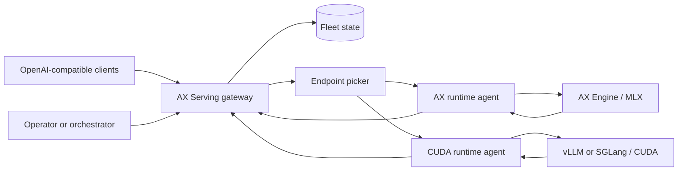

# Product Requirements: AX Serving Hybrid Inference Control Plane

| Field | Value |
| --- | --- |
| Status | Canonical target; architecture implemented, production certification pending |
| Owner | AX Serving maintainers |
| Last updated | 2026-07-12 |
| Applies to | AX Serving 3.x target architecture |
| Architecture decision | [ADR-013](../adr/ADR-013-RUNTIME-NEUTRAL-HYBRID-INFERENCE-CONTROL-PLANE.md) |
| Technical specification | [Hybrid runtime control-plane spec](../specs/TECH-SPEC-HYBRID-RUNTIME-CONTROL-PLANE.md) |
| Evidence status | [Implementation and certification status](../IMPLEMENTATION-STATUS.md) |

## 1. Executive summary

AX Serving is the runtime-neutral control plane for private and hybrid AI inference fleets. It
exposes one OpenAI-compatible endpoint and routes each admitted request to a compatible, ready
runtime deployment across Apple Silicon and CUDA infrastructure.

AX Serving does not replace the execution engine inside a worker. AX Engine owns optimized MLX
execution on Apple Silicon. vLLM, SGLang, or another certified runtime owns CUDA execution. The
runtime remains responsible for tokenization, chat templates, batching, KV-cache management,
speculative decoding, distributed execution, and hardware kernels. AX Serving owns fleet state,
admission, endpoint selection, failover, security boundaries, and end-to-end operations.

In this product, **hybrid** means one managed fleet containing MLX and CUDA deployment pools. Each
request attempt executes wholly on one compatible runtime endpoint.

The product comparison must therefore be stated precisely:

- Compare **AX Engine with llama.cpp or another local runtime** from the same source model and
  tokenizer, using matched quantization class, hardware, prompt, sampler, and token accounting.
  Record unavoidable artifact-format or quantizer differences rather than describing them as exact.
- Compare **AX Serving with an inference gateway or serving control plane**, not with the vLLM
  token engine in isolation.
- Compare a **direct runtime request with the same request through AX Serving** to measure gateway
  overhead.
- Compare a **mixed AX Engine and vLLM fleet with a homogeneous fleet** to measure availability,
  goodput, cost, and SLO behavior.

This separation closes the current architectural gap: AX Engine can evolve rapidly as the MLX
runtime without forcing the gateway to link its SDK or reproduce its model semantics, while AX
Serving can scale across macOS and Linux workers without becoming another inference engine.

## 2. Problem

Organizations with both Apple Silicon and CUDA capacity currently face four practical problems:

1. A client must know which runtime and endpoint can serve a model.
2. Runtime-specific APIs, health signals, metrics, and model identifiers are inconsistent.
3. Failover can silently change tokenizer, template, quantization, or model revision and therefore
   change output behavior.
4. A gateway that links a fast-moving runtime SDK inherits its platform restrictions, threading
   rules, release cadence, and model-specific request logic.

The existing repository already contains useful worker registration, heartbeats, draining,
endpoint selection, streaming proxying, and runtime-agent foundations. However, the gateway is
still coupled to the embedded AX Engine backend, readiness is not fully runtime-authoritative, and
the worker protocol does not carry enough identity or capability information for safe hybrid
failover.

## 3. Product vision

An operator should be able to register Apple Silicon and CUDA deployments, publish one logical
model name, and let AX Serving choose a safe endpoint for every request. Clients should receive
stable API behavior while operators can add, drain, upgrade, and replace runtime deployments
without changing client configuration.

The long-term product is a small, dependable inference control plane with excellent runtime
integration. It is deliberately not a universal tensor runtime, model converter, or replacement
for the scheduling and cache systems already implemented by AX Engine and vLLM.

## 4. Goals

### 4.1 P0 goals

- Provide one OpenAI-compatible API for certified AX Engine and CUDA runtime deployments.
- Run the API gateway without model weights, Metal, MLX, CUDA, or an embedded runtime SDK.
- Support gateways on Apple Silicon macOS and Linux (`x86_64` and `aarch64`).
- Discover runtime readiness, models, operations, limits, and telemetry through a versioned worker
  protocol.
- Route only to endpoints that satisfy the request's hard requirements.
- Preserve streaming bytes and cancellation semantics end to end.
- Prevent unsafe cross-runtime failover when model deployments are not certified equivalent.
- Separate public client credentials, worker control-plane credentials, and runtime credentials.
- Make rollout, drain, failure, retry, and routing decisions observable and testable.
- Publish reproducible performance evidence before making production or comparative claims.

### 4.2 P1 goals

- Support shared fleet state and multiple active gateway replicas.
- Support tenant priorities, quotas, and overload admission policies.
- Add asynchronous deployment lifecycle jobs for runtime adapters that can safely load and unload
  models.
- Support image inputs, tool calling, structured output, and future OpenAI-compatible operations
  when a deployment advertises the corresponding capability.
- Integrate with Kubernetes or another orchestrator without requiring it for small deployments.

## 5. Non-goals

- Implementing model kernels, token generation, continuous batching, paged attention, prefix-cache
  storage, tensor parallelism, or pipeline parallelism in AX Serving.
- Parsing model files or guessing capabilities from filenames in the gateway.
- Rendering chat templates or tokenizing prompts in the gateway request path.
- Splitting one request, model graph, prefill phase, decode phase, or KV cache between MLX and CUDA
  runtimes. Cross-runtime execution is a separate distributed-runtime research problem.
- Making AX Engine support CUDA or making vLLM support MLX.
- Treating unlike quantizations, tokenizer revisions, or templates as interchangeable by default.
- Using NATS or another durable broker as the primary token-stream transport.
- Requiring Kubernetes, Ray, or a service mesh for the initial supported deployment.
- Promising bit-identical output across different runtimes. Equivalence is an explicit certification
  policy, not an assumption.

## 6. Users and primary use cases

### 6.1 Platform operator

The operator runs a private fleet, publishes model aliases, observes capacity, drains nodes, and
rolls runtime versions without disrupting client applications.

### 6.2 Application developer

The developer uses one stable OpenAI-compatible base URL and receives a clear error when no
compatible deployment can satisfy the request.

### 6.3 Runtime integrator

The integrator implements the AX runtime-agent contract for AX Engine, vLLM, SGLang, or another
runtime and validates the adapter with a conformance suite.

### 6.4 Performance engineer

The engineer compares direct runtime performance, gateway overhead, and mixed-fleet SLO goodput
using versioned artifacts and matched workload contracts.

## 7. Product principles

1. **Wire compatibility over SDK linkage.** Runtime integrations use a versioned protocol and
   capability negotiation. The gateway does not link a runtime SDK.
2. **The runtime is authoritative for execution semantics.** Tokenization, templates, model limits,
   batching, caches, and distributed execution stay with the runtime.
3. **Fail closed on semantic uncertainty.** A missing capability, stale observation, or unknown
   deployment identity cannot be interpreted as compatible or idle.
4. **Homogeneous pools, heterogeneous fleet.** Each pool represents one compatible deployment
   class. A logical model alias may target multiple certified pools.
5. **No retry after commitment.** Once response headers or stream bytes reach the client, AX
   Serving never reroutes that request.
6. **Control and data credentials are distinct.** Public bearer tokens are not forwarded to worker
   runtimes by default.
7. **Evidence before claims.** Release and performance claims require complete, reproducible
   validation artifacts.
8. **Small installations remain simple.** One gateway and in-memory fleet state remain a supported
   development and single-node mode.

## 8. Product architecture

The gateway is both the public API boundary and the endpoint picker. Agents normalize runtime
discovery, readiness, telemetry, and transport without taking ownership of runtime scheduling.
The initial data path is direct HTTP/SSE from gateway to agent. Durable messaging is reserved for
asynchronous control jobs and events.

## 9. Functional requirements

Requirement priorities use P0 for the production baseline, P1 for the next supported increment,
and P2 for later extension.

### 9.1 Public inference API

| ID | Priority | Requirement |
| --- | --- | --- |
| API-001 | P0 | Serve `/v1/chat/completions`, `/v1/completions`, `/v1/embeddings`, and `/v1/models` with documented OpenAI-compatible behavior. |
| API-002 | P0 | Preserve unknown request fields when proxying unless the protocol explicitly rejects them. AX Serving must not silently rewrite runtime semantics. |
| API-003 | P0 | Return a stable AX error envelope containing a machine-readable code, request ID, retryability, and safe diagnostic detail. |
| API-004 | P0 | Distinguish unknown model, no compatible deployment, overload, runtime unavailable, deadline, and protocol incompatibility. |
| API-005 | P0 | Support blocking JSON and streaming SSE responses without buffering the complete generated response. |
| API-006 | P1 | Add `/v1/responses` after both the protocol and at least one certified runtime adapter pass conformance tests. |
| API-007 | P0 | Treat `ax.serving.v1` gRPC as an embedded compatibility contract. It must not be exposed by the portable hybrid gateway because its local model paths, backend enums, and token-ID stream cannot be mapped losslessly across AX Engine and CUDA runtimes. |
| API-008 | P2 | Define a new runtime-neutral gRPC v2 only if measured client demand justifies another public protocol. It requires a separate contract review and must use the same admission and endpoint-selection semantics. |

### 9.2 Worker protocol and fleet membership

| ID | Priority | Requirement |
| --- | --- | --- |
| WKR-001 | P0 | Define protocol DTOs in a cross-platform crate with an independently versioned wire contract. |
| WKR-002 | P0 | Registration must include worker, agent, runtime, hardware, trust-domain, endpoint, and protocol identity. |
| WKR-003 | P0 | Heartbeats must report observed runtime readiness, model inventory, capacity, queue pressure, cache pressure, and observation time. |
| WKR-004 | P0 | A successful agent process health check is insufficient for routing; the upstream runtime must be ready. |
| WKR-005 | P0 | The gateway must expire a worker lease when authoritative observations stop. Stale inventory may be displayed but must not remain eligible. |
| WKR-006 | P0 | Workers support explicit drain and drain-complete states. Draining blocks new admissions and allows existing streams to finish up to a deadline. |
| WKR-007 | P0 | Protocol compatibility is negotiated by major version and advertised optional capabilities, not by runtime-name string checks. |
| WKR-008 | P1 | The protocol supports asynchronous deployment-job status and runtime lifecycle adapters. |

### 9.3 Model and deployment identity

| ID | Priority | Requirement |
| --- | --- | --- |
| MOD-001 | P0 | Clients address a logical model alias; routing resolves it to one or more deployments. |
| MOD-002 | P0 | A deployment identity includes runtime family/version, model revision or artifact digest, tokenizer digest, template digest, quantization, supported operations, context limit, and output limit. |
| MOD-003 | P0 | Every deployment belongs to an explicit equivalence class. Cross-pool failover is allowed only inside an operator-approved and tested class. |
| MOD-004 | P0 | Missing identity fields make a deployment ineligible for cross-runtime failover, while allowing explicitly pinned single-pool use. |
| MOD-005 | P0 | `/v1/models` reports logical aliases and safe aggregate capabilities; internal APIs expose deployment-level detail. |
| MOD-006 | P1 | Deployment changes are represented as asynchronous admin jobs with desired state, observed state, progress, and failure reason. |

### 9.4 Request classification and admission

| ID | Priority | Requirement |
| --- | --- | --- |
| REQ-001 | P0 | Build a request profile from operation, logical model, streaming mode, declared output limit, modality, tenant, priority, required capabilities, and optional pool constraints. |
| REQ-002 | P0 | Do not tokenize or render the prompt in the gateway. Runtime token counts remain authoritative. |
| REQ-003 | P0 | Reject a request before dispatch when no deployment satisfies hard operation, modality, context, policy, or trust constraints. |
| REQ-004 | P0 | Enforce gateway concurrency, body-size, deadline, and tenant admission limits before consuming worker capacity. |
| REQ-005 | P1 | Accept an optional runtime-neutral cache-affinity hint that is salted per trust domain and never exposes prompt text. |

### 9.5 Endpoint selection

| ID | Priority | Requirement |
| --- | --- | --- |
| RTE-001 | P0 | Endpoint selection first applies hard eligibility filters and then scores only eligible candidates. |
| RTE-002 | P0 | Hard filters include lease freshness, runtime readiness, drain state, deployment identity, operation, capability, context/output limits, trust policy, and available admission capacity. |
| RTE-003 | P0 | Scoring may use queue depth, active-to-capacity ratio, KV-cache pressure, batch headroom, TTFT EWMA, recent errors, locality, and cache affinity. |
| RTE-004 | P0 | Missing or stale telemetry receives a configurable penalty; it must never be interpreted as zero utilization. |
| RTE-005 | P0 | The selected worker and reason codes are recorded in low-cardinality telemetry. |
| RTE-006 | P1 | Support tenant priority and fairness without reimplementing runtime token scheduling. |

### 9.6 Dispatch, streaming, cancellation, and retries

| ID | Priority | Requirement |
| --- | --- | --- |
| DSP-001 | P0 | Generate a stable request ID and a unique attempt ID for each dispatch attempt. |
| DSP-002 | P0 | Retry at most once, and only after a connection failure or typed pre-admission rejection when no headers or body bytes have reached the client. |
| DSP-003 | P0 | Never retry an arbitrary `5xx`, a request rejected after runtime admission, or a stream after its first committed byte. |
| DSP-004 | P0 | Propagate client disconnect and deadline cancellation to the agent and runtime. |
| DSP-005 | P0 | Proxy SSE bytes incrementally, preserve event order, and enforce connect, first-byte, idle, and total deadlines separately. |
| DSP-006 | P0 | Expose whether a failure occurred before admission, after admission, or after response commitment. |

### 9.7 Operations and lifecycle

| ID | Priority | Requirement |
| --- | --- | --- |
| OPS-001 | P0 | Provide readiness, liveness, fleet summary, worker detail, and route-decision diagnostics without exposing secrets or prompt content. |
| OPS-002 | P0 | Support registration, lease renewal, drain, remove, and protocol compatibility operations over an internal authenticated API. |
| OPS-003 | P0 | Keep synchronous OpenAI model APIs read-oriented. Existing synchronous load/unload endpoints remain compatibility surfaces and are deprecated for fleet deployment. |
| OPS-004 | P1 | Add `/admin/v1/deployments` asynchronous create, update, roll, drain, and delete jobs. |
| OPS-005 | P1 | Provide a shared fleet-state implementation for multiple active gateway replicas while retaining an in-memory implementation for development. |

## 10. Non-functional requirements

### 10.1 Supported validation envelope

The values below are release gates, not claims about the current repository snapshot.

| Dimension | Pilot gate | Production gate | Design ceiling, not a release claim |
| --- | ---: | ---: | ---: |
| Registered workers | 8 | 32 mixed Mac/CUDA | 256 |
| Concurrent streams per gateway | 64 | 256 | 2,000 |
| Gateway replicas | 1 | 2 or more | Deployment-dependent |

### 10.2 SLO and performance gates

| ID | Production requirement |
| --- | --- |
| NFR-001 | Added gateway latency on the same LAN, excluding runtime work: p50 <= 5 ms and p95 <= 15 ms for non-streaming request setup. |
| NFR-002 | Endpoint-selection latency at 256 candidates: p99 <= 2 ms. |
| NFR-003 | A worker with no fresh heartbeat becomes ineligible within the configured lease TTL; the default target is 15 seconds. |
| NFR-004 | An actively probed runtime readiness failure becomes ineligible within 5 seconds under the default probe policy. |
| NFR-005 | No test may observe a duplicate reroute after the first response byte. |
| NFR-006 | A gateway restart recovers routable fleet state within one heartbeat interval plus shared-state propagation time. |
| NFR-007 | At the production validation envelope, the gateway adds less than 3% goodput loss relative to direct requests after normalizing for runtime capacity. |
| NFR-008 | Soak tests run for at least 60 minutes with bounded gateway memory and no leaked inflight, queue, or worker-lease state. |

### 10.3 Reliability

- Every state transition is explicit and monotonic where possible.
- Readiness defaults to false after startup, protocol mismatch, expired lease, or failed runtime
  observation.
- Fleet-state and endpoint-picker failures fail closed for new admissions while existing streams
  continue when possible.
- Gateway shutdown stops admission, drains accepted requests, and terminates at a configured hard
  deadline.
- Agents stop renewing their ready lease before requesting drain during graceful shutdown.

### 10.4 Compatibility

- The gateway and protocol crates compile without AX Engine, MLX, CUDA, or Python.
- The initial certified Apple runtime baseline is AX Engine 6.8.2 or newer protocol-compatible
  releases; capability discovery is authoritative, not this version string.
- Every certified vLLM or SGLang version is recorded with image digest, API surface, metrics mapping,
  and conformance result.
- CI tests both the minimum supported and latest certified runtime adapter versions.
- Protocol minor versions are backward compatible within a major version. Breaking field or
  semantic changes require a new major version.

## 11. Security and privacy requirements

1. Public API authentication terminates at AX Serving.
2. Worker registration and heartbeat use a separate identity and credential, preferably mTLS for
   non-loopback deployments.
3. The agent uses separate runtime credentials. It must not forward the client's `Authorization`,
   cookies, proxy credentials, or hop-by-hop headers by default.
4. TLS is required for gateway-to-agent and agent-to-runtime traffic outside a single-host loopback
   trust boundary.
5. Model paths, internal endpoints, credentials, prompts, generated text, tool arguments, and image
   contents are excluded from logs and metrics by default.
6. Trace and audit identifiers are opaque and non-secret. High-cardinality request data stays in
   bounded logs or traces, not metric labels.
7. Cache-affinity material uses a keyed, tenant- or trust-domain-specific digest. Raw prompt hashes
   are not shared across tenants.
8. Internal APIs enforce replay protection or short-lived credentials where feasible and apply
   rate and body-size limits.

## 12. Observability requirements

AX Serving exports normalized `axs_*` metrics and OpenTelemetry traces while allowing operators to
scrape raw runtime metrics separately.

Required normalized signals include:

- admitted, rejected, dispatched, retried, cancelled, completed, and failed request counts;
- request and attempt latency, time to response headers, time to first token, and stream duration;
- eligible workers, lease age, readiness, drain state, and protocol compatibility;
- active requests, queue depth, advertised capacity, KV pressure, and prefix-cache hit rate when
  available;
- endpoint-selection duration and bounded reason codes;
- deployment and equivalence-class identity using bounded labels.

Trace spans follow current OpenTelemetry semantic conventions where stable and use an AX namespace
for fields that are not standardized. Prompt and output capture is opt-in, redacted, access
controlled, and disabled by default.

## 13. Benchmark and claim policy

### 13.1 Runtime comparison

AX Engine versus llama.cpp, or vLLM versus another CUDA runtime, must match:

- source model revision and tokenizer;
- artifact format and digest, quantizer implementation, scheme, and effective precision; use the
  same artifact only when both runtimes support it, and disclose every unavoidable difference;
- prompt bytes and chat-template behavior;
- sampling parameters and stop conditions;
- input and output token accounting;
- warmup, run count, concurrency, hardware, power, and thermal state.

### 13.2 Serving comparison

AX Serving measurements must report three separate results:

1. direct-to-runtime baseline;
2. same-runtime request through AX Serving;
3. mixed-fleet scenario with failure, drain, and overload events.

The primary serving metrics are SLO goodput, p50/p95/p99 TTFT, inter-token latency, end-to-end
latency, error rate, failover correctness, and gateway overhead. Tokens per second alone is not a
sufficient serving result.

### 13.3 Publication gate

Published results require a complete artifact containing commit or source digest, build profile,
runtime versions, model identity, command, environment, raw samples, summary, and pass/fail status.
Placeholder, partial, or null-valued baseline files are not publication evidence.

## 14. Rollout plan

### Phase 0: Contract and claim correction

- Adopt this PRD, ADR-013, and the technical specification.
- Label embedded inference as compatibility-only and the distributed path as the target product.
- Label `ax.serving.v1` gRPC as embedded compatibility-only; make REST/SSE the portable gateway
  contract.
- Replace unsupported production-ready or benchmark claims with evidence-qualified wording.
- Establish the protocol and benchmark artifact schemas.

Exit gate: documents are internally consistent, public claims match released evidence, and owners
exist for every P0 implementation workstream.

### Phase 1: Decouple gateway and establish protocol v1

- Add the cross-platform protocol crate.
- Remove `ax-serving-engine` from the gateway dependency graph.
- Compile and test the gateway and runtime agent on macOS and Linux.
- Add authoritative runtime readiness, protocol negotiation, and safe header policy.

Exit gate: an AX Engine agent and a vLLM agent pass registration, readiness, inference, streaming,
cancellation, and drain conformance tests.

### Phase 2: Safe model identity and routing v2

- Add logical aliases, deployments, homogeneous pools, and equivalence classes.
- Add request profiles, hard eligibility filtering, stale-telemetry penalties, and scored endpoint
  selection.
- Add route-decision telemetry and simulation tests.

Exit gate: failover cannot cross an uncertified equivalence boundary, and routing tests cover stale,
missing, overloaded, draining, and incompatible candidates.

### Phase 3: Dispatch and security hardening

- Implement request/attempt IDs, typed admission outcomes, retry commitment rules, cancellation,
  and deadline phases.
- Separate client, worker, and runtime credentials; enable TLS/mTLS deployment profiles.
- Complete threat-model and negative conformance tests.

Exit gate: fault injection proves no duplicate streaming commitment and no public credential reaches
a runtime unless explicitly configured by a trusted operator.

### Phase 4: High availability and lifecycle

- Add shared fleet state and two-gateway active validation.
- Add asynchronous deployment jobs and rolling-drain behavior.
- Validate restart, partition, and stale-lease recovery.

Exit gate: the production envelope passes HA, restart, rollout, and 60-minute soak tests.

### Phase 5: Certification and deprecation

- Certify the current AX Engine and selected CUDA runtime versions.
- Publish direct, gateway-overhead, and mixed-fleet evidence.
- Move embedded backends to an optional compatibility crate or feature and publish a removal policy.

Exit gate: all production requirements and evidence gates pass in released artifacts.

## 15. Release acceptance criteria

AX Serving may be described as a production-ready hybrid inference control plane only when all of
the following are true:

- the gateway is runtime-SDK-free and builds on every supported gateway platform;
- AX Engine and one CUDA runtime pass the same protocol conformance suite;
- runtime readiness, stale leases, drain, and protocol mismatch are enforced by routing;
- model equivalence prevents unsafe cross-runtime failover;
- retry and streaming commitment rules pass fault-injection tests;
- client, worker, and runtime credentials are separated and transport security is documented;
- the production validation envelope and SLO gates pass with complete artifacts;
- dashboards and alerts expose saturation, readiness, errors, retries, and route decisions;
- upgrade, rollback, drain, credential rotation, and incident runbooks are tested.

## 16. Risks and mitigations

| Risk | Impact | Mitigation |
| --- | --- | --- |
| Runtime metrics differ or disappear between versions. | Poor endpoint choices. | Version metric adapters, retain conservative fallbacks, penalize unknown data, and test minimum plus latest certified versions. |
| Operators mark semantically different deployments equivalent. | Output drift after failover. | Require explicit equivalence policy, expose all identity fields, and provide certification tests. |
| Gateway-level routing fights runtime batching. | Lower throughput and higher tail latency. | Route requests only between runtime endpoints; leave sequence and token scheduling inside each runtime. |
| Retry duplicates accepted work. | Double cost or inconsistent output. | Typed pre-admission outcomes, attempt IDs, and a hard no-retry-after-commit rule. |
| Agents become a second complex serving layer. | Operational and correctness burden. | Keep agents thin: discovery, normalization, authentication, cancellation, and byte-preserving proxying only. |
| Shared state becomes mandatory too early. | Small deployments become difficult. | Retain in-memory single-gateway mode and introduce shared state only for HA profiles. |
| Rapid AX Engine evolution breaks embedded integration. | Build and runtime failures. | Remove SDK linkage from the gateway and certify the wire adapter independently. |

## 17. Success measures

- Percentage of admitted requests routed to a compatible, ready deployment: 100% in conformance
  and fault-injection tests.
- Duplicate committed requests caused by gateway retry: zero.
- Public credentials observed at a runtime without explicit forwarding policy: zero.
- Runtime upgrade requiring a gateway code release when protocol-compatible: zero.
- Production envelope SLO gate pass rate: 100% before release.
- Operator time to drain or replace a worker without client endpoint changes: under five minutes for
  the documented path.

## 18. References

- [ADR-013: Runtime-neutral hybrid inference control plane](../adr/ADR-013-RUNTIME-NEUTRAL-HYBRID-INFERENCE-CONTROL-PLANE.md)
- [Hybrid runtime control-plane technical specification](../specs/TECH-SPEC-HYBRID-RUNTIME-CONTROL-PLANE.md)
- [AX Serving node contract](../../docs/contracts/ax-serving-node-contract.md)
- [Runtime responsibility inventory](../../docs/contracts/ax-serving-runtime-responsibility-inventory.md)
- [Public contract inventory](../../docs/contracts/ax-serving-public-contract-inventory.md)
- [Multi-worker runbook](../../docs/runbooks/multi-worker.md)
- [Service tuning](../../docs/perf/service-tuning.md)
- [Kubernetes Gateway API Inference Extension](https://github.com/kubernetes-sigs/gateway-api-inference-extension)
- [InferencePool API](https://gateway-api-inference-extension.sigs.k8s.io/api-types/inferencepool/)
- [vLLM production metrics](https://docs.vllm.ai/en/stable/usage/metrics/)
- [vLLM automatic prefix caching](https://docs.vllm.ai/en/stable/design/prefix_caching/)
- [OpenTelemetry semantic conventions](https://opentelemetry.io/docs/specs/semconv/)
- [OpenTelemetry GenAI semantic conventions](https://github.com/open-telemetry/semantic-conventions-genai)
