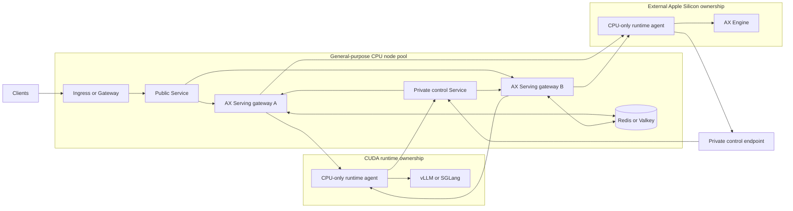
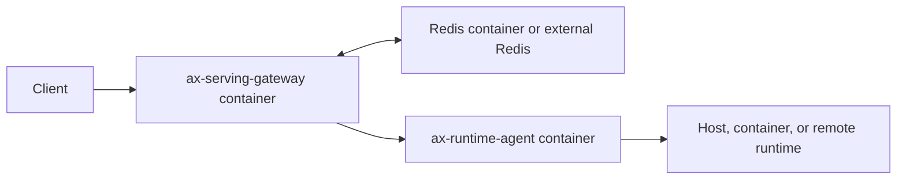

# Technical Specification: CPU-Only OCI and Helm Deployment

| Field | Value |
| --- | --- |
| Status | Approved design; implementation pending |
| Last updated | 2026-07-14 |
| Target | AX Serving 3.x |
| Parent specification | [Hybrid runtime control plane](TECH-SPEC-HYBRID-RUNTIME-CONTROL-PLANE.md) |
| PRD | [CPU-only container deployment requirements](../prd/PRD-CPU-ONLY-CONTAINER-DEPLOYMENT.md) |
| Decision | [ADR-014](../adr/ADR-014-CPU-ONLY-OCI-AND-HELM-DEPLOYMENT.md) |

## 1. Purpose

This specification defines how AX Serving becomes a CPU-only container product delivered through
OCI images and Helm. It covers:

- portable image contents and build boundaries;
- Docker and Compose behavior;
- Helm chart structure and values;
- gateway readiness, routability, and shutdown semantics;
- runtime-agent service discovery;
- in-cluster and external networking;
- CPU resources, placement, availability, and autoscaling;
- secrets, transport, and Pod security;
- monitoring and diagnostics;
- release supply chain;
- CI, cluster, upgrade, and certification tests;
- migration from the current Kustomize baseline.

The specification extends the runtime-neutral protocol and routing architecture. It does not move
runtime execution, model lifecycle, or accelerator ownership into AX Serving.

## 2. Current implementation assessment

### 2.1 Foundations to retain

The repository already has these correct foundations:

- `ax-serving-api` defaults to its portable `gateway` feature.
- `ax-serving-cli` builds `ax-serving-api` and `ax-servingctl` without embedded compatibility.
- `ax-thor-agent` builds the portable `ax-runtime-agent` binary.
- CI rejects AX Engine, MLX, Metal, CUDA, llama.cpp, PyO3, Protobuf, and embedded compatibility in
  the portable gateway dependency tree.
- `packaging/container/Dockerfile` has separate `gateway` and `agent` targets.
- runtime images use a fixed non-root user.
- the gateway Kubernetes Deployment requests CPU and memory only.
- the runtime-agent example assigns `nvidia.com/gpu` only to the vLLM container.
- two gateway replicas, Redis fleet state, a PDB, topology spread, probes, a read-only root
  filesystem, and capability drop are represented in the Kustomize baseline.
- CI builds both container targets and verifies their non-root user.

### 2.2 Gaps this specification closes

| Gap | Required correction |
| --- | --- |
| No Helm chart | Add a versioned chart, schema, templates, tests, and OCI publication. |
| Images not released | Build, scan, sign, attest, and publish multi-platform images. |
| Worker-dependent `/readyz` | Make readiness control-plane specific and add `/routablez`. |
| Worker-dependent readiness creates a registration bootstrap cycle | Make readiness independent of runtime routability; keep the control Service limited to ready gateways. |
| `legacy_compat` manifest default | Make explicit deployment mode the production default. |
| Cluster-only network model | Add private external control exposure and external CIDR policy. |
| Numeric-only agent address | Accept advertised HTTP(S) URI with DNS host support. |
| Ninety-second Pod grace vs 300-second request timeout | Add bounded drain and validate deadline relationships. |
| No Compose product workflow | Add a tested evaluation stack and image-local probe command. |
| ConfigMap changes do not restart Pods | Add config checksum and external-secret rollout controls. |
| Agent has no CPU resource guidance | Add explicit agent resource profiles in integration examples. |
| Public Service reaches admin paths | Add default ingress path restriction and plan a separate admin listener. |

## 3. Target topology

### 3.1 Production Kubernetes topology



All gateway replicas must reach every eligible advertised agent endpoint. Runtime agents initiate
registration and heartbeat traffic to the private control endpoint. No inference request passes
through Redis.

### 3.2 Docker evaluation topology



On macOS, AX Engine remains a native host process. An agent container may reach it through the
documented host gateway name, or the agent may run natively. The AX Serving gateway does not run
MLX inside Docker Desktop.

## 4. Artifact contract

### 4.1 OCI images

The release produces:

```text
${REGISTRY}/ax-serving-gateway:${VERSION}
${REGISTRY}/ax-runtime-agent:${VERSION}
```

Each tag resolves to one OCI image index containing:

- `linux/amd64`;
- `linux/arm64`.

Each platform image uses the same source revision and application version. Release metadata records
the image-index digest and each platform-manifest digest.

### 4.2 Image contents

The gateway image contains only:

- `/usr/local/bin/ax-serving-api`;
- `/usr/local/bin/ax-servingctl`;
- required runtime CA and TLS libraries;
- license and OCI metadata where required.

The runtime-agent image contains only:

- `/usr/local/bin/ax-runtime-agent`;
- required runtime CA and TLS libraries;
- license and OCI metadata where required.

Neither image contains:

- `ax-serving` embedded compatibility binary;
- `ax-serving-engine`;
- AX Engine libraries;
- MLX, Metal, CUDA, llama.cpp, or Python runtime libraries;
- model files or model-download clients beyond ordinary HTTP functionality required by the
  gateway or agent;
- compiler, package manager, source tree, or build cache.

### 4.3 OCI labels

Both images set at least:

```text
org.opencontainers.image.title
org.opencontainers.image.description
org.opencontainers.image.version
org.opencontainers.image.revision
org.opencontainers.image.source
org.opencontainers.image.licenses
org.opencontainers.image.created
```

### 4.4 Runtime user and filesystem

- UID and GID: `65532:65532`.
- Working directory: a non-privileged directory.
- Default signal: SIGTERM.
- Root filesystem: compatible with read-only execution.
- No Linux capability is required.
- Writable temporary storage, if needed, is mounted explicitly at `/tmp`.

### 4.5 Build strategy

`packaging/container/Dockerfile` remains multi-stage and provides `gateway` and `agent` targets.
The build must:

1. use a pinned Rust toolchain compatible with `rust-toolchain.toml` or workspace policy;
2. use `cargo build --locked --release`;
3. build only portable packages and binaries;
4. support BuildKit cache mounts for the Cargo registry, Git checkout cache, and target cache;
5. pin builder and runtime base images by digest in release automation;
6. produce native AMD64 and ARM64 images through native builders or a verified cross-build path;
7. run each platform image before publication.

QEMU-only compilation may be used for development, but release publication should prefer native
builders when build time or native dependency behavior makes emulation unreliable.

### 4.6 Forbidden-dependency policy

CI evaluates the normal dependency trees of:

```bash
cargo tree -p ax-serving-api
cargo tree -p ax-serving-cli --no-default-features --features gateway
cargo tree -p ax-thor-agent
```

The job fails if a portable release path contains any of:

```text
ax-serving-engine
ax-serving-grpc-compat
ax-engine-*
mlx-rs
mlx-sys
metal
llama-cpp
cudarc
pyo3
tonic
prost
```

The image SBOM is checked independently so an unexpected native library or packaged artifact also
fails policy.

## 5. Gateway operational state

### 5.1 State model

Add a process-wide operational state shared by the public and internal routers:

```rust
pub struct GatewayOperationalState {
    pub draining: AtomicBool,
    pub accepted_inflight: AtomicU64,
    pub listeners_ready: AtomicBool,
    pub fleet_store_health: FleetStoreHealth,
    pub started_at: Instant,
}

pub struct FleetStoreHealth {
    pub last_success_unix_ms: AtomicU64,
    pub consecutive_failures: AtomicU64,
}
```

The memory fleet store is always dependency-ready after initialization. Redis/Valkey readiness
requires a successful operation newer than `fleet_store_ready_max_stale_ms`.

New configuration:

| Environment variable | Default | Meaning |
| --- | --- | --- |
| `AXS_FLEET_STORE_READY_MAX_STALE_MS` | `15000` | Maximum age of the last successful shared-store operation before readiness fails. |
| `AXS_SHUTDOWN_PROPAGATION_MS` | `5000` | Time between readiness failure and listener shutdown. |
| `AXS_SHUTDOWN_DRAIN_SECS` | `300` | Maximum graceful wait for accepted work. |
| `AXS_SHUTDOWN_HARD_SECS` | `330` | Final process deadline including propagation and cleanup. |

Validation requires:

```text
shutdown_hard_secs * 1000
  > shutdown_propagation_ms + (shutdown_drain_secs * 1000)
```

The strict inequality reserves bounded cleanup time after the propagation and drain windows.

The chart additionally requires:

```text
terminationGracePeriodSeconds > shutdown_hard_secs
```

### 5.2 Liveness

`GET /livez` is unauthenticated and returns `200` while the process event loop can answer requests.
It does not inspect runtimes, Redis, queue capacity, or routability.

Response:

```json
{
  "status": "live"
}
```

Liveness failure is reserved for a condition where restart is useful. Downstream runtime or Redis
failure must not create a restart loop.

### 5.3 Readiness

`GET /readyz` is unauthenticated. It returns `200` when:

- configuration validation completed;
- public and internal listeners are bound;
- the process is not draining;
- the required fleet store is within its freshness threshold.

It does not require an eligible worker.

Ready response:

```json
{
  "status": "ready",
  "fleet_store": "ready",
  "draining": false
}
```

Not-ready response:

```json
{
  "status": "not_ready",
  "reason": "fleet_store_stale",
  "retry_after_seconds": 5
}
```

Stable reason values are:

```text
starting
draining
fleet_store_stale
fleet_store_unavailable
internal_error
```

### 5.4 Routability

`GET /routablez` is an unauthenticated, non-identifying summary. It returns `200` when at least one
healthy, non-draining, protocol-compatible deployment is eligible, otherwise `503`.

```json
{
  "status": "routable"
}
```

or:

```json
{
  "status": "not_routable",
  "retry_after_seconds": 5
}
```

The endpoint exposes no fleet counts, worker IDs, model IDs, addresses, digests, or trust-domain
details. Scoped routability and counts remain available through authenticated diagnostics, metrics,
and admin APIs.

### 5.5 Inference behavior without runtimes

When the gateway is ready but no compatible runtime is eligible, inference returns:

- HTTP `503 Service Unavailable`;
- `Retry-After` using the configured retry delay;
- stable AX error code `no_eligible_runtime` or a more specific safe code;
- a request ID;
- no broad retry after any response commitment.

This is an operational capacity response, not gateway process failure.

## 6. Graceful shutdown

### 6.1 Admission guard

Every admitted public inference request owns an `AcceptedRequestGuard`. It increments
`accepted_inflight` after authentication and admission succeed and decrements on blocking response
completion, stream termination, cancellation, or error.

When `draining` is true, new inference admission fails before dispatch with:

```text
HTTP 503
Retry-After: <configured>
code: gateway_draining
X-Ax-Admission-State: not-admitted
```

Health, authenticated status, and required control-plane cleanup routes remain available during the
drain window.

### 6.2 Signal sequence

SIGTERM and SIGINT initiate one idempotent shutdown sequence:

1. Set `draining = true`.
2. `/readyz` begins returning `503` immediately.
3. Wait `shutdown_propagation_ms` for EndpointSlice, ingress, and load-balancer convergence.
4. Stop accepting new public connections and new inference admission.
5. Continue serving accepted requests and streams.
6. Wait until `accepted_inflight == 0` or `shutdown_drain_secs` expires.
7. Cancel remaining upstream requests and release local/shared reservations.
8. Stop the internal listener after cleanup or when the hard deadline approaches.
9. Exit no later than `shutdown_hard_secs` after signal receipt.

The implementation must not wait indefinitely inside Axum graceful shutdown. A hard deadline owns
the final cancellation and process exit.

### 6.3 Kubernetes lifecycle

Default chart values:

```yaml
gateway:
  terminationGracePeriodSeconds: 360
  shutdown:
    propagationMilliseconds: 5000
    drainSeconds: 300
    hardSeconds: 330
```

No shell-based preStop sleep is required when the application implements the readiness transition
and propagation delay. A preStop hook may be provided only as an optional compatibility fallback.

## 7. Runtime-agent advertised endpoint

### 7.1 Configuration migration

Introduce:

```text
AXS_NODE_ADVERTISED_URL
```

Examples:

```text
http://10.20.30.40:18081
http://ax-runtime-agent.runtime.svc.cluster.local:18081
https://agent-01.inference.internal:18443
```

Retain `AXS_NODE_ADVERTISED_ADDR` for one deprecation window. When only the old value is present, it
is normalized to `http://<socket-address>`.

### 7.2 Validation

The advertised URL:

- uses `http` or `https` only;
- contains a DNS host or non-wildcard IP;
- contains an explicit port;
- contains no user information, query, fragment, or non-root path;
- is consistent with the transport profile;
- is never logged with credentials;
- is preserved as a validated URL in protocol registration.

`0.0.0.0`, `[::]`, and loopback addresses are rejected for a remote trust profile. DNS resolution
failure prevents eligibility and produces a bounded diagnostic.

### 7.3 Agent placement patterns

#### Sidecar pattern

The agent and runtime share a Pod and communicate over loopback. Only the runtime container requests
an accelerator. The agent has explicit CPU and memory resources and no device mounts.

#### Separate CPU Deployment pattern

The agent runs on a CPU node and communicates with the runtime through a private Service. This is
required when policy forbids AX Serving processes on GPU nodes. Runtime and agent rollout ownership
must still preserve one stable deployment identity and drain sequence.

#### External host pattern

The agent runs natively or in a container on an external Mac or CUDA host. It reaches the private
control endpoint and advertises an address resolvable and routable from all gateways.

## 8. Docker and Compose specification

### 8.1 Image health probe

Extend `ax-servingctl` with:

```text
ax-servingctl probe live  --url http://127.0.0.1:18080
ax-servingctl probe ready --url http://127.0.0.1:18080
ax-servingctl probe routable --url http://127.0.0.1:18080
```

The commands use short bounded timeouts, emit no secrets, and return nonzero when the selected probe
is unsuccessful. The gateway image uses the live probe for Docker `HEALTHCHECK`. Compose uses ready
for startup dependency and exposes routability as a separate operator check.

### 8.2 Compose layout

Add:

```text
deploy/compose/compose.yaml
deploy/compose/.env.example
deploy/compose/README.md
deploy/compose/config/serving.yaml
```

Services:

| Service | Default profile | Purpose |
| --- | --- | --- |
| `gateway` | default | CPU-only public gateway |
| `redis` | default | Evaluation fleet store with local volume |
| `runtime-agent` | optional example | CPU-only adapter pointed at an operator-supplied runtime URL |

Compose requirements:

- no working default credential is committed;
- `.env.example` contains placeholders only;
- gateway and Redis health checks are defined;
- gateway waits for Redis health, not runtime routability;
- images or builds select explicit targets;
- read-only filesystem, capability drop, init, restart policy, and resource examples are included;
- runtime-agent DNS advertisement works through `AXS_NODE_ADVERTISED_URL`;
- macOS host-runtime guidance uses the documented host gateway and a published dispatch port;
- the README explicitly states that Compose is not HA certification.

### 8.3 Docker run contract

The minimal documented command includes:

```text
--read-only
--cap-drop=ALL
--security-opt=no-new-privileges:true
--tmpfs=/tmp
--stop-timeout=<greater-than-hard-shutdown>
--env-file=<operator-owned-file>
--publish=18080:18080
```

Redis, control, and runtime-agent addresses are supplied explicitly. Production credentials should
use orchestrator-managed secrets rather than shell history or committed env files.

## 9. Helm chart layout

Create:

```text
deploy/helm/ax-serving/
├── Chart.yaml
├── README.md
├── values.yaml
├── values.schema.json
├── templates/
│   ├── NOTES.txt
│   ├── _helpers.tpl
│   ├── configmap.yaml
│   ├── deployment.yaml
│   ├── hpa.yaml
│   ├── ingress.yaml
│   ├── gateway-api.yaml
│   ├── networkpolicy.yaml
│   ├── pdb.yaml
│   ├── service-public.yaml
│   ├── service-control.yaml
│   ├── serviceaccount.yaml
│   ├── servicemonitor.yaml
│   └── tests/
│       ├── test-live.yaml
│       └── test-control.yaml
└── ci/
    ├── values-minimal.yaml
    ├── values-production.yaml
    ├── values-external-agents.yaml
    ├── values-hpa.yaml
    └── values-gateway-api.yaml
```

The chart has no runtime or Redis dependency in `Chart.yaml`. Redis is external in production. The
Compose workflow supplies evaluation Redis separately.

The first release uses chart API v2 for Helm 3 and Helm 4 compatibility. CI runs the latest
supported patch of both client majors and records the exact versions in release evidence. Adopting
chart API v3 or a Helm-4-only feature requires an explicit support-policy change and migration
plan.

## 10. Helm values contract

### 10.1 Top-level values

The stable top-level structure is:

```yaml
production:
  enabled: false
  requireImageDigest: true

image:
  repository: ghcr.io/defai-digital/ax-serving-gateway
  tag: ""
  digest: ""
  pullPolicy: IfNotPresent
  pullSecrets: []

gateway:
  replicaCount: 2
  resources:
    requests:
      cpu: 250m
      memory: 256Mi
    limits:
      memory: 1Gi
  terminationGracePeriodSeconds: 360
  shutdown:
    propagationMilliseconds: 5000
    drainSeconds: 300
    hardSeconds: 330
  podAnnotations: {}
  podLabels: {}
  nodeSelector: {}
  affinity: {}
  tolerations: []
  topologySpreadConstraints: []
  priorityClassName: ""
  runtimeClassName: ""

config:
  existingConfigMap: ""
  key: serving.yaml
  inline: {}
  restartNonce: ""

secrets:
  existingSecret: ""
  restartNonce: ""
  keys: {}

redis:
  existingSecret: ""
  urlKey: redis-url

service:
  public: {}
  control: {}

serviceAccount:
  create: true
  name: ""
  annotations: {}
  automountServiceAccountToken: false

ingress: {}
gatewayApi: {}
networkPolicy: {}
podDisruptionBudget: {}
autoscaling: {}
serviceMonitor: {}
```

Names use lower camel case. Related settings are nested only where the grouping is stable and
material to operator comprehension.

### 10.2 Image selection

Image reference rendering follows:

```text
repository@digest                 when digest is set
repository:tag                    otherwise
repository:Chart.AppVersion       when neither is set and production.enabled is false
```

When `production.enabled=true`, template validation requires `image.digest` unless an explicit
policy override is enabled. The digest must match `sha256:<64 hexadecimal characters>`.

### 10.3 Resources

Initial non-certified defaults:

```yaml
gateway:
  resources:
    requests:
      cpu: 250m
      memory: 256Mi
    limits:
      memory: 1Gi
```

No CPU limit is required by default because sustained proxy and TLS work should not be unexpectedly
throttled. Operators may set one under cluster policy. These values are installation defaults, not
capacity claims.

Runtime-agent integration examples begin with:

```yaml
resources:
  requests:
    cpu: 50m
    memory: 64Mi
  limits:
    cpu: 500m
    memory: 256Mi
```

Agent values appear only in integration examples or a future separate agent chart, not the core
gateway chart.

### 10.4 Application configuration

If `config.existingConfigMap` is empty, the chart renders `config.inline` as `serving.yaml` without
using Helm `tpl`. The production CI profile supplies:

```yaml
orchestrator:
  host: 0.0.0.0
  port: 18080
  internal_bind_addr: 0.0.0.0
  internal_port: 19090
  deployment_mode: explicit
  tls_profile: trusted_mesh
  fleet_store: redis
```

Pools, deployments, and equivalence classes are operator data. The default chart can install with
empty routing configuration and report not routable. It must not invent a default model identity or
equivalence relationship.

### 10.5 Secret references

`secrets.existingSecret` is required when production mode is enabled. Default key mapping:

```yaml
secrets:
  keys:
    apiKey: api-key
    adminApiKey: admin-api-key
    internalApiToken: internal-api-token
    dispatchToken: dispatch-token
    cacheAffinitySecret: cache-affinity-secret
```

Redis may use the same Secret or `redis.existingSecret`. The chart does not render secret values,
generate durable credentials, or retrieve Secret contents with Helm `lookup`.

Because an existing Secret change does not alter the Deployment template automatically, operators
use one of:

- `secrets.restartNonce`;
- an external reloader annotation supplied through `gateway.podAnnotations`;
- an explicit `helm upgrade` with a changed rollout annotation.

### 10.6 Config checksum

When the chart renders the ConfigMap, the Pod template includes:

```yaml
checksum/config: <sha256 of rendered config>
```

When an existing ConfigMap is used, `config.restartNonce` provides the rollout identity. The chart
must document that updating an external ConfigMap without changing this identity does not restart
Pods.

### 10.7 Schema and template validation

`values.schema.json` validates types, enums, formats, and basic ranges. Template helper functions
perform cross-field checks that JSON Schema cannot express cleanly:

- public and control ports differ;
- production mode uses explicit deployment mode;
- production HA uses Redis/Valkey;
- production mode references a Secret;
- image digest is present under immutable-image policy;
- hard shutdown exceeds the propagation and drain windows combined;
- Pod termination grace is greater than hard shutdown;
- HPA minimum replicas is at least two under HA policy;
- no chart value introduces a GPU resource through a supported field.

## 11. Kubernetes templates

### 11.1 Gateway Deployment

The Deployment defaults to:

```yaml
replicas: 2
strategy:
  type: RollingUpdate
  rollingUpdate:
    maxUnavailable: 0
    maxSurge: 1
```

Pod requirements:

- `automountServiceAccountToken: false`;
- `runAsNonRoot: true`;
- `runAsUser`, `runAsGroup`, and `fsGroup` compatible with UID 65532;
- `seccompProfile.type: RuntimeDefault`;
- `allowPrivilegeEscalation: false`;
- all capabilities dropped;
- read-only root filesystem;
- named public and control ports;
- liveness, readiness, and startup probes;
- explicit resources;
- unique `AXS_GATEWAY_ID` derived from Pod UID or name;
- config volume mounted read-only;
- optional writable `emptyDir` at `/tmp`;
- configuration and secret rollout annotations;
- termination grace validated against shutdown settings.

The chart exposes generic node selector, affinity, toleration, topology, priority, and runtime-class
values. It sets no GPU node label, toleration, or runtime class by default.

### 11.2 Public Service

Default:

```yaml
type: ClusterIP
port: 80
targetPort: public
publishNotReadyAddresses: false
```

The public Service selects ready gateway Pods. Operators expose it through ingress or Gateway API.
Session affinity is disabled because fleet state and request routing are gateway-safe across
replicas; cache-affinity remains an application-level opaque hint.

### 11.3 Worker-control Service

Default:

```yaml
type: ClusterIP
port: 19090
targetPort: control
publishNotReadyAddresses: false
```

This Service is private, authenticated, and not referenced by public ingress templates. Because
gateway readiness does not depend on runtime routability, a no-runtime installation still publishes
control endpoints as soon as gateway configuration, listeners, and the fleet store are ready.
Starting, dependency-unready, and draining gateways remain excluded. Runtime agents must retry
registration with bounded exponential backoff and jitter and reconnect across Service endpoints.

Optional external-agent profile:

- internal `LoadBalancer` Service with operator-supplied annotations; or
- private Gateway API route when supported by the platform; or
- no Service exposure when an overlay network or service mesh supplies connectivity.

The chart cannot infer cloud-specific internal load-balancer annotations.

### 11.4 PodDisruptionBudget

PDB is enabled when replica count is greater than one. Default:

```yaml
maxUnavailable: 1
```

Operators may choose `minAvailable`, but the chart does not render both. PDB protects voluntary
disruption; it is not a substitute for replicas, topology, or rollout testing.

### 11.5 Topology

Recommended production profile includes soft spreading by zone and hostname. Clusters with known
capacity may select hard `DoNotSchedule` behavior. Defaults must not make a single-node development
cluster unschedulable.

### 11.6 Autoscaling

HPA is disabled by default until capacity evidence exists. When enabled:

- API version is `autoscaling/v2`;
- minimum replicas defaults to two;
- CPU utilization is allowed only because the container has a CPU request;
- scale-down stabilization is longer than scale-up stabilization;
- custom metrics may target active requests, queued requests, or request rate;
- runtime GPU utilization is not a gateway HPA metric.

Suggested starting behavior:

```yaml
behavior:
  scaleUp:
    stabilizationWindowSeconds: 0
  scaleDown:
    stabilizationWindowSeconds: 300
```

Custom-metric names and adapters are platform-specific and therefore values, not chart
dependencies.

### 11.7 Ingress and Gateway API

Ingress and Gateway API resources are disabled by default. When enabled, the public route permits
only the documented client surface. Admin, deployment-job, diagnostics, audit, and metrics paths
are not published by default.

TLS termination is mandatory in production. The chart references an existing certificate Secret or
platform-managed certificate; it does not generate a self-signed production certificate.

### 11.8 ServiceMonitor

ServiceMonitor is optional and rendered only when enabled. It targets a private Service or an
authenticated scrape proxy. The chart does not place an admin bearer token directly in a committed
ServiceMonitor. Operator-specific authorization mechanisms are supplied through values and
existing Secrets where supported.

## 12. NetworkPolicy specification

### 12.1 Default-deny posture

When NetworkPolicy is enabled, the chart isolates gateway ingress and egress and then permits only
configured channels. The operator must confirm that the cluster CNI enforces NetworkPolicy.

### 12.2 Ingress rules

Public ingress may be selected by:

- ingress-controller namespace and Pod selectors;
- API-gateway namespace and Pod selectors;
- explicit trusted CIDRs for direct private access.

Worker-control ingress may be selected by:

- runtime-agent namespace and Pod selectors;
- explicit external agent CIDRs.

The empty `from` rule is not a production default for the control port.

### 12.3 Egress rules

Gateway egress supports independent peers for:

- Redis/Valkey by namespace/Pod selector or CIDR;
- runtime agents by namespace/Pod selector or CIDR;
- DNS by namespace/Pod selector and UDP/TCP 53;
- OTLP/telemetry endpoint by selector or CIDR;
- certificate or identity services where required by the platform.

Standard NetworkPolicy does not select arbitrary DNS names. Operators using managed services must
provide stable CIDRs, a CNI-specific FQDN policy, or an egress gateway. The chart does not silently
open all egress when an external hostname is supplied.

### 12.4 External Apple Silicon path

An external AX Engine node requires:

1. a private route from agent to the gateway control endpoint;
2. a private route from every gateway to the agent dispatch endpoint;
3. resolvable advertised agent URI;
4. control and dispatch credentials;
5. trusted transport or private overlay policy;
6. allowed control source CIDR;
7. gateway egress CIDR permission;
8. retained connectivity and reconnect test evidence.

The chart documents these prerequisites but does not create the cross-network route.

## 13. Security specification

### 13.1 Credential separation

The gateway receives separate environment variables from an existing Secret:

```text
AXS_API_KEY
AXS_ADMIN_API_KEY
AXS_INTERNAL_API_TOKEN
AXS_DISPATCH_TOKEN
AXS_CACHE_AFFINITY_SECRET
AXS_REDIS_URL
```

The runtime agent receives:

```text
AXS_WORKER_TOKEN
AXS_DISPATCH_TOKEN
AXS_RUNTIME_API_KEY, when required
```

Public credentials are never forwarded to a runtime. Runtime credentials are never sent to the
gateway or client. Control credentials are not accepted by public/admin routes.

### 13.2 Transport profiles

`loopback_dev` is valid only for loopback listeners. Container and Helm production profiles use
`trusted_mesh`. That setting is an assertion that the platform provides authenticated trusted
transport; it does not create TLS itself.

External-agent documentation must name the concrete transport mechanism used by the deployment.
An unauthenticated public LoadBalancer on the control port is invalid even if bearer tokens exist.

### 13.3 Pod and image security

Core chart policy requires:

- no privileged mode;
- no host PID, IPC, or network namespace;
- no hostPath volume;
- no host device;
- no added capability;
- no service-account token;
- non-root execution;
- read-only root filesystem;
- RuntimeDefault seccomp;
- immutable image support;
- resource requests and memory limit;
- no accelerator extended resource.

### 13.4 Admin exposure

The application currently serves public and admin routes on one public listener. The chart mitigates
this by excluding admin and metrics paths from generated public ingress/Gateway rules. A future
application change should add a dedicated admin listener; that change requires a separate API and
compatibility review.

## 14. Observability and autoscaling signals

### 14.1 Application metrics

Retain the bounded `axs_gateway_*` metrics and add:

```text
axs_gateway_ready
axs_gateway_routable
axs_gateway_draining
axs_gateway_fleet_store_ready
axs_gateway_accepted_inflight
axs_gateway_shutdown_forced_total
```

No metric includes request IDs, worker IDs, addresses, prompts, credentials, or artifact paths as
labels.

### 14.2 Container and Kubernetes metrics

Dashboards and release evidence include:

- CPU usage and throttling;
- RSS, working set, and OOM events;
- open file descriptors and connections;
- Pod restart and termination reason;
- desired, ready, available, and updated replicas;
- HPA desired replicas and limiting metric;
- PDB allowed disruptions;
- rollout duration;
- EndpointSlice ready/serving/terminating counts;
- Redis latency and errors;
- external-agent reconnect and heartbeat age.

### 14.3 Alert behavior

Separate alerts distinguish:

- gateway process unavailable;
- fleet store stale or unavailable;
- gateway ready but fleet not routable;
- queue or admission pressure;
- runtime capacity pressure;
- forced shutdown with remaining requests;
- configuration rollout stuck;
- agent reconnect storm.

Runtime loss does not page as a gateway crash unless the gateway itself is unavailable.

## 15. Release workflow

### 15.1 Build and publish sequence

For a version tag:

1. Validate source versions and release evidence.
2. Run Rust, SDK, security, chart, Compose, and disposable-cluster tests.
3. Build gateway and agent images for AMD64 and ARM64.
4. Run platform-specific smoke tests.
5. Generate image SBOMs and vulnerability results.
6. Push platform manifests and assemble immutable image indexes.
7. Generate provenance attestations and signatures for image indexes.
8. Render the chart with the released image digests.
9. Lint, package, sign, and publish the Helm chart as OCI.
10. Publish a machine-readable release manifest.
11. Attach human release notes and verification commands.

### 15.2 Release manifest

Example schema:

```json
{
  "schema_version": "ax-serving.release/v1",
  "version": "3.0.0",
  "source_revision": "<git-sha>",
  "images": {
    "gateway": {
      "index_digest": "sha256:<digest>",
      "platforms": {
        "linux/amd64": "sha256:<digest>",
        "linux/arm64": "sha256:<digest>"
      }
    },
    "runtime_agent": {
      "index_digest": "sha256:<digest>",
      "platforms": {
        "linux/amd64": "sha256:<digest>",
        "linux/arm64": "sha256:<digest>"
      }
    }
  },
  "helm": {
    "reference": "oci://<registry>/charts/ax-serving",
    "digest": "sha256:<digest>"
  },
  "evidence": {
    "sbom": [],
    "provenance": [],
    "signatures": [],
    "certification": "pending"
  }
}
```

The manifest contains references and digests, never credentials.

### 15.3 Publication policy

- Semantic tags are convenience aliases.
- Production examples use digests.
- Prerelease chart and image versions use matching prerelease identifiers.
- Chart publication waits for both image indexes.
- A chart is not promoted if either architecture failed its smoke test.
- Vulnerability policy distinguishes exploitable vulnerabilities from documented informational
  maintenance notices.
- Production certification state is explicit and cannot be inferred from artifact publication.

## 16. CI and verification matrix

### 16.1 Static checks

- `cargo fmt --all -- --check`;
- portable gateway and agent check, clippy, and tests on AMD64 and ARM64;
- forbidden Cargo dependency check;
- Dockerfile lint and build-target validation;
- shell, YAML, JSON, and chart schema parsing;
- `helm lint --strict` and render tests on the supported Helm 3 and Helm 4 client versions;
- template rendering for every `ci/values-*.yaml` profile;
- Kubernetes schema validation using a pinned validator and supported version matrix;
- rendered policy rejecting privileged fields and accelerator resources;
- chart documentation and values consistency check;
- secret-pattern scan;
- release-manifest schema test.

### 16.2 Image tests

For each platform and image:

1. Verify effective user `65532:65532`.
2. Verify expected entrypoint.
3. Verify version and revision labels.
4. Start under read-only root, capability drop, and no-new-privileges.
5. Verify liveness and expected readiness behavior.
6. Inspect SBOM for forbidden dependencies.
7. Run vulnerability policy.
8. Verify no accelerator device or runtime requirement.
9. Send SIGTERM with an active request in the integration profile.

### 16.3 Helm render profiles

Required profiles:

| Profile | Purpose |
| --- | --- |
| minimal | One development replica, memory store, no ingress. |
| production | Two replicas, Redis, immutable image, existing Secret, PDB, topology. |
| external agents | Private control exposure and external agent/Redis CIDRs. |
| HPA | Autoscaling with resource and custom metric examples. |
| Gateway API | Public route with admin paths excluded. |
| restricted security | Read-only root, restricted policy, no service-account token. |

Every profile must render deterministically and contain no Secret value.

### 16.4 Disposable-cluster tests

Use a pinned Kubernetes version matrix with at least one supported current minor and the oldest
supported minor.

Test sequence:

1. Install Redis test dependency and the chart with no runtime.
2. Wait for gateway readiness; confirm routability is false.
3. Confirm the private control Service has endpoints before runtime routability becomes true.
4. Start a mock protocol-v1 runtime agent.
5. Confirm registration, heartbeat, and routability transition.
6. Run blocking and streaming inference through the public Service.
7. Scale gateway from two to three and back to two.
8. Restart Redis and verify readiness/recovery semantics.
9. Delete one gateway during an active stream.
10. Upgrade to a new image/config generation and roll back.
11. Enable NetworkPolicy and repeat required connectivity checks.
12. Run `helm test`.
13. Uninstall and verify no namespaced resource leak owned by the release.

### 16.5 External-agent conformance

Before production certification, retain evidence for:

- native AX Engine and agent on Apple Silicon outside the cluster;
- vLLM or SGLang and agent in a CUDA environment;
- private control registration in both directions;
- gateway-to-agent dispatch from every gateway replica;
- DNS and IP advertised endpoints;
- agent restart and address change;
- control credential rotation;
- network interruption and reconnect;
- runtime drain and removal;
- no accelerator dependency in the agent process.

### 16.6 Scale and soak profile

The initial certification profile includes:

- two or more gateways;
- 32 agents across at least two pools;
- 256 concurrent streams;
- mixed blocking and streaming traffic;
- one Redis restart or failover;
- one gateway rolling update;
- one runtime-pool loss and recovery;
- at least 60 minutes of retained metrics and request outcomes.

The profile records machine types, image and chart digests, source revision, configuration digest,
runtime identities, request mix, CPU, RSS, queue, errors, retries, cancellation, and latency.

## 17. Kustomize migration

The current `deploy/kubernetes/base` remains available during one migration window.

Migration rules:

1. Correct the readiness/control bootstrap behavior in both Helm and Kustomize immediately.
2. Mark the Kustomize directory as an integration example after the first chart release.
3. Add a CI comparison for stable labels, ports, probes, security context, and resource defaults.
4. Document value mappings from the old ConfigMap and Secrets.
5. Do not add a new feature only to Kustomize.
6. After one stable release, decide whether to generate the Kustomize example from chart output or
   deprecate it.

Example mapping:

| Existing manifest | Helm value/template |
| --- | --- |
| `gateway-deployment.yaml` | `gateway.*`, `image.*`, Deployment template |
| `gateway-services.yaml` | `service.public.*`, `service.control.*` |
| `config-map.yaml` | `config.inline` or `config.existingConfigMap` |
| `gateway-pdb.yaml` | `podDisruptionBudget.*` |
| `network-policy.yaml` | `networkPolicy.*` |
| `service-account.yaml` | `serviceAccount.*` |

## 18. Implementation plan

### PR 1: Health and bootstrap semantics

- Add `GatewayOperationalState`.
- Redefine `/readyz` and add `/routablez`.
- Add stable probe responses and metrics.
- Keep the control Service readiness-aware and add bounded agent registration retry coverage.
- Add fresh-install/registration regression tests.

### PR 2: Bounded gateway shutdown

- Add admission drain state and accepted-request guard.
- Implement propagation, drain, cancellation, and hard deadlines.
- Add shutdown configuration and validation.
- Add active blocking and streaming shutdown tests.
- Reconcile Kubernetes termination grace.

### PR 3: Runtime-agent URL and deployment patterns

- Add `AXS_NODE_ADVERTISED_URL` and compatibility parsing.
- Preserve URL in protocol registration.
- Add DNS, HTTPS-profile, wildcard, and migration tests.
- Update Kubernetes and Docker integration examples.
- Add agent CPU resource guidance.

### PR 4: Container product hardening

- Add image-local probe command.
- Improve Docker build caching and labels.
- Add Compose files and smoke test.
- Add multi-platform image CI and forbidden-SBOM policy.

### PR 5: Helm core chart

- Add chart, schema, helpers, Deployment, Services, ConfigMap, ServiceAccount, PDB, and tests.
- Add production validation and digest support.
- Add render matrices and Kubernetes schema validation.

### PR 6: Helm platform integrations

- Add NetworkPolicy, ingress, Gateway API, HPA, ServiceMonitor, topology, and external-agent
  profiles.
- Add disposable-cluster tests.
- Reconcile Kustomize support level.

### PR 7: OCI release and supply chain

- Publish multi-platform images.
- Generate and verify SBOMs, provenance, signatures, and release manifest.
- Publish signed OCI chart after image publication.
- Add immutable install and rollback documentation.

### PR 8: Production qualification

- Run live AX Engine and CUDA conformance.
- Run HA, partition, upgrade, rollback, scale, and soak suites.
- Attach evidence and update implementation status without changing architecture history.

## 19. Requirement traceability

| Requirement group | Primary implementation sections |
| --- | --- |
| DEP-001 through DEP-009 | Sections 4, 13, 15, and 16 |
| DEP-010 through DEP-016 | Sections 4 and 8 |
| DEP-020 through DEP-035 | Sections 9 through 12 |
| DEP-040 through DEP-048 | Sections 5, 6, and 11 |
| DEP-050 through DEP-057 | Sections 11 through 13 |
| DEP-060 through DEP-066 | Sections 15 and 16 |
| NFR-DEP-001 through NFR-DEP-012 | Sections 4 through 16 |

## 20. Completion criteria

Implementation is complete when:

- every P0 PRD requirement has code or artifact coverage;
- the chart and images are published from one source revision;
- the default rendered chart is CPU-only by dependency, resource, device, and scheduling contract;
- a no-runtime install becomes ready and remains discoverable by runtime agents;
- routability accurately follows runtime eligibility;
- external Apple Silicon and in-cluster CUDA agents pass live conformance;
- planned replacement preserves accepted work within the declared deadline;
- release digests, signatures, SBOMs, provenance, and source verify;
- scale and soak evidence satisfies the certification profile;
- public documentation describes only behavior that has passed the release gates.

Until those conditions are met, the design is approved but the Docker and Helm deployment surface
must be described as an implementation or preview target rather than production certified.

## 21. References

- [Kubernetes EndpointSlices](https://kubernetes.io/docs/concepts/services-networking/endpoint-slices/)
- [Kubernetes Pod lifecycle and termination](https://kubernetes.io/docs/concepts/workloads/pods/pod-lifecycle/)
- [Kubernetes liveness, readiness, and startup probes](https://kubernetes.io/docs/tasks/configure-pod-container/configure-liveness-readiness-startup-probes/)
- [Kubernetes NetworkPolicy](https://kubernetes.io/docs/concepts/services-networking/network-policies/)
- [Kubernetes Pod Security Standards](https://kubernetes.io/docs/concepts/security/pod-security-standards/)
- [Kubernetes Horizontal Pod Autoscaling](https://kubernetes.io/docs/concepts/workloads/autoscaling/horizontal-pod-autoscale/)
- [Helm chart best practices](https://docs.helm.sh/docs/chart_best_practices/)
- [Helm OCI registries](https://docs.helm.sh/docs/topics/registries/)
- [Helm 4 overview](https://docs.helm.sh/docs/overview/)
