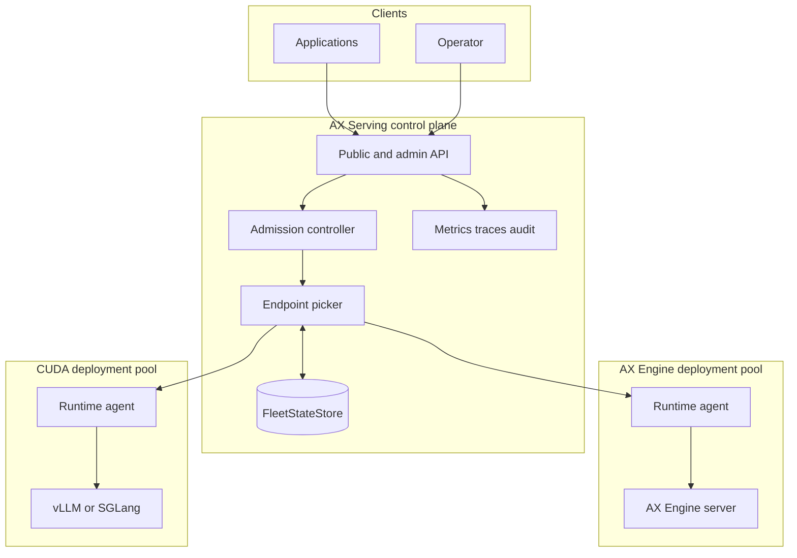

# Technical Specification: Hybrid Runtime Control Plane

| Field | Value |
| --- | --- |
| Status | Approved; core migration implemented, certification pending |
| Last updated | 2026-07-12 |
| Target | AX Serving 3.x |
| PRD | [AX Serving product requirements](../prd/PRD-AX-SERVING.md) |
| Decision | [ADR-013](../adr/ADR-013-RUNTIME-NEUTRAL-HYBRID-INFERENCE-CONTROL-PLANE.md) |

## 1. Purpose

This specification turns ADR-013 into an incremental Rust implementation plan. It defines the
crate boundary, worker protocol, fleet state, deployment identity, endpoint picker, dispatch and
streaming rules, security model, telemetry, compatibility strategy, and verification gates for a
hybrid AX Engine and CUDA runtime fleet.

This remains the target-state specification. The core source migration is implemented; live runtime,
platform, performance, resilience, and release certification remain governed by the
[implementation status ledger](../IMPLEMENTATION-STATUS.md). Existing v1 APIs remain compatible
unless a section explicitly marks them for deprecation.

## 2. Historical current-state review

This section records the pre-migration state that motivated the design. It is not a description of
the current source tree; implementation status is tracked separately so architecture history is not
rewritten as work lands.

The repository has strong foundations that should be retained:

- `crates/ax-serving-api/src/orchestration/registry.rs` implements worker registration,
  heartbeats, TTL-based health, drain state, model inventory, and snapshots.
- `crates/ax-serving-api/src/orchestration/policy.rs` separates endpoint-selection policies.
- `crates/ax-serving-api/src/orchestration/direct.rs` provides a direct HTTP streaming dispatcher.
- `crates/ax-thor-agent` discovers runtime models and metrics and proxies OpenAI-style routes.
- Existing orchestration tests cover registration, eligibility, retries, TTL, and proxy behavior.

The following gaps drive this specification:

1. `ax-serving-api` and its gateway binary still depend on the embedded engine and are compile-time
   restricted to Apple Silicon macOS.
2. `crates/ax-serving-engine/Cargo.toml` pins AX Engine SDK `v4.10.0`, while the live AX Engine
   architecture and SDK have materially changed.
3. `crates/ax-serving-engine/src/ax_engine.rs` shares a session behind a mutex and executes
   generation on request-created threads. This conflicts with the current AX Engine MLX owner-thread
   contract.
4. The embedded adapter hand-implements a limited set of chat templates and request features,
   duplicating semantics now owned by AX Engine.
5. `crates/ax-thor-agent/src/proxy.rs` reports static agent health rather than authoritative upstream
   runtime readiness.
6. `crates/ax-thor-agent/src/agent.rs` can retain stale model inventory after discovery failure and
   continue heartbeating.
7. The current worker DTOs have useful capacity fields but lack protocol version, agent instance,
   runtime-readiness evidence, trust domain, complete deployment identity, and observation freshness.
8. `DispatchContext` is too small to express operation, modality, limits, tenant policy, equivalence,
   and telemetry freshness.
9. Retry behavior does not have a typed pre-admission boundary and therefore cannot safely infer
   retryability from every `5xx`.
10. The current “split scheduler” is request accounting; it must not be presented as prefill/decode
    token scheduling across runtimes.
11. `proto/ax_serving.proto` is an embedded-engine contract: it accepts local model paths and
    Metal/CPU backend types and emits token IDs that OpenAI-style runtime streams do not uniformly
    provide. Translating it in the hybrid gateway would silently weaken its semantics.

The implementation should evolve the existing orchestration path, not replace it wholesale.

## 3. Target topology



The gateway never accesses model weights. Runtime agents and runtimes may be co-located on one host
and communicate over loopback, but they remain separate ownership domains.

One attempt is bound to one runtime endpoint for its entire lifetime. There is no cross-runtime KV
transfer, layer partition, prefill/decode split, or mid-stream migration between MLX and CUDA.

## 4. Crate and binary layout

### 4.1 New crate: `ax-serving-protocol`

Create `crates/ax-serving-protocol` with these constraints:

- dependencies limited to serialization, URL, time, UUID, and error-schema support;
- no Tokio, Axum, Reqwest, runtime SDK, accelerator library, Python, or platform compile guard;
- all public wire types derive `Debug`, `Clone`, `Serialize`, and `Deserialize` when appropriate;
- unknown optional capability strings are preserved;
- enums that cross the wire include an `Unknown(String)` or use validated string newtypes so a
  newer minor version does not break an older peer;
- fixtures are checked into `tests/fixtures/protocol/v1/` and round-trip tested.

Suggested modules:

```text
ax-serving-protocol/src/
├── lib.rs
├── version.rs
├── worker.rs
├── deployment.rs
├── operation.rs
├── telemetry.rs
├── admission.rs
└── error.rs
```

### 4.2 `ax-serving-api`

Change `ax-serving-api` into the portable control plane:

- remove the unconditional `ax-serving-engine` dependency;
- remove the non-macOS compile error from the control-plane path;
- consume all worker wire DTOs from `ax-serving-protocol`;
- retain public REST/SSE, admin, auth, metrics, registry, endpoint picker, dispatcher, and
  orchestration;
- place local embedded model management behind a compatibility interface, not in the gateway state;
- build in CI on `aarch64-apple-darwin`, `x86_64-unknown-linux-gnu`, and
  `aarch64-unknown-linux-gnu`.

### 4.3 Runtime agent

Evolve `crates/ax-thor-agent` into the portable `ax-runtime-agent` implementation. To avoid a flag
day:

- first add an `ax-runtime-agent` binary using the existing crate;
- retain `ax-thor-agent` as a deprecated binary alias for one major release;
- split runtime adapters behind a `RuntimeAdapter` trait;
- support `ax-engine`, `vllm`, and `sglang` adapter names explicitly;
- keep request bodies and streamed responses opaque to the agent except for bounded metadata needed
  for admission, routing headers, and operation allowlisting.

### 4.4 Compatibility crates

`ax-serving-engine`, `ax-serving-shim`, and direct Python bindings remain compatibility products.
They must not be linked into `ax-serving-api`. If local embedded inference remains supported, expose
it through a separate macOS-only binary or process with an explicit `embedded-compat` feature.

Any direct AX Engine SDK adapter must use one dedicated owner thread per session and send commands
over channels. It may not move the MLX session or stream across request threads.

### 4.5 CLI features

Split CLI dependencies so binaries do not inherit unrelated platform requirements:

| Binary | Default role | Runtime SDK linked |
| --- | --- | --- |
| `ax-serving-api` | Portable gateway | No |
| `ax-servingctl` | Portable operator client | No |
| `ax-runtime-agent` | Portable runtime adapter | No; HTTP only |
| `ax-serving` | Local compatibility inference/worker | Only with explicit macOS feature |

CI must run `cargo tree -p ax-serving-api` and fail if `ax-serving-engine`, `ax-engine-sdk`, PyO3,
Metal, MLX, CUDA, or a runtime-specific Python package enters the gateway dependency tree.

### 4.6 gRPC v1 disposition

Keep `ax.serving.v1` and its current Python client available only with the embedded compatibility
binary or feature during its published support window. Do not expose that service from the portable
hybrid gateway: `LoadModel` accepts a gateway-local path, `BackendType` encodes CPU/Metal choices,
and `InferResponse.token_id` is unavailable from standard AX Engine/vLLM OpenAI streams.

The portable gateway's canonical inference protocol is OpenAI-compatible REST with SSE. A future
gRPC service must use a new `ax.serving.v2` package, logical model aliases, deployment-neutral
errors, explicit commitment/cancellation semantics, and the same `RequestProfile` and endpoint
picker. It is out of scope until demand and a separate protocol specification justify it.

## 5. Protocol versioning

### 5.1 Version type

Protocol version is independent of the AX Serving product version:

```rust
#[derive(Debug, Clone, Copy, PartialEq, Eq, Serialize, Deserialize)]
pub struct ProtocolVersion {
    pub major: u16,
    pub minor: u16,
}
```

Rules:

- Major versions define incompatible required semantics.
- Minor versions may add optional fields, enum values, metrics, or capabilities.
- The sender omits unsupported optional fields rather than inventing zero values.
- The receiver ignores unknown optional fields and preserves unknown capability strings where
  forwarding or diagnostics require it.
- Registration fails with `AXS_PROTOCOL_INCOMPATIBLE` when there is no supported major version.
- The registration response contains the negotiated version and feature set.

Protocol v1 requires JSON over HTTP for control messages and HTTP/SSE for inference. A future binary
or gRPC encoding of the worker protocol must preserve the same semantic contract and requires a
separate ADR.

### 5.2 Protocol capabilities

Initial capability names are stable lowercase dotted strings:

```text
control.inventory-delta
control.drain
control.deployment-jobs
dispatch.typed-admission
dispatch.cancel
inference.chat
inference.completions
inference.embeddings
inference.vision
inference.tools
inference.structured-output
telemetry.capacity
telemetry.kv-cache
telemetry.prefix-cache
```

Capabilities describe implemented protocol behavior, not marketing names. The model descriptor
separately declares whether a specific deployment supports an inference capability.

## 6. Core domain model

### 6.1 Strong identifiers

Use validated newtypes rather than interchangeable strings:

```rust
pub struct WorkerId(pub String);
pub struct WorkerInstanceId(pub Uuid);
pub struct RegistrationId(pub Uuid);
pub struct PoolId(pub String);
pub struct RuntimeModelId(pub String);
pub struct LogicalModelId(pub String);
pub struct DeploymentId(pub String);
pub struct EquivalenceClassId(pub String);
pub struct TrustDomainId(pub String);
pub struct RequestId(pub Uuid);
pub struct AttemptId(pub Uuid);
```

Infrastructure identifiers must be 1-128 ASCII characters from `[A-Za-z0-9._:-]`. Logical and
runtime model identifiers may be up to 256 bytes and additionally accept repository-style `/`,
`@`, and `+` characters because AX Engine, vLLM, and SGLang commonly expose Hugging Face-style
names. Empty, leading, trailing, `.` and `..` path segments remain invalid. UUID-backed identifiers
are generated by the component that owns their lifecycle. Never interpret a model identifier as a
filesystem path.

`WorkerId` is stable operator identity. `WorkerInstanceId` changes on every agent process start.
`RegistrationId` changes whenever the gateway grants a new lease. This prevents a delayed heartbeat
from a previous process instance from reviving a replacement worker.

### 6.2 Runtime operation

```rust
pub enum Operation {
    ChatCompletions,
    TextCompletions,
    Embeddings,
    Responses,
}
```

Modality and behavior capabilities are separate sets, for example `text`, `image`, `tools`,
`structured_output`, and `logprobs`. Do not overload a generic `llm` string to mean every operation.

### 6.3 Runtime model observation

The agent reports what the runtime currently serves. The control plane maps that observation to a
declared deployment.

```rust
pub struct RuntimeModelDescriptor {
    pub runtime_model_id: RuntimeModelId,
    pub revision: Option<String>,
    pub artifact_digest: Option<String>,
    pub tokenizer_digest: Option<String>,
    pub template_digest: Option<String>,
    pub quantization: Option<String>,
    pub operations: BTreeSet<Operation>,
    pub capabilities: BTreeSet<String>,
    pub max_context_tokens: Option<u64>,
    pub max_output_tokens: Option<u64>,
}
```

Digests use an algorithm-qualified representation such as `sha256:<hex>`. An adapter must not
fabricate unavailable identity. The control plane exposes an identity-completeness status and only
permits cross-runtime equivalence when the configured policy's required fields are present.

### 6.4 Deployment and pool configuration

A deployment is declared control-plane state, not whatever model name a worker reports:

```rust
pub struct DeploymentSpec {
    pub id: DeploymentId,
    pub logical_model: LogicalModelId,
    pub pool: PoolId,
    pub runtime_model_id: RuntimeModelId,
    pub equivalence_class: Option<EquivalenceClassId>,
    pub required_identity: IdentityPolicy,
    pub required_capabilities: BTreeSet<String>,
    pub enabled: bool,
}

pub struct PoolSpec {
    pub id: PoolId,
    pub runtime_kind: String,
    pub hardware_class: Option<String>,
    pub trust_domain: TrustDomainId,
    pub selector: BTreeMap<String, String>,
}
```

A worker joins a pool only when its authenticated identity and labels match the pool selector. The
gateway rejects a registration that attempts to claim a more privileged trust domain than its
credential permits.

An equivalence class contains a policy and certification record:

```rust
pub struct EquivalencePolicy {
    pub id: EquivalenceClassId,
    pub required_matching_fields: BTreeSet<IdentityField>,
    pub allowed_quantizations: BTreeSet<String>,
    pub certified_deployments: BTreeSet<DeploymentId>,
    pub certification_artifact: String,
}
```

The default policy requires exact model revision, tokenizer digest, template digest, and
quantization. Operators may define a looser class only with an explicit certification artifact.

## 7. Worker control protocol

Existing endpoint paths remain during protocol v1 migration:

| Method | Path | Purpose |
| --- | --- | --- |
| `POST` | `/internal/workers/register` | Negotiate protocol and create a lease. |
| `POST` | `/internal/workers/{worker_id}/heartbeat` | Renew lease and send observations. |
| `POST` | `/internal/workers/{worker_id}/drain` | Stop new admission and begin drain. |
| `POST` | `/internal/workers/{worker_id}/drain-complete` | Confirm zero inflight work. |

These endpoints are never public-auth exemptions. They use worker-control credentials and a
dedicated listener or network policy in production.

### 7.1 Registration

Example request, abbreviated:

```json
{
  "protocol": {
    "version": {"major": 1, "minor": 0},
    "capabilities": ["control.drain", "dispatch.cancel", "telemetry.capacity"]
  },
  "agent": {
    "name": "ax-runtime-agent",
    "version": "3.0.0",
    "build_sha": "sha256:..."
  },
  "worker": {
    "id": "mac-mini-07",
    "instance_id": "627f7e26-348f-4fe6-b9b4-cce6785d17ea",
    "advertise_url": "https://10.0.4.27:18080",
    "labels": {"pool": "mac-qwen", "zone": "office-a"},
    "trust_domain": "private-prod"
  },
  "runtime": {
    "kind": "ax-engine",
    "version": "6.8.2",
    "api": "openai-v1"
  },
  "hardware": {
    "platform": "macos",
    "accelerator": "apple-gpu",
    "device_count": 1,
    "memory_bytes": 137438953472
  },
  "observation": {
    "observed_at": "2026-07-12T16:20:00Z",
    "runtime_ready": true,
    "status": "ready",
    "inventory_generation": 4,
    "models": []
  }
}
```

Example response:

```json
{
  "registration_id": "9fe2f234-591f-43df-a900-cfd68e5600bd",
  "lease_token": "opaque-secret",
  "protocol": {
    "version": {"major": 1, "minor": 0},
    "capabilities": ["control.drain", "dispatch.cancel", "telemetry.capacity"]
  },
  "heartbeat_interval_ms": 5000,
  "lease_ttl_ms": 15000,
  "inventory_resync": false
}
```

The lease token is secret, scoped to the worker ID, instance ID, and registration ID, and never
logged. A gateway may use an mTLS identity plus opaque lease token or an equivalent short-lived
signed credential.

Registration validation order:

1. authenticate worker identity;
2. validate body size, identifier syntax, and URL scheme;
3. verify the credential permits the worker ID, pool labels, trust domain, and advertised network;
4. negotiate protocol version and capabilities;
5. validate observation age and runtime descriptor;
6. create or replace the lease atomically;
7. return the lease token only after state is committed.

The gateway must prevent server-side request forgery by rejecting loopback, link-local, metadata,
or disallowed private ranges unless explicitly included in the worker network policy. It must not
follow redirects when dispatching to a registered worker.

### 7.2 Heartbeat

```rust
pub struct HeartbeatRequest {
    pub registration_id: RegistrationId,
    pub instance_id: WorkerInstanceId,
    pub sequence: u64,
    pub observed_at: DateTime<Utc>,
    pub runtime: RuntimeStatus,
    pub inventory_generation: u64,
    pub models: Option<Vec<RuntimeModelDescriptor>>,
    pub capacity: Option<CapacityObservation>,
}

pub struct RuntimeStatus {
    pub ready: bool,
    pub state: String,
    pub reason_code: Option<String>,
    pub message: Option<String>,
    pub probe_latency_ms: Option<u64>,
}
```

Heartbeat rules:

- Lease expiry uses the gateway's monotonic receive time, never the worker wall clock.
- `observed_at` is used to reject replayed or excessively delayed observations and to measure lag.
- `sequence` must increase for the active registration. Duplicate sequence numbers are idempotent;
  lower values are rejected.
- `runtime.ready=false` immediately makes the worker ineligible without waiting for lease expiry.
- A failed runtime probe sends `ready=false`; it must not reuse the previous ready status or model
  list as eligible state.
- Model inventory is sent on registration and whenever `inventory_generation` changes. The gateway
  can request a full resync if it lacks that generation.
- Missing optional telemetry becomes unknown, not zero.
- Heartbeat responses can request `drain`, `inventory_resync`, or `reregister`.

### 7.3 Runtime readiness

The adapter maps an authoritative runtime check into these states:

| State | Eligible | Meaning |
| --- | --- | --- |
| `starting` | No | Process exists but cannot accept requests. |
| `ready` | Yes | Runtime health and required model observation succeeded. |
| `degraded` | Policy-dependent | Runtime is usable but a bounded capability or capacity signal is impaired. |
| `draining` | No new work | Existing admitted requests may finish. |
| `unavailable` | No | Probe failed, runtime rejected discovery, or required model disappeared. |
| `unknown` | No | Adapter cannot establish authoritative state. |

The agent's `/health` response becomes a structured diagnostic:

```json
{
  "agent_live": true,
  "runtime_ready": false,
  "runtime_state": "unavailable",
  "reason_code": "runtime_connect_failed",
  "observed_at": "2026-07-12T16:20:00Z"
}
```

Liveness for process supervisors may use `/livez`; dispatch eligibility always uses
`runtime_ready` from the control protocol.

### 7.4 Capacity and telemetry

```rust
pub struct CapacityObservation {
    pub active_requests: Option<u64>,
    pub max_concurrent_requests: Option<u64>,
    pub waiting_requests: Option<u64>,
    pub kv_cache_used_ratio: Option<f64>,
    pub prefix_cache_hit_ratio: Option<f64>,
    pub batch_token_capacity: Option<u64>,
    pub batch_tokens_in_use: Option<u64>,
    pub ttft_ewma_ms: Option<f64>,
    pub inter_token_ewma_ms: Option<f64>,
    pub generated_tokens_per_second: Option<f64>,
    pub observation_window_ms: Option<u64>,
}
```

All ratios must be finite and in `[0, 1]`. Counters must fit configured bounds. Invalid values are
dropped individually and increment `axs_protocol_invalid_fields_total`; one bad optional metric
does not panic or reject an otherwise valid ready heartbeat.

Adapters maintain a versioned mapping from runtime metrics:

- AX Engine maps current `ax_engine_*` health and metric signals.
- vLLM maps running and waiting requests, KV-cache usage, prefix-cache queries/hits, TTFT,
  inter-token latency, and request latency where available.
- SGLang maintains its own mapping rather than pretending all vLLM metric names are stable.

Metric absence is expected across versions. A runtime adapter reports a metric only when its
semantics match the normalized field.

## 8. Fleet state and state machine

### 8.1 Worker state

```rust
pub enum WorkerState {
    RegisteredNotReady,
    Ready,
    Degraded,
    Draining,
    Unavailable,
    Expired,
}
```

Transitions are driven by authenticated registration, heartbeats, lease expiry, active probes,
operator drain, and removal. A state transition records reason code, source, receive time, and
registration ID.

Eligibility is a derived predicate, not a mutable boolean:

```text
state is Ready or policy-approved Degraded
AND lease is fresh
AND runtime observation is fresh and ready
AND worker is not draining
AND protocol is compatible
AND deployment is observed and identity-compatible
AND request requirements match
AND local circuit breaker permits an attempt
```

### 8.2 Store interface

Replace direct `DashMap` ownership in routing code with an interface:

```rust
#[async_trait]
pub trait FleetStateStore: Send + Sync {
    async fn register(&self, command: RegisterWorker) -> Result<LeaseGrant, FleetError>;
    async fn heartbeat(&self, command: RenewLease) -> Result<LeaseDirective, FleetError>;
    async fn worker(&self, id: &WorkerId) -> Result<Option<WorkerSnapshot>, FleetError>;
    async fn candidate_snapshot(
        &self,
        query: &CandidateQuery,
    ) -> Result<Vec<EndpointSnapshot>, FleetError>;
    async fn begin_drain(&self, command: BeginDrain) -> Result<(), FleetError>;
    async fn remove(&self, command: RemoveWorker) -> Result<(), FleetError>;
    async fn reserve(&self, command: ReserveAttempt) -> Result<Reservation, FleetError>;
    async fn release(&self, reservation: ReservationId) -> Result<(), FleetError>;
}
```

Implementations:

- `InMemoryFleetStateStore`: wraps current registry behavior for development and one gateway.
- `RedisFleetStateStore`: P1 HA implementation using TTL keys and atomic scripts for registration,
  lease renewal, registration fencing, and short-lived attempt reservations.

The interface returns immutable snapshots. No lock or store transaction remains open during
network dispatch. A reservation has a short TTL so a crashed gateway cannot permanently consume
advertised capacity.

### 8.3 HA ownership

Every gateway has a stable `gateway_id` and unique process instance ID. Shared state stores worker
leases, deployment configuration, and reservations. Per-request stream state remains local to the
gateway that accepted it.

Active probes are assigned using deterministic worker-to-gateway hashing with a short ownership
lease to avoid every replica probing every worker. A failed owner does not affect heartbeat-based
lease expiry.

## 9. Request profile and admission

### 9.1 Request profile

The gateway parses only bounded routing metadata from a public request:

```rust
pub struct RequestProfile {
    pub request_id: RequestId,
    pub operation: Operation,
    pub logical_model: LogicalModelId,
    pub stream: bool,
    pub max_output_tokens: Option<u64>,
    pub body_bytes: usize,
    pub message_count: Option<usize>,
    pub modalities: BTreeSet<String>,
    pub required_capabilities: BTreeSet<String>,
    pub minimum_context_tokens: Option<u64>,
    pub tenant_id: TenantId,
    pub priority: PriorityClass,
    pub required_pool: Option<PoolId>,
    pub preferred_pool: Option<PoolId>,
    pub cache_affinity: Option<CacheAffinityKey>,
}
```

The gateway must not render a chat template or calculate an authoritative token count. A client may
supply an estimate or declared context requirement, but the runtime performs final validation.

For a bounded JSON body, extract routing fields once and retain the original bytes for dispatch.
Reject malformed JSON, duplicate security-sensitive fields, or a body over the configured limit.
Do not deserialize and reserialize the complete request because that can drop unknown extension
fields or alter numeric/string representation.

### 9.2 Admission order

1. Authenticate client and resolve tenant policy.
2. Enforce body-size, method, route, and content-type limits.
3. Parse bounded request profile.
4. Enforce gateway rate, concurrency, and deadline policy.
5. Resolve logical model to enabled deployments.
6. Build and hard-filter a candidate snapshot.
7. Select an endpoint and reserve one pending attempt.
8. Dispatch opaque request bytes.

Admission failures before step 7 do not consume worker inflight capacity.

## 10. Endpoint picker

### 10.1 Hard filters

A candidate is removed if any condition fails:

- worker state and runtime readiness are eligible;
- lease and telemetry freshness are within policy;
- worker and deployment are not draining or disabled;
- protocol supports the requested operation and required dispatch semantics;
- observed runtime model matches the deployment selector and identity policy;
- operation, modality, tools, structured output, and other required capabilities match;
- context and output limits are known to satisfy explicit request requirements;
- tenant trust policy permits the pool and runtime;
- cross-pool attempt remains inside the selected equivalence class;
- local circuit breaker is not open;
- advertised capacity and outstanding reservations do not prove saturation.

Unknown hard requirements fail closed. For example, if the client requires a 64K context and the
deployment does not advertise a context limit, that deployment is ineligible.

### 10.2 Score

For each remaining endpoint, normalize available observations to `[0, 1]` and compute a lower-is-
better score:

```text
score =
    0.30 * active_capacity_ratio
  + 0.20 * queue_pressure
  + 0.15 * kv_cache_pressure
  + 0.10 * batch_pressure
  + 0.10 * normalized_ttft
  + 0.10 * recent_error_penalty
  + 0.05 * locality_penalty
  + unknown_telemetry_penalty
  - cache_affinity_bonus
  + stable_jitter
```

Defaults are starting values and must be configuration-versioned and benchmarked. Definitions:

- `active_capacity_ratio = (active + reservations) / max_concurrent` when capacity is known.
- `queue_pressure = waiting / (waiting + queue_scale)` with a nonzero configured scale.
- `kv_cache_pressure` is the runtime-reported used ratio.
- `batch_pressure = tokens_in_use / token_capacity` when both are available.
- `normalized_ttft` compares EWMA with the pool's configured SLO, capped at 1.
- `recent_error_penalty` comes from a local rolling window and circuit breaker.
- `unknown_telemetry_penalty` is added per missing required soft signal and grows when observations
  are stale.
- `cache_affinity_bonus` applies only inside the same trust domain and equivalence class.
- `stable_jitter` is a small request-ID-derived value that avoids stampedes without random tests.

Cache affinity uses bounded rendezvous hashing of the tenant-keyed affinity value and eligible
worker-instance IDs. The gateway does not collect per-prompt cache inventories, expose raw hashes,
or allow affinity to override readiness, equivalence, or saturation filters. This is stickiness that
can preserve locality, not proof that a runtime currently holds a specific KV block.

NaN, infinity, negative counts, and out-of-range ratios are treated as missing. A worker with all
telemetry missing can still be a compatibility candidate when policy allows, but it will not beat
a similarly capable worker with fresh low-load evidence.

### 10.3 Selection result

```rust
pub struct RouteDecision {
    pub request_id: RequestId,
    pub deployment_id: DeploymentId,
    pub pool_id: PoolId,
    pub worker_id: WorkerId,
    pub worker_instance_id: WorkerInstanceId,
    pub registration_id: RegistrationId,
    pub score: f64,
    pub reason_codes: SmallVec<[RouteReason; 4]>,
    pub telemetry_age_ms: Option<u64>,
}
```

The decision captures registration fencing data so a replaced worker cannot receive an attempt
selected from an old snapshot. Logs may include request, deployment, pool, and bounded reason codes;
full candidate lists belong in sampled traces or an explicit diagnostics endpoint.

### 10.4 Circuit breaker

Maintain a breaker per worker instance:

- connect failures and typed unavailable responses increment the breaker;
- client errors, deadline cancellations after admission, and model-validation errors do not imply
  worker failure;
- an open breaker removes the endpoint for a short exponential interval;
- half-open allows a bounded probe or request;
- a new worker instance or registration resets old breaker state.

The breaker supplements but does not overwrite authoritative runtime readiness.

## 11. Dispatch and proxy contract

### 11.1 Attempt state machine

```text
Created
  -> Connecting
  -> RequestHeadersSent
  -> RequestBodyInProgress
  -> AwaitingAdmissionOrHeaders
  -> ResponseCommitted
  -> Streaming
  -> Completed

Any pre-commit state -> FailedUncommitted
Any post-commit state -> FailedCommitted
Any active state -> Cancelled
```

Only `Created`, a proven connect failure before any request bytes, or an authenticated typed
`NotAdmitted` result can produce a retryable attempt. Ambiguous write failures are not retryable.
Reqwest error categories alone are not sufficient if they cannot prove whether bytes were written;
the dispatcher must use a conservative transport classifier or return `retryable=false`.

### 11.2 Request identifiers

- Accept a syntactically valid client `x-request-id` only as correlation metadata.
- Always generate an internal `x-ax-request-id` for the public request.
- Generate a unique `x-ax-attempt-id` per worker attempt.
- Send both AX identifiers to the trusted agent.
- Do not expose the attempt ID to clients unless a diagnostic policy enables it.
- Runtimes may receive the AX request ID for tracing, but not tenant secrets.

### 11.3 Typed pre-admission response

An agent-generated rejection before forwarding to the runtime uses HTTP `503` or `429`, an
authenticated internal header `x-ax-admission-state: not-admitted`, and this body:

```json
{
  "error": {
    "code": "AXS_WORKER_DRAINING",
    "message": "worker is not accepting new requests",
    "retryable": true,
    "phase": "pre_admission"
  },
  "request_id": "...",
  "attempt_id": "..."
}
```

The agent sets this marker only for decisions it made before sending any request bytes upstream.
It strips any runtime-provided `x-ax-admission-state` header and never adds the marker to a raw
runtime `5xx`. The gateway trusts the marker only over the authenticated worker channel.

### 11.4 Retry policy

Default policy:

- maximum attempts: 2;
- second attempt must use a different worker instance;
- second attempt must remain in the same certified equivalence class;
- retry only on proven connect failure or typed `not-admitted`;
- retry must fit the original request deadline;
- never retry after response headers or body bytes are committed;
- never retry due only to a generic runtime `500`, `502`, `503`, or timeout after body transmission;
- record both attempts under one request trace.

Embeddings may later opt into a broader idempotent policy through an explicit operation policy, but
not by silently changing the generation default.

### 11.5 Header policy

Gateway-to-agent forwarding uses an allowlist. Initial allowed request headers:

```text
accept
content-type
content-encoding
user-agent
traceparent
tracestate
baggage (after size and key filtering)
x-ax-request-id
x-ax-attempt-id
```

Explicitly deny:

```text
authorization
proxy-authorization
cookie
set-cookie
host
connection
keep-alive
transfer-encoding
te
trailer
upgrade
forwarded
x-forwarded-*
```

The agent injects runtime authentication from its own secret source. Runtime credentials never
enter registration payloads, logs, or gateway configuration. Response forwarding similarly removes
hop-by-hop headers, runtime auth challenges, internal addresses, and unsafe cookies while preserving
content type and SSE framing.

### 11.6 Streaming

- Use a streaming body from agent to gateway and gateway to client; do not aggregate SSE output.
- Preserve byte order and event boundaries. Do not parse and reserialize runtime JSON deltas in the
  normal proxy path.
- Mark the response committed before writing headers to the client.
- Apply separate connect, response-header/first-byte, idle-stream, and total request deadlines.
- Reset the idle deadline when bytes arrive, not only on parsed SSE events.
- On client disconnect, cancel the upstream request immediately by dropping the body and invoking
  an adapter cancellation hook when supported.
- Release reservations and inflight guards exactly once through RAII on complete, error, timeout,
  or cancellation.
- A malformed runtime stream fails the current response; it does not trigger reroute after commit.

### 11.7 Public error envelope

Use an OpenAI-compatible `error` object and add bounded AX metadata:

```json
{
  "error": {
    "message": "no ready deployment supports the requested operation",
    "type": "service_unavailable_error",
    "param": "model",
    "code": "AXS_NO_COMPATIBLE_DEPLOYMENT"
  },
  "ax": {
    "request_id": "...",
    "retryable": true,
    "phase": "admission"
  }
}
```

Do not expose worker URLs, runtime credentials, model filesystem paths, stack traces, prompt text,
or the complete candidate set.

## 12. Runtime adapter contract

```rust
#[async_trait]
pub trait RuntimeAdapter: Send + Sync {
    fn kind(&self) -> &str;
    fn version(&self) -> &str;
    fn protocol_capabilities(&self) -> BTreeSet<String>;

    async fn readiness(&self) -> Result<RuntimeStatus, AdapterError>;
    async fn inventory(&self) -> Result<Vec<RuntimeModelDescriptor>, AdapterError>;
    async fn capacity(&self) -> Result<CapacityObservation, AdapterError>;
    async fn proxy(
        &self,
        operation: Operation,
        request: ProxyRequest,
    ) -> Result<ProxyResponse, AdapterError>;
    async fn cancel(&self, attempt: &AttemptId) -> Result<(), AdapterError>;
}
```

`capacity` and `cancel` may return typed `Unsupported`; readiness and inventory are required. Each
adapter defines exact runtime routes and does not accept arbitrary destination paths, preventing the
agent from becoming an open proxy.

### 12.1 AX Engine adapter

- Use the AX Engine server's supported health, runtime, model, inference, embedding, metric, and
  lifecycle endpoints.
- Treat generation-worker unavailability or a non-ready health response as not ready.
- Obtain model capabilities and limits from runtime discovery rather than maintaining a family list
  in AX Serving.
- Forward tool, multimodal, structured-output, and future fields opaquely when the runtime advertises
  support.
- Map current `ax_engine_*` metrics by semantic meaning and version.
- Do not rely on the old `v4.10.0` SDK request structs in the gateway or agent.

### 12.2 vLLM adapter

- Use the supported OpenAI-compatible endpoints and `/metrics` from the certified vLLM release.
- Record the exact image and runtime version in worker identity.
- Map running/waiting requests, KV-cache usage, prefix-cache queries and hits, TTFT, inter-token, and
  end-to-end metrics only when the metric exists with matching semantics.
- Leave tensor, pipeline, data, and expert parallel configuration inside vLLM.
- Do not infer semantic equivalence from the served model alias.

### 12.3 SGLang adapter

Keep SGLang mappings isolated from vLLM mappings even where endpoint shapes currently resemble one
another. Runtime-specific quirks belong in adapter tests, not endpoint-picker branches.

## 13. Model lifecycle

### 13.1 Read path

`GET /v1/models` returns client-visible logical model aliases. Aggregate a capability only when at
least one ready deployment currently supports it, and include conservative limits. Internal admin
APIs expose each deployment and worker observation separately.

### 13.2 Write path

Fleet model changes are asynchronous because loading may take minutes and may require downloads,
placement, drain, rollback, or multiple runtime-specific operations.

Target endpoints:

| Method | Path | Meaning |
| --- | --- | --- |
| `POST` | `/admin/v1/deployments` | Create desired deployment and return `202` job. |
| `PATCH` | `/admin/v1/deployments/{id}` | Change desired state or rollout policy. |
| `DELETE` | `/admin/v1/deployments/{id}` | Begin drain and removal job. |
| `GET` | `/admin/v1/deployments/{id}` | Return desired and observed state. |
| `GET` | `/admin/v1/jobs/{id}` | Return progress, result, and bounded failure detail. |

The control plane invokes lifecycle actions only on adapters that advertise
`control.deployment-jobs`. Otherwise it reports the deployment as externally managed.

Existing synchronous `POST /v1/models`, `DELETE /v1/models/{id}`, and reload endpoints remain behind
a compatibility flag, emit deprecation metadata, and are not used for multi-worker rollouts.

## 14. Security design

### 14.1 Trust zones

| Zone | Credential | Accepted by | Forwarded onward |
| --- | --- | --- | --- |
| Public client | API key or configured identity | Gateway | No |
| Operator/admin | Strong admin identity | Gateway admin API | No |
| Worker control | mTLS identity or worker token | Gateway internal API | No |
| Gateway dispatch | mTLS identity or dispatch token | Agent | No |
| Runtime | Runtime-local credential | Runtime, injected by agent | No |

One credential must not be reused across zones.

### 14.2 Required controls

- Constant-time token comparison and bounded multi-token configuration.
- Secret values loaded from environment, file descriptor, keychain, or orchestrator secret mount and
  represented by redacting wrapper types.
- TLS for every non-loopback hop; mTLS recommended for worker control and dispatch.
- Network allowlists for advertised worker endpoints and redirect disabled.
- Request body, header count, header bytes, heartbeat inventory, and metrics bounds.
- Internal route rate limits and replay-resistant lease credentials.
- Audit events for worker registration, protocol rejection, trust-domain mismatch, drain, removal,
  deployment change, and admin policy change.
- Prompt, output, tools, image data, API keys, lease tokens, runtime tokens, and full URLs excluded
  from default logs and metrics.
- Tenant-specific keyed cache-affinity digests. Never compare unsalted prompt hashes between trust
  domains.

### 14.3 Threat tests

Required negative tests include forged pool labels, stale registration replay, old-instance
heartbeat, internal API access with a public key, public authorization forwarding, redirect to a
metadata IP, oversized inventory, NaN metrics, response-header injection, SSE disconnect, and lease
token disclosure through debug formatting.

## 15. Observability

### 15.1 Metrics

Normalized metric names:

```text
axs_requests_total{operation,outcome,error_code}
axs_request_duration_seconds{operation,outcome}
axs_time_to_response_headers_seconds{operation}
axs_time_to_first_byte_seconds{operation}
axs_stream_duration_seconds{operation,outcome}
axs_dispatch_attempts_total{operation,outcome,phase}
axs_endpoint_selection_duration_seconds{outcome}
axs_endpoint_candidates{stage}
axs_worker_states{state,runtime_kind,pool_id}
axs_worker_lease_age_seconds{runtime_kind,pool_id}
axs_runtime_active_ratio{runtime_kind,pool_id}
axs_runtime_queue_depth{runtime_kind,pool_id}
axs_runtime_kv_cache_usage_ratio{runtime_kind,pool_id}
axs_protocol_invalid_fields_total{field,runtime_kind}
axs_route_reason_total{reason,pool_id}
```

Labels must be bounded. Request ID, attempt ID, raw model path, worker URL, prompt hash, tenant name,
and arbitrary error messages are forbidden metric labels. Worker-level values are available in the
admin diagnostics API and optionally in a separately controlled high-cardinality scrape.

### 15.2 Tracing

Trace hierarchy:

```text
axs.request
├── axs.admission
├── axs.endpoint_select
├── axs.dispatch attempt=1
│   └── runtime.proxy
└── axs.dispatch attempt=2 (only when safe)
```

Use current OpenTelemetry HTTP and GenAI semantic conventions where stable. AX-specific attributes
use `axs.*`. Record logical model, deployment, pool, runtime kind/version, operation, stream flag,
route reasons, admission phase, retry reason, and response status. Prompt and response content are
off by default and require an explicit redaction policy.

### 15.3 Logs and audit

Structured logs carry request ID, bounded error code, state transition, and duration. Audit logs are
append-oriented and capture actor, action, target identifier, result, and policy revision without
secrets. Human-readable runtime error text is truncated and redacted before storage.

## 16. Configuration

Add configuration through the existing typed config loader; do not read environment variables from
request-path modules.

| Variable | Default | Purpose |
| --- | --- | --- |
| `AXS_GATEWAY_ID` | `gateway-local` | Stable operator-assigned HA gateway identity. |
| `AXS_FLEET_STORE` | `memory` | `memory` or `redis`. |
| `AXS_REDIS_URL` | none | Shared-state endpoint; secret-redacted. |
| `AXS_WORKER_HEARTBEAT_MS` | `5000` | Requested heartbeat interval. |
| `AXS_WORKER_TTL_MS` | `15000` | Worker lease TTL. |
| `AXS_TELEMETRY_STALE_MS` | `10000` | Soft telemetry freshness threshold. |
| `AXS_DISPATCH_POLICY` | `inference_aware` | Endpoint picker policy. |
| `AXS_DEPLOYMENT_MODE` | `legacy_compat` | `explicit` enables validated logical-model deployments; compatibility mode cannot certify hybrid routing. |
| `AXS_MAX_DISPATCH_ATTEMPTS` | `2` | Hard maximum, constrained by safe retry policy. |
| `AXS_DISPATCH_TOKEN` | none | Distinct gateway-to-agent inference credential; required by agents listening off loopback. |
| `AXS_INTERNAL_API_TOKEN` | none | Gateway worker-control credential; required when its listener is remote. |
| `AXS_WORKER_TOKEN` | none | Agent copy of the worker-control credential. |
| `AXS_TLS_PROFILE` | `loopback_dev` | `loopback_dev` or deployment-provided `trusted_mesh`; the latter asserts, but does not create, external mTLS. |

Validation must enforce heartbeat `<` lease TTL, nonzero bounds, supported store/TLS profiles,
remote credential requirements, and maximum attempts `<= 2` for generation. Configuration
diagnostics print whether a secret is configured, never its value.

Routing weights and equivalence policies belong in a versioned configuration object or admin store,
not a growing set of independent environment variables.

## 17. Migration and backward compatibility

### Stage A: Protocol crate without behavior change

- Move current register, heartbeat, inventory, capability, and status DTOs into
  `ax-serving-protocol`.
- Add optional v1 fields with serde defaults.
- Keep current endpoint paths and legacy agent fixtures passing.
- Add a compatibility decoder that marks legacy observations as identity-incomplete and readiness
  conservative.

### Stage B: Portable gateway

- Replace engine-owned types in gateway state with protocol and control-plane types.
- Make the engine dependency optional in CLI compatibility binaries only.
- Move `ax.serving.v1` service startup to the embedded compatibility binary or feature and keep it
  out of the portable gateway.
- Remove gateway platform compile guards.
- Add Linux checks and dependency-tree guards.

### Stage C: Runtime-authoritative agent

- Replace static health with upstream readiness.
- Send `ready=false` on discovery/probe failure.
- Add instance ID, registration ID, sequence, observation time, protocol version, and inventory
  generation.
- Apply request and response header allowlists and runtime credential injection.

### Stage D: Deployments and routing v2

- Add pool, deployment, logical model, identity, and equivalence configuration.
- Expand `DispatchContext` into `RequestProfile`.
- Add hard-filter and score phases behind `AXS_DISPATCH_POLICY=inference_aware`.
- Preserve existing least-inflight and weighted policies for rollback during one release.

### Stage E: Commitment-aware dispatch

- Add request and attempt IDs, reservation guard, attempt state, typed pre-admission responses,
  conservative transport classification, cancellation, and phased deadlines.
- Remove retry-on-arbitrary-`5xx` behavior.
- Run fault-injection tests before enabling safe retry by default.

### Stage F: HA and lifecycle

- Implement Redis fleet state and reservation fencing.
- Validate two active gateways.
- Add asynchronous deployment APIs and mark synchronous fleet mutation deprecated.

Legacy registrations remain available only in `AXS_DEPLOYMENT_MODE=legacy_compat`. They are
identity-incomplete, cannot participate in certified cross-runtime failover, and are excluded from
the explicit production profile. Publish a separate deprecation decision before removing that mode.

## 18. Test strategy

### 18.1 Unit and property tests

- Identifier and protocol-version parsing.
- Unknown capability and enum round trips.
- Identity-policy and equivalence evaluation.
- Heartbeat sequence, lease fencing, and stale observation behavior.
- Metric finite/range validation.
- Hard eligibility filters with every missing field.
- Score monotonicity: more load, queue, KV pressure, staleness, or errors cannot improve score.
- Deterministic tie-breaking.
- Attempt state transitions and exactly-once reservation release.
- Header allowlist and redaction.

Use property tests for arbitrary heartbeat JSON, candidate sets, score inputs, and SSE chunk
boundaries. Fuzz protocol decoding and streamed-body handling with strict memory limits.

### 18.2 Protocol conformance suite

Run the same black-box suite against every agent adapter:

1. incompatible protocol rejection;
2. registration and lease renewal;
3. upstream runtime unavailable at startup;
4. runtime fails after successful registration;
5. inventory add, remove, and resync;
6. chat, completion, embedding, and unsupported-operation behavior;
7. blocking and chunked SSE proxy;
8. client cancellation;
9. drain with inflight request;
10. public credential non-forwarding;
11. typed local pre-admission rejection;
12. generic runtime `5xx` not mislabeled retryable.

### 18.3 Gateway integration tests

- Mixed AX Engine and CUDA mock workers with matching and mismatching equivalence classes.
- No candidate, stale candidate, draining candidate, incompatible protocol, unknown limit, and
  overloaded candidate.
- Retry to a second equivalent worker only before commitment.
- No retry across quantization/template/revision mismatch.
- No retry after response headers, first SSE byte, or ambiguous body write.
- Gateway shutdown and worker shutdown drain behavior.
- Registration replacement and delayed old-instance heartbeat.
- Two-gateway shared-store registration, selection, reservation, restart, and partition behavior.

### 18.4 Live runtime certification

Nightly or release-gated jobs use pinned runtime artifacts:

- current minimum and latest certified AX Engine server;
- current selected vLLM image and, when supported, SGLang image;
- one small text model per runtime for API and streaming conformance;
- capability-specific models for embedding, tools, vision, and structured output where claimed.

Every result records source digest, runtime version, model identity, hardware, configuration, raw
requests, bounded response hashes or semantic checks, and timestamps.

### 18.5 Platform matrix

| Component | macOS arm64 | Linux x86_64 | Linux arm64 |
| --- | --- | --- | --- |
| `ax-serving-protocol` | Required | Required | Required |
| `ax-serving-api` gateway | Required | Required | Required |
| `ax-runtime-agent` | Required | Required | Required |
| AX Engine adapter live test | Required | Not applicable | Not applicable |
| vLLM/SGLang live test | Optional client test | Required | Hardware-dependent |
| Embedded compatibility and gRPC v1 | Required when feature enabled | Not built | Not built |

## 19. Performance and resilience validation

### 19.1 Required scenarios

1. Direct runtime baseline.
2. Same runtime through one gateway and agent.
3. Eight-worker pilot with mixed runtime telemetry.
4. Thirty-two-worker, 256-stream production envelope.
5. Runtime crash during blocking request and before first stream byte.
6. Runtime crash after first stream byte.
7. Worker drain under sustained load.
8. Stale heartbeat and stale telemetry independently.
9. One of two active gateways restarting.
10. Shared-state latency and temporary partition.
11. Cache-affinity enabled and disabled within one trust domain.
12. Overload with tenant priorities.

### 19.2 Measurements

- gateway admission and endpoint-selection latency;
- time to response headers, TTFT, inter-token latency, and end-to-end latency;
- requests and tokens meeting the target SLO (goodput);
- request, attempt, retry, cancellation, and duplicate-commit counts;
- runtime queue and KV pressure;
- gateway CPU, RSS, connection count, and allocator growth;
- worker exclusion and recovery time;
- distribution of requests across pools and reason codes.

Benchmark commands must use release builds. Runtime comparisons match source model revision,
tokenizer, quantization class, prompt, sampler, token accounting, warmup, hardware, and thermal
context. Artifact format, digest, quantizer implementation, and every unavoidable difference are
recorded. The benchmark runner writes a schema-versioned artifact and exits nonzero when required
samples are absent.

## 20. Implementation sequence

Each item should be a reviewable PR with no unrelated cleanup.

### PR 1: Protocol foundation

- Add `ax-serving-protocol` and fixtures.
- Move existing DTOs without behavioral changes.
- Add version negotiation and compatibility tests.

Acceptance: workspace tests pass under the supported Python toolchain, protocol crate passes all
three platform checks, and current agents still register.

### PR 2: Gateway dependency and platform split

- Remove engine dependency and platform compile guard from gateway.
- Split CLI features and binaries.
- Isolate `ax.serving.v1` in the embedded compatibility feature and update Python SDK selection.
- Add dependency-tree and Linux CI checks.

Acceptance: gateway starts and serves health/admin endpoints on macOS and Linux with no runtime SDK
in its dependency tree.

### PR 3: Agent readiness and trust boundary

- Add runtime adapter trait and AX Engine/vLLM/SGLang adapter modules.
- Add protocol/agent/runtime identity, process instance, observation freshness, and inventory
  generation.
- Replace static health and stale-ready behavior.
- Implement header policy and independent runtime credentials.

Acceptance: conformance tests prove runtime failure removes eligibility and public auth does not
reach the runtime.

### PR 4: Deployment identity and equivalence

- Add logical models, pools, deployments, identity policies, and equivalence classes.
- Add admin read APIs and configuration validation.
- Mark legacy workers identity-incomplete.

Acceptance: no test can fail over between uncertified deployments.

### PR 5: Endpoint picker v2

- Add `RequestProfile`, hard filters, score inputs, stale penalties, and deterministic reason codes.
- Add reservation guard and circuit breaker.
- Retain old policies as temporary rollback options.

Acceptance: property tests prove score monotonicity and simulation meets the 2 ms p99 target at 256
candidates.

### PR 6: Safe dispatch and streaming

- Add attempt state machine, typed pre-admission, conservative retry, phased deadlines, cancellation,
  and SSE commitment tests.

Acceptance: fault injection records zero reroutes after commitment and zero leaked reservations.

### PR 7: Shared state and HA

- Add Redis store, registration fencing, reservation TTLs, probe ownership, and two-gateway tests.

Acceptance: restart and partition tests meet the PRD recovery gates without duplicate committed
attempts.

### PR 8: Deployment jobs and operator workflows

- Add async admin APIs, rollout/drain state machine, status, audit, and runbooks.
- Deprecate synchronous fleet mutation.

Acceptance: a mixed fleet rolls one deployment, drains it, and rolls back without changing the
client model alias.

### PR 9: Certification and claim update

- Run live runtime compatibility, production-envelope, security, and soak gates.
- Publish complete evidence and update public documentation to match proven behavior.

Acceptance: every release criterion in the PRD is backed by a retained artifact.

## 21. Definition of done

The architecture migration is complete when:

- the gateway dependency tree contains no runtime SDK;
- portable gateway and agent builds pass the platform matrix;
- AX Engine and one CUDA runtime pass protocol conformance;
- runtime readiness, deployment identity, equivalence, and telemetry freshness control eligibility;
- public credentials are not forwarded and non-loopback production traffic is protected;
- dispatch cannot retry after commitment and propagates cancellation;
- two gateways pass shared-state and restart tests;
- the production validation envelope, SLOs, security suite, and soak tests pass;
- public product and performance claims cite complete release artifacts;
- embedded inference is clearly isolated as compatibility-only or removed under its deprecation
  policy.

## 22. References

- [AX Serving product requirements](../prd/PRD-AX-SERVING.md)
- [ADR-013](../adr/ADR-013-RUNTIME-NEUTRAL-HYBRID-INFERENCE-CONTROL-PLANE.md)
- [AX Serving node contract](../../docs/contracts/ax-serving-node-contract.md)
- [Runtime responsibility inventory](../../docs/contracts/ax-serving-runtime-responsibility-inventory.md)
- [Public contract inventory](../../docs/contracts/ax-serving-public-contract-inventory.md)
- [Multi-worker runbook](../../docs/runbooks/multi-worker.md)
- [Service tuning](../../docs/perf/service-tuning.md)
- [Kubernetes Gateway API Inference Extension](https://github.com/kubernetes-sigs/gateway-api-inference-extension)
- [InferencePool API](https://gateway-api-inference-extension.sigs.k8s.io/api-types/inferencepool/)
- [vLLM production metrics](https://docs.vllm.ai/en/stable/usage/metrics/)
- [vLLM automatic prefix caching](https://docs.vllm.ai/en/stable/design/prefix_caching/)
- [vLLM parallelism and scaling](https://docs.vllm.ai/en/latest/serving/parallelism_scaling/)
- [OpenTelemetry semantic conventions](https://opentelemetry.io/docs/specs/semconv/)
- [OpenTelemetry GenAI semantic conventions](https://github.com/open-telemetry/semantic-conventions-genai)
