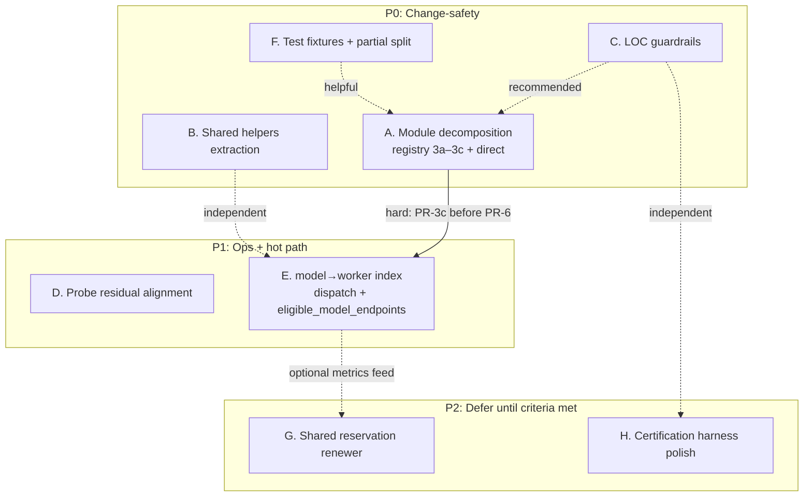
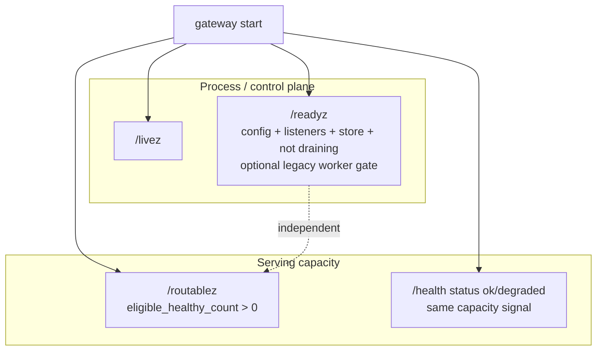
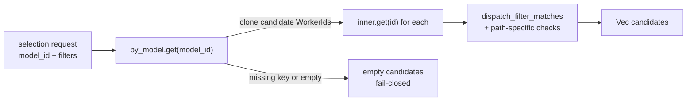

# Stability and Change-Safety Hardening for AX Serving

| Field | Value |
| --- | --- |
| Title | Stability and Change-Safety Hardening for AX Serving |
| Author | _TBD_ |
| Date | 2026-07-14 |
| Status | Draft ready for implementation |
| Scope | Portable gateway (`ax-serving-api` orchestration path), tests, ops probes, evidence harness |
| Architecture constraint | ADR-013 runtime-neutral hybrid inference control plane (accepted; not open for redesign) |
| Deployment constraint | ADR-014 readiness/routability split and CPU-only packaging (accepted) |
| Related status ledger | `.internal/IMPLEMENTATION-STATUS.md` |
| Revision | 2026-07-14r2 — addresses design review issues 1–14 |

---

## Overview

AX Serving’s product architecture is correct: a **runtime-neutral control plane** that selects endpoints and proxies streams, without owning KV/batching/token scheduling or embedding inference SDKs in the portable gateway. The primary engineering risks today are not architectural—they are **change-safety**, **hot-path cost under fleet growth**, **ops/probe clarity residual work**, and **missing production evidence**.

This design specifies an incremental, mock-testable PR stack that:

1. **Decomposes giant orchestration modules** so reviews and regressions stay bounded (registry split across **multiple** move-only PRs).
2. **Extracts shared helpers** that currently risk drift between embedded-compat and portable proxy surfaces, with an explicit **parity matrix** for intentional differences.
3. **Adds lightweight maintainability guardrails** (LOC reporting with soft thresholds and deterministic test-stripping rules).
4. **Finishes readiness/routability operational alignment** (code largely exists; contracts, runbooks, `/health` ops language, and legacy-mode HTTP tests remain).
5. **Adds a secondary worker index** covering **both** legacy/direct dispatch and deployment `eligible_model_endpoints`, with exhaustive mutation hooks and a concurrency contract.
6. **Improves integration-test maintainability** without requiring hardware.
7. **Defers** shared reservation renewers and certification harness polish until P0/P1 land, with clear deferral criteria—and **instruments** reservation renew so those criteria can be measured.

No product redesign. No retry-after-commitment. No NATS data plane. No fabricated NFR numbers.

**Rough effort band (one mid-level engineer familiar with the crate):** PR-1/7 small (~0.5–1 day each); PR-2 medium (~1–2 days); PR-3a–3c large total (~3–5 days across three PRs); PR-4 large (~2–3 days); PR-5 medium (~1–2 days); PR-6 medium-large (~2–3 days). Full P0/P1 stack ≈ **2–3 engineer-weeks** calendar if sequenced; much of PR-1/2/5/7 can parallelize. P2 is out of band.

---

## Background & Motivation

### Current architecture (must stay)

```text
client  →  AX Serving gateway  →  runtime agent  →  AX Engine / vLLM / SGLang
              │
              ├─ WorkerRegistry (leases, inventory, eligibility)
              ├─ DispatchPolicy (hard filter + score)
              ├─ DirectDispatcher (HTTP/SSE, at-most-one safe retry)
              └─ FleetStateStore (memory or Redis/Valkey HA)
```

Non-negotiables from ADR-013:

- Fail-closed routing (missing identity/capability ≠ equivalence).
- Safe retry: at most one; only connect failure or typed pre-admission; never after client commitment.
- Portable gateway free of AX Engine / MLX / llama.cpp / Metal / CUDA / prost / tonic under default features.
- NATS is not the primary inference stream.

### Pain points (measured from tree, 2026-07-14)

| Area | Evidence | Stability impact |
| --- | --- | --- |
| Giant modules | `registry.rs` ~4813 LOC (~2460 prod + ~2353 unit tests); `proxy_handlers.rs` ~2426; `direct.rs` ~2163; `rest/inference.rs` ~2672 (embedded) | High review radius; accidental coupling; hard ownership |
| Giant tests | `tests/orchestration.rs` ~4273; `tests/model_management.rs` ~4177 (`embedded-compat`) | Slow navigation; duplicated fixtures; merge conflicts |
| Hot-path scan | `dispatch_workers_filtered_with_pool_mode` **and** `eligible_model_endpoints` iterate entire `DashMap` every selection | O(workers) per request on both legacy and deployment routing; NFR-002 p99≤2 ms at 256 candidates is at risk under multi-model fleets |
| HA reservations | `SharedReservationGuard` spawns a tokio renew task per reserved attempt (`direct.rs`) | Task churn under concurrency; harder resource accounting |
| Dual stack | Default `gateway` vs `embedded-compat` + `ax-serving-engine` | Divergent validation/helpers tax correctness |
| Certification gap | NFR soak/goodput/multi-gateway Redis evidence missing; code/harness partially present | Cannot claim production readiness |
| Historical plan | `docs/maintainability-refactor-plan.md` (2026-03-29) superseded by ADR-013 but still correct on giant modules/duplication | Use as maintainability signal only |

### What is already done (do not re-implement as greenfield)

**Readiness split (ADR-014 intent) is largely implemented in code:**

- Routes: `/livez`, `/readyz`, `/routablez` in `orchestration/mod.rs`.
- Pure state machine: `gateway_ops::{ReadyzMode, GatewayOperationalState}` with unit tests.
- Default config `orchestrator.readyz_mode = "control_plane"`; legacy `eligible_workers` preserved.
- Helm/Kustomize/Compose already set `readyz_mode: control_plane` and document `/routablez`.
- Auth exemptions include both probe paths.
- Integration suite already asserts zero workers → `/readyz` 200 and `/routablez` 503 (control_plane default, with listeners marked ready).

**Residual readiness gaps are documentation, ops language, and one missing end-to-end legacy test**, not the core state machine:

- Public `README.md` still says `/readyz` is “200 only when at least one worker is routable” (stale).
- `docs/contracts/ax-serving-public-contract-inventory.md` still labels `/readyz` as “routable readiness”.
- `docs/runbooks/multi-worker.md` still states `/readyz` is `200` only with eligible endpoints (same class of bug as README; **required** fix, not optional).
- `.internal/IMPLEMENTATION-STATUS.md` still states “Current readiness is coupled to worker eligibility” under deployment status (partially outdated for default mode).
- Fabric contract (`docs/contracts/ax-fabric-runtime-contract.md`) is closer to truth and should be the reference for remaining doc fixes.
- No orchestration HTTP integration test for `readyz_mode = eligible_workers` (only pure unit tests in `gateway_ops.rs`).
- `/health` (and related admin JSON) still derives `"ok"` vs `"degraded"` from `eligible_healthy_count()`—that is a **capacity** signal, not process readiness under `control_plane`.

### Historical plan vs this design

| Historical WS | Status relative to this design |
| --- | --- |
| REST routes split | Partially done (`rest/{inference,models,admin,license}.rs`); not reopened except for shared helpers |
| Orchestrator public surface split | Partially done (`proxy_handlers`, `gateway_ops`, `fleet_state`); continue into `registry`/`direct` |
| Shared helpers | Partial (`utils/request_meta`); request-shape validation still duplicated |
| Test support | Not done (`tests/common/` absent) |
| Engine rewrite / product repositioning | Explicit non-goals |

---

## Goals & Non-Goals

### Goals

1. **Change-safety first**: behavior-preserving decomposition of the largest orchestration modules so a single PR cannot silently alter fail-closed eligibility or retry rules.
2. **Measured hot-path improvement**: secondary index for model→worker candidates used by **all request-path selectors** (`dispatch_workers_filtered*` and `eligible_model_endpoints`); preserve DashMap concurrency and fail-closed filters.
3. **Probe clarity residual**: align docs/contracts/runbooks/monitoring language with implemented `/readyz` vs `/routablez` semantics; document `/health` capacity meaning; keep migration path for Fabric/legacy with an HTTP legacy-mode test.
4. **Test maintainability**: shared fixtures; start thematic extraction without a big-bang test rewrite.
5. **Implementable PR stack**: independently reviewable PRs (see effort bands), mock-backed, no hardware required for merge gates of P0/P1.

### Non-Goals

- Redesign ADR-013 topology or ownership boundaries.
- Re-embed engines in the portable gateway.
- Add KV / continuous batching / token scheduling to the gateway.
- Retry generic 5xx or buffer full streams for smarter retry.
- Make NATS the primary inference data plane.
- Language rewrite or new framework.
- Fabricate or claim NFR pass results without retained artifacts.
- Merge portable and embedded paths into one serving binary.
- Full rewrite of `proxy_handlers.rs` or `rest/inference.rs` in the first stack (optional follow-on only if capacity remains).
- Pool secondary index (`by_pool`) in the first index PR (deferred until measured after model index).

---

## Proposed Design

### Workstream map

Hard dependency: registry modularization (A) before index (E). Everything else is parallelizable or soft-recommended only.



Parallel tracks: **C ∥ F ∥ B ∥ D ∥ A.direct**; **E after A.registry complete**.

### A. Module decomposition (behavior-preserving)

#### A.1 `registry.rs` → focused modules (multi-PR)

**Current structure (single file):**

| Region (approx) | Responsibility |
| --- | --- |
| Types / IDs / enums | `WorkerId`, `BackendKind`, `RuntimeKind`, `RequestKind`, health, payloads |
| `WorkerRegistry` mutations | legacy + protocol register/heartbeat/evict/drain/restore |
| Queries | `eligible_*`, `dispatch_workers_filtered*`, `eligible_model_endpoints`, snapshots, counts |
| Normalization helpers | inventory, operations, capability refresh |
| `#[cfg(test)]` | ~half the file |

**Target layout** (under `crates/ax-serving-api/src/orchestration/registry/`):

```text
registry/
  mod.rs                 # re-exports public API used today; WorkerRegistry facade
  types.rs               # WorkerId, health, capabilities, RequestKind, snapshots
  legacy_register.rs     # register / heartbeat / mark_drain / evict / tick
  protocol_session.rs    # register_protocol / heartbeat_protocol / lease / restore
  eligibility.rs         # dispatch_filter_matches + eligible/dispatch + eligible_model_endpoints
  index.rs               # secondary index (lands in PR-6 after modularization)
  normalize.rs           # inventory/ops normalization pure helpers
  health_tick.rs         # tick + health transitions if pulled out cleanly
  snapshots.rs           # list_all / get_snapshot / counts / eligible_healthy_count
  tests/                 # move existing unit tests with their symbols; keep behavior identical
```

**Decomposition rules:**

1. **No public API renames** across the split series. Callers continue `use orchestration::registry::{WorkerRegistry, WorkerId, ...}` via `registry/mod.rs` re-exports.
2. Move pure functions first (`dispatch_filter_matches`, inventory normalizers), then methods as thin wrappers.
3. Keep the concurrency model documentation on `WorkerRegistry` (DashMap shards; `tick` full scan).
4. Move unit tests with their production symbols; prefer one `tests` module per subfile or a `registry/tests/` folder with `#[cfg(test)]` mods.
5. Soft size target after the **series** completes: **≤ ~800 LOC production code per file**, tests allowed separately. The ≤800 target is a **series goal**, not a single-PR gate.
6. **Do not** land the secondary index inside the move-only split PRs.

**Sequenced split (reviewable diffs):**

| PR | Scope | Intent |
| --- | --- | --- |
| **PR-3a** | Extract pure helpers (`normalize.rs`) + `types.rs`; optionally peel `#[cfg(test)]` into `registry/tests/` or co-located test modules **without** changing production logic | Shrink blast radius; enable parallel review |
| **PR-3b** | Extract `eligibility.rs` + `snapshots.rs` (query path only; still full-scan `inner`) | Isolate fail-closed filters for later index PR |
| **PR-3c** | Extract `legacy_register.rs`, `protocol_session.rs`, `health_tick.rs`; `mod.rs` facade only | Mutations isolated so PR-6 can add hooks without re-touching queries |

Each of 3a–3c is move-only: no eligibility algorithm edits, no index.

**Verification (each split PR):**

```bash
cargo test -p ax-serving-api --lib registry
AXS_ALLOW_NO_AUTH=true cargo test -p ax-serving-api --test orchestration
cargo fmt --all -- --check
cargo clippy -p ax-serving-api --tests -- -D warnings
```

#### A.2 `direct.rs` → focused modules

**Current responsibilities mixed in one file:**

| Concern | Symbols |
| --- | --- |
| Client / pool | `DirectDispatcher`, `Client`, timeouts, dispatch token |
| Inflight / attempt | `InflightGuard`, `AttemptGuard` |
| Reservation | `SharedReservationGuard`, `reserve_attempt` |
| Retry policy | connect vs typed not-admitted vs never-after-commit |
| Stream proxy | SSE chunk forward, idle/first-byte timeouts, header filtering |
| Metrics | `AtomicLatencyHistogram`, `DispatchMetrics`, outcome guards |
| Body limits | limited read helpers |

**Target layout** (`orchestration/direct/`):

```text
direct/
  mod.rs              # DirectDispatcher public surface + re-exports
  client.rs           # Client construction, pool knobs, worker_url
  attempt.rs          # InflightGuard, AttemptGuard, attempt IDs
  retry_policy.rs     # is_typed_not_admitted, safe-retry predicates (pure + docs)
  stream_proxy.rs     # streaming/buffered response path
  reservation.rs      # SharedReservationGuard + reserve_attempt
  metrics.rs          # histograms, DispatchMetricsSnapshot + reservation gauges (see §G)
  headers.rs          # trace inject, header allowlists
```

**Critical invariant comments** must move with the code (not be “cleaned away”):

- At most one retry.
- Never retry generic 5xx.
- Never retry after first committed client byte / headers.
- Reservation release best-effort on drop; fenced renew ends renew loop.

**PR-4 also adds reservation instrumentation** (see §G / Observability) so P2 deferral criteria are measurable without implementing the shared renewer.

**Optional same-stack follow-on for `proxy_handlers.rs`:** only if PRs stay small. Preferred first cut for handlers (not required in the same stack):

```text
proxy_handlers/  # optional later
  inference.rs   # proxy_inference + profile build
  probes.rs      # livez/readyz/routablez
  admin.rs       # status/diagnostics/fleet
  metrics_fmt.rs # prometheus text
  validation.rs  # until shared helper module absorbs it
```

Do **not** force handler split if it would couple with index/eligibility PRs.

### B. Shared helper extraction

#### Problem

Portable proxy validation lives in `proxy_handlers.rs` (`validate_proxy_*`), while embedded inference validation lives in `rest/validation.rs` and `rest/inference.rs` (only under `embedded-compat`). Shared pieces already exist in `utils/request_meta.rs` (`estimate_*`, `audit_actor`, `default_audit_limit`), but request-shape rules can still **drift** (limits, empty-message rules, embedding input).

`rest/validation.rs` currently depends on `ax_serving_engine::GenerationParams`—**not portable**. Shared modules must not pull engine types into the default gateway graph.

On the default `gateway` feature graph, public request types are available as `crate::openai_schema` (re-export of `rest::schema`); full `rest::validation` is **not** present. Portable helpers must import types from `crate::openai_schema` (or an equivalent always-available schema path), never from embedded-only modules.

#### Target

```text
crates/ax-serving-api/src/
  utils/
    request_meta.rs      # already: audit + prompt estimate
    request_shape.rs     # NEW: portable pure validation of public request shape
```

**Portable shared surface (examples):**

```rust
// utils/request_shape.rs — no ax_serving_engine imports
use crate::openai_schema::{EmbeddingsInput, InputMessage, MAX_CONTENT_BYTES, MAX_MAX_TOKENS, ...};
use axum::http::StatusCode;

pub struct ShapeError { pub status: StatusCode, pub message: String }

pub fn validate_max_tokens(max_tokens: Option<u32>) -> Result<(), ShapeError>;
pub fn validate_chat_messages(messages: &[InputMessage]) -> Result<(), ShapeError>;
pub fn validate_prompt(prompt: Option<&str>) -> Result<(), ShapeError>;
pub fn validate_embeddings_input(input: &EmbeddingsInput) -> Result<(), ShapeError>;
// Model-id helpers may share charset/length constants but keep surface-specific
// adapters where status codes already differ (see parity matrix).
```

Adapters:

- Proxy path maps `ShapeError` → existing Axum `(StatusCode, String)` / AX error responses.
- Embedded path maps to existing `validation_error` / `Option<Response>` style **only under `embedded-compat`**, without making portable code depend on engine.

**Out of scope for shared module:** sampling-param rules that require `GenerationParams` conversion—those stay behind `embedded-compat` until decoupled.

#### Parity matrix (proxy vs embedded) — deliberate compatibility

Surfaces **already differ** on some client-visible errors. PR-5 must **not** “unify for beauty” without an explicit row. Default rule: **preserve each surface’s current status/message** unless a row marks “converge.”

| Rule | Proxy (`proxy_handlers`) today | Embedded (`rest/validation` / inference) today | PR-5 policy |
| --- | --- | --- | --- |
| Missing `model` field | 400 `missing field: model` | Field-specific empty/missing messages via `validate_model_identifier` | **Keep surface-specific** adapters |
| Model whitespace / charset | Proxy uses trim + `LogicalModelId::new` path with its own messages | `validate_model_identifier`: empty → 400; unsupported whitespace → 422; charset → 422 | **Keep surface-specific**; share only pure charset/length **predicates** if identical |
| `max_tokens == 0` / over limit | 400 with proxy strings | 422/`validation_error` style via shared rest helpers | **Keep surface-specific** status if already different; share limit constants (`MAX_MAX_TOKENS`) |
| Chat messages empty / oversize | Proxy `validate_proxy_chat_messages` | Embedded `validate_chat_message_content` path | Share pure checks for empty/byte limits; **preserve messages** per surface |
| Assistant `tool_calls` without content | Allowed on proxy | Embedded has its own tool/content rules | Cover both in table tests; **do not change allow/deny** without a dedicated behavior PR |
| Embeddings empty / aggregate byte or token caps | Proxy embeddings validators | Embedded embeddings validators | Share pure aggregate limit math; preserve status codes |
| Sampling / `GenerationParams` | N/A on pure proxy shape path | Engine-backed | **Out of shared module** |

**Drift / table tests (minimum):**

- empty / missing model (per-surface expected status+message fixture);
- max_tokens=0 and max_tokens > `MAX_MAX_TOKENS`;
- oversize message content (`MAX_CONTENT_BYTES`);
- assistant tool_calls without content (proxy allow path);
- empty embeddings input and aggregate embedding limits;
- empty prompt for `/v1/completions`.

Fixtures are **per-surface expected outcomes**, not a single forced message string.

### C. Maintainability guardrails

Add a lightweight script (no new cargo plugin required):

`scripts/report_rust_loc.py` (preferred over shell for deterministic parsing):

- Scan production Rust under `crates/**/src/**/*.rs`.
- Exclude `tests/` crates paths and `target/`.
- **Test stripping rule (documented in script header; best-effort, not perfect AST):**
  1. Prefer stripping contiguous blocks that start with a line matching `#[cfg(test)]` followed by `mod tests {` (or `mod <name> {` immediately after) through the matching closing brace at the same indent depth.
  2. Do **not** claim accuracy for tests interleave mid-function or for exotic macro-generated modules.
  3. Emit a footnote: “counts are heuristic; re-measure with `tokei`/`cloc` if gating on exact numbers.”
- Emit TSV or Markdown: path, LOC, bucket (`ok` / `warn` / `soft_over`).
- Thresholds (script header + this design):

| Band | Production LOC / file | Meaning |
| --- | ---: | --- |
| ok | ≤ 800 | Preferred ownership unit |
| soft target | ≤ 1500 | Acceptable for mature modules |
| warn | > 1500 | Prefer split before large features |
| hard review flag | > 2500 | New feature PRs should not grow further without split plan |

CI: optional non-blocking job or `scripts/` check documented for local pre-submit. **Do not fail the whole workspace on existing giants** until after decomposition PRs land; script should support `--baseline` / allowlist for currently oversized files that shrink over time.

Example allowlist entries post-split (then remove as files shrink):

```text
# scripts/loc_allowlist.txt — temporary; remove entries as splits land
crates/ax-serving-api/src/orchestration/proxy_handlers.rs
crates/ax-serving-api/src/rest/inference.rs
```

### D. Readiness probe residual work

#### Implemented semantics (source of truth)

| Probe | Meaning | HTTP |
| --- | --- | --- |
| `/livez` | Process can make progress | 200 |
| `/readyz` | Config validated, listeners ready, not draining, fleet store healthy; **default does not require workers** | 200 / 503 + `Retry-After` |
| `/routablez` | ≥1 eligible healthy non-draining worker | 200 / 503 + `Retry-After` |
| `/health` | JSON fleet summary; `"status": "ok"` only when `eligible_healthy_count() > 0` (**capacity**, not process readiness) | typically 200 with body |

Legacy: `orchestrator.readyz_mode = eligible_workers` restores worker-gated `/readyz` for Fabric migration (`AXS_READYZ_MODE` / config).

`/readyz` and `/routablez` are **parallel assessments**, not sequential states of one probe:



#### Remaining engineering (small, high leverage)

1. **Doc/contract/runbook fix (all required in PR-7):**
   - Fix `README.md` health bullets to match ADR-014.
   - Fix public contract inventory `/readyz` wording.
   - Fix **`docs/runbooks/multi-worker.md`** worker-gated `/readyz` claims (same severity as README).
   - Align IMPLEMENTATION-STATUS deployment row with `control_plane` default.
   - Add ops note: `/health` `"ok"` means capacity (eligible workers), **not** interchangeable with `/readyz` under `control_plane`.
2. **Integration coverage:**
   - Keep existing zero-worker control_plane case: `/readyz` 200, `/routablez` 503.
   - **Add** HTTP integration test: `readyz_mode = eligible_workers` (or env equivalent) with zero workers → `/readyz` 503 + reason/body consistent with legacy; with one eligible worker → 200. Unit tests in `gateway_ops` are not sufficient alone.
3. **Monitoring**: confirm alerts/runbooks that mean “serving capacity” use `/routablez` or `workers.eligible > 0` / `/health` capacity fields—not process readiness alone (Fabric contract already states this).
4. **No semantic flip-flop**: do not change default back to worker-gated; do not change `/health` `"ok"` semantics in this stack without a separate contract review (docs only).

### E. Worker selection indexing

#### Today

Two request-path selectors full-scan `inner`:

```rust
// 1) dispatch_workers_filtered_with_pool_mode — full scan (~1579–1633)
for r in self.inner.iter() {
    // dispatch_filter_matches(model_id, kind, backend, runtime, context, ...)
}

// 2) eligible_model_endpoints — full scan (~1654–1709); used by deployment.rs
self.inner.iter().filter_map(|item| {
    // dispatch_filter_matches(...) then stricter inventory/protocol checks
})
```

`eligible_workers*` wrappers funnel into `dispatch_workers_filtered` and benefit automatically once that path is indexed. **`eligible_model_endpoints` does not** unless explicitly updated—**PR-6 must index both** (or NFR language must be scoped only to direct dispatch; this design chooses **both**).

Also full scan (leave O(N) for now): `eligible_healthy_count`, `counts`, `tick` (tick must remain global).

#### Design

Add a **secondary membership index** maintained on model-set mutations:

```text
WorkerRegistry {
  inner: DashMap<WorkerId, WorkerEntry>,              // source of truth
  protocol_sessions: DashMap<ProtocolWorkerId, ...>,
  by_model: DashMap<String, HashSet<WorkerId>>,       // NEW membership only
  // by_pool: DEFERRED until after model-index measurement
}
```

**Index key source of truth:** the **post-normalization `entry.capabilities.models` set**—the same set `dispatch_filter_matches` uses (`entry.capabilities.models.iter().any(|c| c == model_id)`), not raw inventory alone. Heartbeat and register paths that rewrite `capabilities.models` from inventory/`model_ids` must reindex against that final set.

**Index semantics:** membership, not eligibility. Index answers “which workers **advertise** model M?” Filters still fail-closed on live entries:

- healthy, not drain;
- request kind / structured vs legacy capability source;
- backend/runtime hint;
- min context / inventory operations;
- preferred pool / require_preferred_pool / excluded_id;
- for `eligible_model_endpoints`: additional inventory context/output/modality/protocol capability checks and inflight capacity.



#### Exhaustive mutation audit checklist

Every registry mutation is classified. Index updates go through **two internal helpers only**:

```rust
fn reindex_worker(&self, id: WorkerId, old_models: &[String], new_models: &[String]);
fn unindex_worker(&self, id: WorkerId, models: &[String]);
```

| Method | Index action | Notes |
| --- | --- | --- |
| `register` (insert) | `reindex_worker(id, [], new_models)` | `new_models` = post-normalization `capabilities.models` |
| `register` (`and_modify` re-register) | Capture `old_models` under entry lock; write entry; `reindex_worker(id, old, new)` | Includes inventory retain via `retain_model_inventory_for_ids` → models may shrink without a “full inventory blob” |
| `register_protocol` | Same as register (wraps/feeds same membership) | Session map is separate; index keys off internal `WorkerId` + `capabilities.models` |
| `heartbeat` | **Always** reindex when `capabilities.models` changes; treat empty `model_ids` as **clear all models** | Code always rewrites `capabilities.models` from `model_ids` + inventory (empty means no models)—**not** optional |
| `heartbeat_protocol` | Same as heartbeat after translation to entry fields | |
| `mark_drain` | **No index change** | Drain is filter-time only |
| `mark_unhealthy` | **No index change** | Health is filter-time only |
| `evict` | Capture models **before** `inner.remove` (or from remove return); `unindex_worker` | Also cleans `protocol_sessions` |
| `evict_protocol` | Unindex internal id using models before/at remove; drop session | Must not rely on session alone |
| `evict_if_unhealthy_at_addr` | On successful `remove_if`, unindex using **captured models from removed entry** | Today `remove_if` does not pre-capture—implementation must capture models in the predicate closure or from the returned removed value |
| `tick` second-pass remove | For each dead id, capture models then remove + unindex | First-pass `iter_mut` health transitions do not change model membership |
| `restore_protocol_record` / `restore_protocol_record_if_newer` | After insert/update of entry, reindex like register | Index is process-local; HA restore must reindex even when wire record is unchanged |

**PR-6 acceptance (required):**

1. Every row above implemented or explicitly marked no-op with rationale.
2. `assert_index_consistent` after: heartbeat with empty `model_ids`; tick eviction; `evict_if_unhealthy_at_addr` success; re-register model-set change; restore path.
3. Both `dispatch_workers_filtered_with_pool_mode` and `eligible_model_endpoints` use `by_model` candidates.
4. Empty model keys pruned (`by_model.remove` when last WorkerId removed).

#### Concurrency contract

Hard case: **same-worker model churn concurrent with hot-path selection**. Multi-worker heartbeats advertising the same model are safe with DashMap per-key locking.

1. **Under the entry lock (`inner.get_mut` / entry API):** capture `old_models` from `capabilities.models`; compute `new_models`; apply entry field writes (including the new models vector).
2. **Index update after entry write (or still under a short critical section that holds only index locks, not both maps long-term):** call `reindex_worker` with **add new memberships before remove old** (prefer brief **over-include** over under-route). Over-include is fail-closed-safe because selection re-checks `dispatch_filter_matches` on live entries.
3. **Remove-before-add is forbidden** for model-set diffs (enlarges under-route window).
4. **Selection path:** clone candidate `WorkerId`s from the index set into a `Vec` **before** looking up `inner` (minimize lock stacking; do not hold `by_model` guard across slow work).
5. Stale index ID → `inner.get` miss → skip (debug/trace in tests). Missing membership (under-include) is **not self-healing** without a later mutation; long-lived divergence is a **bug**. Temporary under-routing is acceptable only for the duration of a single in-flight mutation (sub-millisecond lock windows), not across requests after the mutation completes.
6. Optional kill-switch: when `AXS_WORKER_MODEL_INDEX=0` (or equivalent config), queries use full `inner` scan (see Key Decisions).

**Required tests beyond consistency checker:**

- Concurrent heartbeat model flip + parallel `dispatch_workers_filtered*` smoke (tokio tasks).
- Empty `model_ids` heartbeat clears worker from all model keys.
- Re-register model set change.
- Preferred-pool partition membership set equality (not Vec order).
- `eligible_model_endpoints` returns same **set** of worker ids as full-scan oracle on fixtures.

#### Empty key / memory hygiene

On last `WorkerId` removal for a model key, `by_model.remove(model_id)`. Consistency checker asserts **no empty sets** remain. Protects against unbounded growth if clients advertise ephemeral/random model names.

#### Optional pool index

`by_pool` is **deferred** until after model-index measurement (Key Decision). Preferred-pool path partitions **index candidates** (or full scan under kill-switch), not a separate pool index in PR-6.

#### Complexity target

| Fleet | Today eligibility | After index (1 model, k advertisers) |
| --- | --- | --- |
| N workers, M models sparse | O(N) | O(k) + filter |
| N=256, k=8 | full 256 filter | ~8 lookups |

This supports NFR-002 instrumentation already in `DirectDispatcher` metrics (`axs_gateway_endpoint_selection_duration_seconds`) without claiming a p99 number until measured. After PR-6, **both** direct and deployment selectors are in scope for that measurement story.

**`eligible_healthy_count`:** keep O(N) for now (probe path, low QPS). Do not add a global counter unless proven hot—counters race with drain/health transitions.

### F. Test maintainability

#### F.1 `tests/common/` for portable orchestration

New:

```text
crates/ax-serving-api/tests/common/
  mod.rs
  env.rs           # ENV_LOCK, TestConfigHome, EnvVarsGuard
  mock_workers.rs  # spawn_mock_worker, spawn_echo_model_worker, not_admitted
  registry.rs      # reg_req, reg_req_with_pool helpers
  orchestrator.rs  # spawn_orchestrator_with_layer, proxy_router_with_key
```

Wire via:

```rust
// tests/orchestration.rs
#[path = "common/mod.rs"]
mod common;
```

**Decision:** Prefer **`#[path]` / `mod common`** and gradual additional `[[test]]` binaries when a thematic file is extracted. Do not introduce a new workspace package for fixtures.

#### F.2 Thematic split (multi-PR)

After helpers extract, split tests gradually (each PR moves a coherent group):

| New file | Themes |
| --- | --- |
| `tests/orchestration_registry.rs` | register/heartbeat/eligible/drain/TTL |
| `tests/orchestration_dispatch.rs` | mock dispatch, retry, 5xx non-retry, connection refused |
| `tests/orchestration_policy.rs` | WRR, token_cost, pool header, project policy |
| `tests/orchestration_admin.rs` | admin status/diagnostics/fleet/audit |
| `tests/orchestration_probes.rs` | livez/readyz/routablez, legacy readyz mode, metrics cardinality |
| `tests/orchestration_overload.rs` | queue full/shed/timeout |

Keep `[[test]]` entries in `Cargo.toml` as needed. First PR may only extract `common/` without file split if review load is high.

#### F.3 `model_management.rs`

Requires `embedded-compat`. Extract mock backends (`NullBackend`, embedding doubles) into `tests/common/backends.rs` **gated** so portable `cargo test` without embedded features does not need engine. Do not block portable stability stack on full model_management split.

### G. Shared reservation renewer (P2)

#### Current cost

Each `SharedReservationGuard::new` spawns:

```rust
tokio::spawn(async move {
  loop {
    select! {
      _ = sleep(renew_every) => try_reserve(...),
      _ = stop => break,
    }
  }
});
```

Under high concurrency and long streams this is one task per inflight reserved attempt.

#### P0/P1 measurement hooks (ship before P2)

In PR-4 (`metrics.rs` / reservation path), add **low-cardinality** signals so deferral criteria are not permanently unmeasurable:

| Signal | Type | Purpose |
| --- | --- | --- |
| `axs_gateway_reservation_renew_tasks` | gauge (or approximate atomic count of active renew loops) | task churn vs concurrency |
| `axs_gateway_reservation_renew_total{result="ok\|fenced\|error"}` | counter | fence/error rate feeding P2 criteria |
| optional: renew latency histogram | histogram | only if cheap |

No attempt_id / worker_id labels.

#### Proposed design (only if deferral criteria pass)

```text
ReservationRenewer {
  entries: DashMap<(WorkerId, AttemptId), RenewEntry>,
  // single task: wake every min(renew_interval) or use delay queue
}
```

- Guard registers/unregisters interest; does not spawn.
- Renewer batches `try_reserve` calls with concurrency limit to Redis.
- Drop still releases reservation (existing best-effort spawn or channel to renewer).

**Risks (severity):**

| Risk | Severity | Mitigation |
| --- | --- | --- |
| Missed renew → early TTL expiry → double admission | High | Same TTL math (`ttl/3`); unit tests with fake clock/store |
| Renewer task death | High | Supervise in orchestrator bootstrap; metric + panic hook |
| Semantics change under fencing | Medium | Preserve fenced → stop renewing that attempt |
| Complexity vs win | Medium | Only if task count or Redis QPS measured as issue |

**Deferral criteria (must meet ≥1 before scheduling):**

1. `axs_gateway_reservation_renew_tasks` (or equivalent profiling) shows reservation tasks dominate scheduler/memory under production-like concurrency; **or**
2. Redis reservation QPS is a measured bottleneck; **or**
3. Soak shows task/FD growth correlated with renew spawns / renew counters.

Until then, keep per-attempt spawn (correct and simple).

### H. Certification harness improvements (P2)

Do **not** invent results. Improve the path from code → retained artifacts:

| Gap (from IMPLEMENTATION-STATUS) | Harness improvement |
| --- | --- |
| NFR-001/002 no retained p99 | Document exact `ax-serving-bench` / load invocation + artifact schema in `docs/perf/service-tuning.md`; ensure empty/null JSON still rejected by CI |
| NFR-007 goodput | Script skeleton that runs direct vs gateway with same trace and writes comparison JSON (values filled by operators) |
| NFR-008 soak | Wire existing soak runner docs to multi-gateway Redis topology checklist |
| NFR-006 multi-gateway Redis | Expand `tests/redis_fleet_state.rs` notes + CI service already present; add operator runbook checklist for two gateways |

Optional script: `scripts/nfr_artifact_checklist.sh` that verifies artifact files exist and required fields are non-null—**fails closed**, never fills fake numbers.

NFR artifact **storage ownership** (CI vs internal bucket) remains an open ops question and does not block P0/P1 code.

---

## API / Interface Changes

### Public HTTP

| Endpoint | Change in this design |
| --- | --- |
| `/livez` | None |
| `/readyz` | No code change required for default semantics; docs/contracts/runbook fix + legacy HTTP test |
| `/routablez` | Already present; document as capacity probe |
| `/health` | No semantic change; document `"ok"` = capacity |
| Inference `/v1/*` | No intentional wire contract change; validation may share helpers with parity matrix |

### Config

| Key | Status |
| --- | --- |
| `orchestrator.readyz_mode` | Keep `control_plane` (default) and `eligible_workers` (legacy) |
| `AXS_WORKER_MODEL_INDEX` | **Ship with PR-6**: default **on** (`1`/unset); `0` forces full-scan eligibility (operational escape hatch for silent under-index 503s). Document in config/env table. |

### Rust public API (crate-internal)

- `WorkerRegistry` methods remain stable.
- New private fields on `WorkerRegistry` (`by_model`)—same crate, no semver surface.
- Re-export module path `orchestration::registry` preserved.
- Private helpers `reindex_worker` / `unindex_worker` are not public API.

### Before / after selection sketch

```rust
// BEFORE (both dispatch_workers_filtered* and eligible_model_endpoints)
self.inner.iter().filter_map(|r| { /* filters */ }).collect()

// AFTER — shared candidate expansion (both paths)
fn candidate_ids_for_model(&self, model_id: &str) -> Vec<WorkerId> {
    if !self.model_index_enabled() {
        return self.inner.iter().map(|r| r.key().clone()).collect(); // or iterate entries directly
    }
    self.by_model
        .get(model_id)
        .map(|set| set.iter().copied().collect()) // clone ids; drop index guard
        .unwrap_or_default()
}

// non-pool dispatch path
let mut out = Vec::new();
for id in self.candidate_ids_for_model(model_id) {
    let Some(entry) = self.inner.get(&id) else { continue };
    if dispatch_filter_matches(entry.value(), model_id, ...) {
        out.push(worker_status_of(entry.value()));
    }
}
out

// preferred-pool path: SAME candidate_ids_for_model, then partition
// preferred vs fallback among those candidates (not a full fleet scan)

// eligible_model_endpoints: SAME candidate_ids_for_model, then existing
// inventory/protocol/inflight checks on each live entry
```

**Validation of outcomes:** compare **set equality** of candidate worker ids (and preferred vs fallback partition membership), not `Vec` order. DashMap / `HashSet` iteration is unordered today; dispatch policies may still break ties by encounter order + scores/jitter—that order dependence remains **as today** and is not a regression target for the index PR.

---

## Data Model Changes

### In-memory only

| Structure | Change | Migration |
| --- | --- | --- |
| `WorkerRegistry.by_model` | New secondary index: `model_id → set of WorkerId` | Process-local; rebuilt on cold start via register/restore; prune empty keys |
| Redis fleet records | **None** | Index is not persisted; restore paths must re-index |
| Protocol wire types | **None** | |

### Rebuild on HA restore

`restore_protocol_record*` must update `by_model` when inserting/updating entries (see mutation audit). Add unit tests covering restore → eligible_workers / eligible_model_endpoints path.

### Storage estimates

Negligible for stable catalogs: O(sum of model advertisements). Example: 256 workers × 4 models ≈ 1k set entries of UUIDs. Empty-key pruning bounds growth under ephemeral model names.

---

## Alternatives Considered

### 1. Full rewrite of orchestration into a new crate/framework

- **Pros:** Clean slate.
- **Cons:** High regression risk; conflicts with ADR-013 “no new framework”; blocks certification.
- **Decision:** Rejected.

### 2. Keep giant files; only add index and probes

- **Pros:** Faster short-term feature velocity.
- **Cons:** Every eligibility change remains a 2.5k–5k LOC review; historical plan already identified this as a regression risk.
- **Decision:** Rejected as sole strategy; index still needed but **after** modularization for review safety.

### 3. Global eligible-worker counter instead of `/routablez`

- **Pros:** Single probe.
- **Cons:** Couples control plane to capacity (ADR-014 bootstrap deadlock); already fixed in code.
- **Decision:** Rejected; finish doc alignment only.

### 4. Precomputed fully eligible bitsets per model

- **Pros:** Fastest queries.
- **Cons:** Health/drain/context/kind filters invalidate constantly; complex consistency; easy fail-open bugs.
- **Decision:** Rejected; membership index + live filters is the right trade-off.

### 5. Merge embedded-compat into portable gateway

- **Pros:** One path.
- **Cons:** Violates ADR-013/014 SDK-free gateway; rebuilds the original problem.
- **Decision:** Rejected; reduce drift via shared portable helpers only.

### 6. Immediate shared reservation renewer

- **Pros:** Fewer tasks.
- **Cons:** Semantics risk under fencing/TTL without measured pain.
- **Decision:** Defer (P2) with explicit criteria; instrument renew loops in P0/P1.

### 7. Periodic full-fleet snapshot / epoch copy instead of fine-grained index

- **Pros:** Simpler mutation story (rebuild vector of workers on a timer or generation counter); readers pin an epoch snapshot and scan O(N) in-memory without DashMap iteration costs.
- **Cons:** Still O(N) per selection (only improves constant factors / lock behavior); multi-model fleets do not get O(k) candidate sets; rebuild cadence trades staleness vs CPU. Worse fit for sparse multi-model NFR-002 goals than membership index.
- **Decision:** Rejected as primary design; full scan remains the **kill-switch** path (`AXS_WORKER_MODEL_INDEX=0`), which is the operational analogue of “ignore index / scan source of truth.”

### 8. Lazy rebuild of `by_model` on inconsistency detect

- **Pros:** Self-heal under-index bugs without process restart.
- **Cons:** Hides mutation bugs; rebuild is O(N·models); hard to know when to trigger without a checker that is already O(N).
- **Decision:** Rejected for production hot path. Use: (1) exhaustive hooks + tests; (2) kill-switch full scan; (3) optional admin/debug rebuild command only if operators need it later—not in P0/P1.

---

## Security & Privacy Considerations

| Topic | Assessment |
| --- | --- |
| Auth | Probes remain auth-exempt; no change to admin/metrics auth. Index does not expose new endpoints. |
| Fail-closed | Index membership must never expand eligibility beyond filters; empty index ⇒ no route. Over-include during add-before-remove is mitigated by live filters. |
| Under-include | Availability impact (silent 503s); mitigated by exhaustive mutation audit, add-before-remove ordering, consistency tests, and **kill-switch full scan**. |
| Information disclosure | `/routablez` continues to omit worker IDs/model details (as in `proxy_routability`). |
| Prompt privacy | No new logging of prompts; helper extraction must not add debug dumps. |
| Dual-stack | Shared validation must not weaken either surface; parity matrix + per-surface fixtures. |
| Secrets | Reservation/store paths unchanged; no secrets in metrics labels (existing rule). |

---

## Observability

### Existing (keep)

- `axs_gateway_endpoint_selection_duration_seconds` histogram.
- `axs_gateway_endpoint_selections_total{outcome=...}` bounded outcomes.
- Probe JSON fields on `/readyz` (`status`, `fleet_store`, `draining`, compatibility `eligible_workers`).

### Add with index PR (lightweight)

| Signal | Type | Purpose |
| --- | --- | --- |
| `axs_gateway_registry_index_candidates` | optional histogram/summary of candidate set size | detect pathological k |
| debug assert / test-only consistency | tests | prevent silent drift |
| tracing: empty membership vs all filtered | debug | distinguish “no advertisers” vs “all filtered” |

Avoid high-cardinality labels (no model_id on metrics).

### Add with direct split PR (reservation)

| Signal | Type | Purpose |
| --- | --- | --- |
| `axs_gateway_reservation_renew_tasks` | gauge | P2 criteria |
| `axs_gateway_reservation_renew_total{result=...}` | counter | fence/error visibility |

### Alerting

- Capacity outages: `/routablez`, `/health` capacity `"ok"`, or eligible count—not `/readyz` in `control_plane` mode.
- Existing endpoint-selection p99 rule remains the release gate once artifacts exist.

---

## Rollout Plan

### Feature flags

- Decomposition: no flag (pure refactor).
- Index: **always-on by default** + **`AXS_WORKER_MODEL_INDEX=0` kill-switch** for first production releases (Key Decision).
- Readyz: already flagged via `readyz_mode`.

### Stages

1. Merge behavior-preserving refactors + tests/common (zero intentional behavior change). Registry split lands as **PR-3a → 3b → 3c**.
2. Merge shared helpers with dual-adapter tests and parity matrix fixtures.
3. Merge index behind full unit + orchestration suite; validate **set equality** of candidate worker ids (and preferred/fallback partitions) against a full-scan oracle on fixtures—not Vec order.
4. Doc/contract/runbook residual readiness PR (parallel with 1–2); include legacy readyz HTTP test.
5. P2 renewer/harness only after criteria (now measurable via reservation metrics).

### Rollback

- Refactors: git revert (no data migration).
- Index: set `AXS_WORKER_MODEL_INDEX=0` or revert PR; behavior returns to full scan.
- Docs: revert markdown only.

### Risks

| Risk | Severity | Mitigation |
| --- | --- | --- |
| Silent eligibility change during split | High | No logic edits in move-only PRs; identical unit tests; fail CI on behavior tests |
| Index under-registration | High | Exhaustive mutation audit; add-before-remove; consistency tests; kill-switch |
| Preferred-pool fallback subtlety | Medium | Port existing unit tests; set-equality on partitions |
| Deployment path left O(N) | Medium | **PR-6 includes `eligible_model_endpoints`** |
| Test split breaks `required-features` | Low | Keep embedded tests feature-gated |
| LOC script flaky CI | Low | Non-blocking first; allowlist giants; document heuristic accuracy |

---

## Open Questions

1. When to force `proxy_handlers.rs` split—after registry/direct only, or later when LOC script still warns?
2. Who owns retained NFR artifact storage (CI artifacts vs internal evidence bucket) for H? (Does not block P0/P1.)
3. Should an operator-facing admin “rebuild index” endpoint exist later, or is kill-switch + restart enough? (Default: kill-switch only for first release.)

**Resolved (formerly open):** see Key Decisions 11–14 (`by_pool` defer, index kill-switch default on, test packaging, NFR owner can stay open).

---

## Key Decisions

1. **Do not redesign product architecture** — ADR-013 hybrid control plane and ADR-014 probe model remain authoritative; this work is engineering hardening only.
2. **Change-safety before speed** — behavior-preserving module splits and test fixtures land before the hot-path index so eligibility/retry logic is reviewable.
3. **Membership index, not precomputed eligibility** — `model_id → WorkerId` is membership only; hard filters stay fail-closed on live entries; keys = post-normalization `capabilities.models`.
4. **Readiness split is residual alignment, not a rewrite** — code already implements `/readyz` vs `/routablez` with `control_plane` default; finish docs/contracts/**runbooks**, `/health` ops language, and legacy HTTP tests.
5. **Shared helpers must stay portable** — no `ax-serving-engine` types; import request types via `openai_schema`; parity matrix preserves intentional surface differences.
6. **Per-attempt reservation renew stays until measured pain** — avoid subtle HA TTL bugs; **ship renew gauges/counters in PR-4** so criteria can be evaluated.
7. **Evidence harness may improve process, not invent numbers** — null/placeholder rejection remains; scripts only make real runs easier to retain.
8. **Dual stack remains dual** — reduce drift tax; do not re-embed engines into the portable gateway.
9. **LOC guardrails are soft first** — report + allowlist, not a hard merge block that freezes necessary work mid-split; counts use documented heuristic test stripping.
10. **PR stack is incremental and mock-testable** — every P0/P1 PR merges without hardware or live AX Engine.
11. **Index default on + kill-switch** — `AXS_WORKER_MODEL_INDEX` defaults to enabled; `0` forces full scan for first production releases because under-index is silent availability loss.
12. **`by_pool` deferred** — ship model index only in PR-6; revisit pool index after measurement.
13. **Test packaging** — `#[path] mod common` + gradual `[[test]]` thematic splits; no new fixture crate.
14. **Both selection hot paths indexed in PR-6** — `dispatch_workers_filtered*` and `eligible_model_endpoints`.
15. **Registry split is multi-PR (3a–3c)** — pure/types → queries → mutations; ≤800 LOC is a series goal, not a single-PR gate.
16. **Index concurrency: add-before-remove; clone ids before `inner` lookup** — prefer brief over-include; forbid remove-before-add for model diffs.
17. **Candidate validation uses set equality** — not Vec order (DashMap iteration unordered).

---

## References

- `.internal/adr/ADR-013-RUNTIME-NEUTRAL-HYBRID-INFERENCE-CONTROL-PLANE.md`
- `.internal/adr/ADR-014-CPU-ONLY-OCI-AND-HELM-DEPLOYMENT.md`
- `.internal/IMPLEMENTATION-STATUS.md`
- `docs/maintainability-refactor-plan.md` (historical)
- `docs/perf/service-tuning.md`
- `docs/contracts/ax-fabric-runtime-contract.md`
- `docs/contracts/ax-serving-public-contract-inventory.md`
- `docs/runbooks/multi-worker.md`
- `crates/ax-serving-api/src/orchestration/{mod.rs,registry.rs,direct.rs,proxy_handlers.rs,gateway_ops.rs,policy.rs,fleet_state.rs,deployment.rs}`
- `crates/ax-serving-api/tests/orchestration.rs`
- `Agents.md` (workspace conventions)

---

## PR Plan

Ordered for independent reviewability. Each PR should pass `cargo fmt`, relevant `clippy`, and the narrowest tests listed. Prefer Conventional Commits.

**Effort legend:** S ≤1 day · M 1–2 days · L 2–3 days · XL 3–5 days (one familiar engineer).

### PR-1: `chore(api): add Rust LOC report script and soft thresholds` — **S**

| Field | Detail |
| --- | --- |
| **Title** | `chore(api): add Rust LOC report script and soft thresholds` |
| **Depends on** | None |
| **Files** | `scripts/report_rust_loc.py`; optional `scripts/loc_allowlist.txt`; script header documents thresholds and `#[cfg(test)] mod …` stripping heuristic |
| **Description** | Non-blocking maintainability tooling. Scans production `crates/**/src/**/*.rs`, reports LOC, marks warn/allowlisted giants. Does not fail CI hard initially. |
| **Validation** | Run script locally; exits 0 with allowlist; no runtime behavior change. |

### PR-2: `test(api): extract orchestration fixtures into tests/common` — **M**

| Field | Detail |
| --- | --- |
| **Title** | `test(api): extract orchestration fixtures into tests/common` |
| **Depends on** | None (parallel with PR-1) |
| **Files** | `crates/ax-serving-api/tests/common/{mod,env,mock_workers,registry,orchestrator}.rs`; thin `tests/orchestration.rs` to use helpers; no production code |
| **Description** | Move `ENV_LOCK`, `TestConfigHome`, `EnvVarsGuard`, mock worker spawners, `reg_req*`, router/orchestrator spawn helpers. Behavior-identical tests. Packaging: `#[path] mod common`. Full thematic split may continue later. |
| **Validation** | `AXS_ALLOW_NO_AUTH=true cargo test -p ax-serving-api --test orchestration` |

### PR-3a: `refactor(api): extract registry types and pure helpers` — **M**

| Field | Detail |
| --- | --- |
| **Title** | `refactor(api): extract registry types and pure helpers` |
| **Depends on** | None strictly; PR-1 recommended to show LOC baseline |
| **Files** | `orchestration/registry/{mod,types,normalize}.rs` (or keep thin `registry.rs` re-exporting); move pure normalizers + type definitions; optionally relocate `#[cfg(test)]` modules for moved symbols |
| **Description** | **Move-only.** No eligibility or mutation algorithm edits. Establishes `registry/` directory and public re-exports. |
| **Validation** | lib registry tests + orchestration suite; clippy `-D warnings` |

### PR-3b: `refactor(api): extract registry eligibility and snapshots` — **M–L**

| Field | Detail |
| --- | --- |
| **Title** | `refactor(api): extract registry eligibility and snapshots` |
| **Depends on** | **PR-3a** |
| **Files** | `registry/eligibility.rs`, `registry/snapshots.rs`; methods for `eligible_*`, `dispatch_workers_filtered*`, `eligible_model_endpoints`, `list_all`, counts—still full-scan |
| **Description** | **Move-only.** Isolates fail-closed filters for the later index PR. No index yet. |
| **Validation** | All eligibility unit tests; orchestration dispatch/policy tests |

### PR-3c: `refactor(api): extract registry mutations and protocol sessions` — **L**

| Field | Detail |
| --- | --- |
| **Title** | `refactor(api): extract registry mutations and protocol sessions` |
| **Depends on** | **PR-3b** |
| **Files** | `registry/legacy_register.rs`, `registry/protocol_session.rs`, `registry/health_tick.rs`; facade `mod.rs` |
| **Description** | **Move-only.** Completes modularization so PR-6 can add `reindex_worker` hooks at every mutation without editing query logic in the same diff. Soft LOC ≤800 series goal. |
| **Validation** | Full registry unit suite including tick/evict/restore; orchestration suite |

### PR-4: `refactor(api): split DirectDispatcher into focused modules` — **L**

| Field | Detail |
| --- | --- |
| **Title** | `refactor(api): split DirectDispatcher into focused modules` |
| **Depends on** | None strictly; prefer not simultaneous with PR-3c |
| **Files** | `orchestration/direct/{mod,client,attempt,retry_policy,stream_proxy,reservation,metrics,headers}.rs` |
| **Description** | Behavior-preserving split. Preserve retry/commitment comments and reservation drop semantics. **Add** reservation renew gauge/counters (no shared renewer). |
| **Validation** | Orchestration tests covering retry, 5xx non-retry, streaming; metrics smoke for new counters |

### PR-5: `refactor(api): extract portable request-shape validation helpers` — **M**

| Field | Detail |
| --- | --- |
| **Title** | `refactor(api): extract portable request-shape validation helpers` |
| **Depends on** | None strictly; can parallel PR-3/4 |
| **Files** | `src/utils/request_shape.rs`; `utils/mod.rs`; `orchestration/proxy_handlers.rs` call sites; optional embedded adapters under `embedded-compat` |
| **Description** | Portable pure checks via `openai_schema` types. **Parity matrix** governs which messages/statuses stay surface-specific. Expand table tests (tool_calls, embedding aggregates). No engine imports in default graph. |
| **Validation** | Proxy validation tests; embedded tests if touched; `cargo tree` default features free of engine |

### PR-6: `feat(api): model→worker secondary index for selection` — **L**

| Field | Detail |
| --- | --- |
| **Title** | `feat(api): model→worker secondary index for selection` |
| **Depends on** | **PR-3c** (mutations modularized) |
| **Files** | `registry/index.rs`; hooks in every mutation path per audit table; `eligibility.rs` for `dispatch_workers_filtered*` **and** `eligible_model_endpoints`; config/env for kill-switch; unit tests |
| **Description** | Maintain `by_model` from post-normalization `capabilities.models`. Selection clones candidate ids then live-filters. Add-before-remove concurrency contract. Empty-key prune. `AXS_WORKER_MODEL_INDEX=0` full scan. Consistency + concurrent heartbeat tests. |
| **Validation** | All eligibility unit tests; set-equality vs full-scan oracle for both selectors; empty heartbeat clears; tick/probe-evict unindex; preferred-pool partition set equality; orchestration suite |

### PR-7: `docs(ops): align readiness contracts and finish probe residual tests` — **S–M**

| Field | Detail |
| --- | --- |
| **Title** | `docs(ops): align readiness contracts and finish probe residual tests` |
| **Depends on** | None for docs; test additions can use PR-2 fixtures |
| **Files** | **Required:** `README.md`; `docs/contracts/ax-serving-public-contract-inventory.md`; `docs/runbooks/multi-worker.md`; `.internal/IMPLEMENTATION-STATUS.md` deployment readiness row; probe tests in orchestration suite (or `tests/orchestration_probes.rs`) including **legacy `eligible_workers` mode HTTP test** |
| **Description** | Document `/readyz` = control plane (default), `/routablez` = capacity, `/health` ok = capacity; legacy mode; Fabric uses routablez. No intentional probe semantic change. |
| **Validation** | Markdown review; control_plane + legacy probe integration tests |

### PR-8 (optional/P2): `perf(api): shared reservation renewer` — **deferred · L**

| Field | Detail |
| --- | --- |
| **Title** | `perf(api): shared reservation renewer` |
| **Depends on** | PR-4; **deferral criteria in §G** using PR-4 metrics |
| **Files** | `direct/reservation.rs`, orchestrator bootstrap, fleet_state tests |
| **Description** | Replace per-attempt `tokio::spawn` renew loops with a shared renewer. Only schedule when criteria met. |
| **Validation** | HA reservation tests; stress under mock Redis; fencing cases |

### PR-9 (optional/P2): `chore(perf): NFR artifact checklist and harness docs` — **deferred · S–M**

| Field | Detail |
| --- | --- |
| **Title** | `chore(perf): NFR artifact checklist and harness docs` |
| **Depends on** | None |
| **Files** | `docs/perf/service-tuning.md`; optional `scripts/nfr_artifact_checklist.sh`; pointers to `ax-serving-bench` |
| **Description** | Make evidence production easier; keep CI rejection of null placeholders; never fabricate results. Artifact storage ownership can remain ops-open. |
| **Validation** | Checklist fails on empty artifacts; docs render correctly |

### Suggested merge order (critical path)

```text
PR-1 ───────────── (parallel)
PR-2 ───────────── (parallel)
PR-5 ───────────── (parallel)
PR-7 ───────────── (parallel; tests nicer after PR-2)
PR-3a → PR-3b → PR-3c → PR-6
PR-4 ───────────── (parallel with 3a–3c if staffing allows; avoid co-landing with 3c)
PR-8 / PR-9 only after deferral criteria / certification scheduling
```

### Explicitly out of this stack

- Helm chart feature work beyond probe docs alignment.
- Live AX Engine/vLLM certification runs (ops evidence, not code merge).
- Full `proxy_handlers.rs` / `rest/inference.rs` rewrites (schedule only if LOC script still warns after PR-3–6).
- `by_pool` secondary index (deferred).
- Any change that retries after stream commitment or reintroduces engine SDKs into default features.
